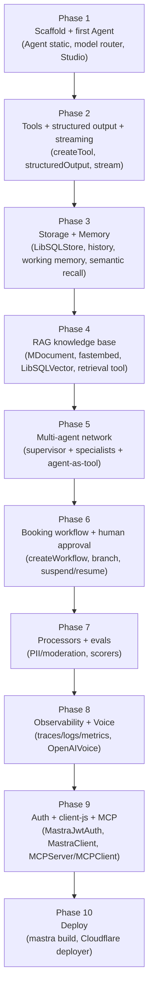

# Travel Agent — Learn Mastra by Building It (a step-by-step project)

This is a hands-on tutorial: you build **one** app — *Travel Agent*, a multi-agent AI travel concierge — that forces you to use **every core Mastra module and key integration**. Each phase tells you the goal, which modules it exercises, the pain it removes, the exact files/code, how to test it in Studio, and a checkpoint. All code is grounded in this repo's real API. Work through the phases in order.

---

## Travel Agent — Design Specification (Build Contract)

> This is the authoritative design spec for the **Travel Agent** tutorial. Every later phase MUST follow the tech choices, structure, and module mapping below. All APIs here are grounded in the real `@mastra/*` source and docs in this repo (verified signatures: `new Agent({ id, name, instructions, model, tools, agents, memory, voice, inputProcessors, outputProcessors, scorers })`, `createTool({ id, description, inputSchema, outputSchema, execute })`, `createStep`/`createWorkflow().then().branch().commit()` with `suspend()`/`resume()`, `new Mastra({ agents, workflows, storage, vectors, memory, observability, mcpServers, server })`).

---

## The project: Travel Agent

**Travel Agent** is a multi-agent AI Travel Concierge. A traveler describes a trip in plain language ("10 days in Japan in spring, mid-budget, loves food and trains, needs a visa from India") and Travel Agent researches destinations against a curated visa/destination knowledge base, remembers the traveler's preferences across conversations, coordinates a team of specialist agents (flights, hotels, activities) under a supervisor, runs a deterministic booking workflow that **pauses for human approval** before anything is "booked," can be spoken to by voice, exposes its capabilities over MCP, and is fully observable, authenticated, and deployable. It is one app that organically forces you to touch every core Mastra module.

The finished app can:

- Take a free-text trip brief and turn it into a grounded, structured itinerary.
- Answer visa/entry questions using **RAG** over a destination knowledge base (no hallucinated visa rules).
- Remember a traveler's home airport, dietary needs, budget band, and seat preference across sessions (**working memory** + **semantic recall** + **message history**).
- Delegate to **specialist agents** (Flights, Hotels, Activities) via a **supervisor** and call agents/tools as tools.
- Assemble candidate flights/hotels/activities through **tools** backed by real providers (SerpApi/Google Flights for flights, LiteAPI for hotels; key-free live APIs for weather and currency).
- Produce **structured output** (a typed `Itinerary` object) and **stream** progress to the UI.
- Run a deterministic **booking workflow** with **suspend/resume** for human approval ("Confirm this $2,140 itinerary?").
- Redact PII and moderate input via **processors**.
- Be talked to with **voice** (speech-to-text in, text-to-speech out).
- Be **scored/evaluated** for answer relevancy and safety on live traffic.
- Be **observed** end-to-end (traces, logs, metrics) in Studio.
- Be **authenticated** (JWT) and called from a client app via **client-js**.
- Expose a subset of its tools/agents as an **MCP server**, and consume an external **MCP client**.
- **Deploy** to a cloud target.

---

## What you'll have when done

A single TypeScript Mastra project (`src/mastra/`) that, when run with `mastra dev`, gives you a working Studio with:

- **Agents:** a static `conciergeAgent` (supervisor), a **dynamically configured** `conciergeAgent` variant (instructions/model swap by request context), and three specialist subagents.
- **Tools:** flight search, hotel search, activity search, currency conversion, plus a RAG retrieval tool.
- **RAG:** a destination/visa knowledge base ingested into a vector store with a local embedder.
- **Memory:** per-traveler working memory (preferences), semantic recall, and message history persisted to a DB.
- **Workflows:** a `bookingWorkflow` with branching and a human-approval suspend/resume gate.
- **Multi-agent network:** supervisor delegation + agent-as-tool.
- **Processors:** PII redaction + moderation on input, output validation.
- **Evals:** live scorers attached to the concierge agent.
- **Observability:** traces/logs/metrics visible in Studio.
- **Voice:** speak/listen on the concierge agent.
- **Auth:** JWT-protected server.
- **Client app:** a tiny Node script using `@mastra/client-js` against the authenticated server.
- **MCP:** a Travel Agent MCP server exposing tools/agents, and an MCP client consuming an external server.
- **Deployer:** a build configured for one concrete cloud target.

---

## Tech choices (fixed — use these everywhere for consistency)

> Use these exact choices in **every** phase. Do not introduce alternatives mid-tutorial. Where an API key is required it is **clearly marked**; everywhere else we prefer key-free local options.

| Concern | Choice | Notes |
| - | - | - |
| Language / runtime | **TypeScript**, **Node.js ≥ v22.13.0**, **pnpm** | Matches Mastra's documented minimum runtime. |
| Project scaffold | **`create-mastra`** / `mastra dev` (Studio) | Studio is the test harness throughout. |
| Model router string (default) | **`'openai/gpt-4o-mini'`** | Mastra model-router `'provider/model-id'` form. **Swappable** — set `OPENAI_API_KEY`, or swap the string to `'anthropic/claude-...'`, `'google/...'`, etc. **API key required.** In tutorial code blocks we write the literal `'openai/gpt-4o-mini'`. |
| Storage backend | **`@mastra/libsql` → `LibSQLStore`** | `url: 'file:./travel-agent.db'` (or `:memory:` for quick demos). Key-free. Used for memory history, workflow snapshots, and observability storage. |
| Vector store | **`@mastra/libsql` → `LibSQLVector`** | Same DB. Powers both RAG and semantic recall. Key-free. |
| Embedder (default) | **`@mastra/fastembed` → `fastembed`** | Local, **no API key**. `import { fastembed } from '@mastra/fastembed'`; pass as `embedder`/`model`. **Alternative (marked):** `new ModelRouterEmbeddingModel('openai/text-embedding-3-small')` from `@mastra/core/llm` (API key required). |
| RAG document tooling | **`@mastra/rag` → `MDocument`** | `MDocument.fromText(...).chunk({ strategy: 'recursive', size: 512, overlap: 50 })`. |
| Memory | **`@mastra/memory` → `Memory`** | `new Memory({ storage, vector, embedder, options: { lastMessages, semanticRecall, workingMemory } })`. |
| Workflows | **`@mastra/core/workflows`** | `createStep`, `createWorkflow().then().branch().commit()`, `suspend()`/`resume()`, snapshots in LibSQL. |
| Processors | **`@mastra/core/processors`** | `ModerationProcessor`, PII/redaction + a custom processor. (Moderation processor uses a model → API key.) |
| Evals / scorers | **`@mastra/evals` → `@mastra/evals/scorers/prebuilt`** | `createAnswerRelevancyScorer`, `createToxicityScorer` with `sampling`. Model-graded → API key. |
| Observability | **`@mastra/observability`** with **`MastraStorageExporter`** (Studio) + **`SensitiveDataFilter`** span processor; **Langfuse exporter noted as the external alternative** | Storage exporter is key-free and lights up Studio's traces/metrics. **Alternative (marked):** Langfuse / OTEL exporter (keys + endpoint). |
| Voice | **`@mastra/voice-openai` → `OpenAIVoice`** (+ `@mastra/node-audio` `playAudio` for local playback) | TTS/STT. **API key required.** |
| Auth | **`@mastra/auth` → `MastraJwtAuth`** | `server.auth = new MastraJwtAuth({ secret: process.env.MASTRA_JWT_SECRET })`. Shared-secret JWT; key-free for dev (generate token at jwt.io). |
| Client | **`@mastra/client-js` → `MastraClient`** | `new MastraClient({ baseUrl, headers: { Authorization: 'Bearer <jwt>' } })`. |
| MCP | **`@mastra/mcp` → `MCPServer` + `MCPClient`** | Travel Agent exposes a server via `mcpServers` on `Mastra`; consumes an external server (e.g. a Wikipedia/`npx` server) via `MCPClient.listTools()`. |
| Deployer | **`@mastra/deployer` + `mastra build`**, target **Cloudflare** (`@mastra/deployer-cloudflare`) | One concrete target. Build is verifiable without deploying; deploying needs a Cloudflare account (marked). |

**Environment variables used across the tutorial:**
`OPENAI_API_KEY` (model + voice + OpenAI embedder alt), `MASTRA_JWT_SECRET` (auth), `MASTRA_JWT_TOKEN` (dev client token), `LANGFUSE_*` (optional observability), `CLOUDFLARE_*` (optional deploy). Everything not listed runs key-free.

---

## Module coverage matrix

| Mastra module / feature | Where in Travel Agent it's used | What it teaches |
| - | - | - |
| **Agent (static)** | `conciergeAgent` with fixed `instructions` + `model` | Core `new Agent({ id, name, instructions, model })`; `generate()` vs `stream()`. |
| **Agent (dynamic)** | Concierge instructions/model chosen by request context (e.g. budget band, locale) | Runtime config via request context; swapping behavior per request. |
| **Tools** | `flightSearchTool`, `hotelSearchTool`, `activitySearchTool`, `currencyTool` | `createTool` with `inputSchema`/`outputSchema`/`execute`; agent tool selection. |
| **Memory — message history** | Every concierge conversation, keyed by `resource`/`thread` | `memory: { resource, thread }` on calls; recall across turns. |
| **Memory — working memory** | Traveler profile: home airport, diet, budget band, seat pref | Persistent structured user data via `options.workingMemory`. |
| **Memory — semantic recall** | Recalling earlier trip details from long sessions | `semanticRecall: true` + `vector` + `embedder` (LibSQLVector + fastembed). |
| **RAG (+ embedder + vector store)** | Destination/visa knowledge base → `ragRetrievalTool` | `MDocument.chunk()`, `fastembed`, `LibSQLVector.upsert()/query()`, retrieval-grounded answers. |
| **Workflows (+ branch)** | `bookingWorkflow`: validate → price → branch(approve path) → confirm | `createStep`, `.then()`, `.branch()`, `.commit()`; typed step schemas; workflow state. |
| **Workflows — suspend/resume** | Human-approval gate before "booking" | `suspend()`/`resume()`, `resumeSchema`/`suspendSchema`, snapshots in LibSQL. |
| **Multi-agent networks** | Supervisor `conciergeAgent` over Flights/Hotels/Activities | `agents: { ... }` delegation; supervisor instructions; delegation behavior. |
| **Agent-as-tool** | Specialist agent invoked as a tool from a workflow step / supervisor | Composing agents as callable units. |
| **Processors (PII/moderation)** | `inputProcessors` (moderation + PII redaction), `outputProcessors` (validate itinerary) | `@mastra/core/processors` ordering; guardrails. |
| **Structured output** | Concierge returns a typed `Itinerary` object | `structuredOutput: { schema }`; `response.object`. |
| **Streaming** | Live itinerary assembly progress to UI/CLI | `agent.stream()` `textStream`; tool-call streaming. |
| **MCP (server)** | Travel Agent exposes tools/agents/workflows as an MCP server | `MCPServer` + `mcpServers` registration. |
| **MCP (client)** | Concierge pulls an external tool over MCP | `MCPClient` + `listTools()`/`listToolsets()`. |
| **Evals / scorers** | Live answer-relevancy + toxicity scoring on concierge | `@mastra/evals/scorers/prebuilt` with `sampling`. |
| **Observability** | Traces/logs/metrics for every run | `Observability` + `MastraStorageExporter` + `SensitiveDataFilter`; Studio traces. |
| **Storage backend** | All persistence (memory, snapshots, traces) | `LibSQLStore`; single DB powering multiple domains. |
| **Voice** | Speak/listen on the concierge | `OpenAIVoice` `.speak()` / `.listen()`. |
| **Auth** | JWT-protected Mastra server | `MastraJwtAuth` + Studio header / client `Authorization`. |
| **client-js** | External Node app calls the authenticated agent | `MastraClient` with bearer token. |
| **Studio** | Test harness in every phase | Run agents/workflows, inspect traces/memory, resume suspended runs. |
| **Deployer** | Production build for Cloudflare | `mastra build` + `@mastra/deployer-cloudflare`. |

---

## Project structure

Final `src/mastra/` tree (built up incrementally across the 10 phases):

```text
travel-agent/
├─ package.json
├─ tsconfig.json
├─ .env                      # OPENAI_API_KEY, MASTRA_JWT_SECRET, etc. (gitignored)
├─ knowledge/
│  └─ destinations.md        # visa/entry/destination KB source for RAG
├─ scripts/
│  ├─ ingest.ts              # one-off: chunk + embed + upsert KB into LibSQLVector
│  └─ client-demo.ts         # @mastra/client-js demo against the authed server
└─ src/
   └─ mastra/
      ├─ index.ts            # new Mastra({ agents, workflows, storage, vectors,
      │                      #   observability, mcpServers, server })
      ├─ storage.ts          # LibSQLStore + LibSQLVector singletons
      ├─ embedder.ts         # fastembed (default) | OpenAI embedder (alt)
      ├─ memory.ts           # Memory: history + workingMemory + semanticRecall
      ├─ observability.ts    # Observability config (Studio exporter + filter)
      ├─ agents/
      │  ├─ concierge-agent.ts    # supervisor: static + dynamic config
      │  ├─ flights-agent.ts      # specialist
      │  ├─ hotels-agent.ts       # specialist
      │  └─ activities-agent.ts   # specialist
      ├─ tools/
      │  ├─ flight-search-tool.ts
      │  ├─ hotel-search-tool.ts
      │  ├─ activity-search-tool.ts
      │  ├─ currency-tool.ts
      │  └─ rag-retrieval-tool.ts
      ├─ rag/
      │  └─ destinations-index.ts # index name / query helpers over LibSQLVector
      ├─ workflows/
      │  └─ booking-workflow.ts    # validate → price → branch → approval(suspend) → confirm
      ├─ processors/
      │  ├─ pii-redactor.ts        # custom PII processor
      │  └─ itinerary-validator.ts # custom output processor
      ├─ schemas/
      │  └─ itinerary.ts           # zod Itinerary schema (structured output + workflow IO)
      ├─ voice/
      │  └─ concierge-voice.ts     # OpenAIVoice wiring
      └─ mcp/
         ├─ travel-agent-mcp-server.ts  # MCPServer exposing tools/agents/workflow
         └─ external-mcp-client.ts # MCPClient to an external server
```

---

## Build order

The 10 phases are ordered so each builds only on what already exists — you always have a runnable app in Studio, and "magic" features (memory, RAG, networks) land only after their foundations (storage, tools, agents).



**Why this order:**

1. **Scaffold + Agent** first — nothing works without a registered agent and Studio to test it; establishes the model-router string and `Mastra` instance.
2. **Tools + structured output + streaming** — give the agent capabilities and a typed `Itinerary` contract before any persistence; these are pure additions to the agent.
3. **Storage + Memory** — memory *requires* a storage provider, so storage lands here and immediately pays off with history/working memory/semantic recall.
4. **RAG** — reuses the same LibSQLVector + embedder introduced for semantic recall, so the vector stack is already familiar; produces the retrieval tool the concierge needs to answer visa questions.
5. **Multi-agent network** — once one agent + tools + RAG work, split responsibilities into specialists under a supervisor; agent-as-tool composes cleanly on top.
6. **Booking workflow + suspend/resume** — deterministic orchestration belongs after agents/tools exist to call; snapshots reuse the Phase 3 storage.
7. **Processors + evals** — hardening (guardrails, PII, scoring) is meaningful only once there's real behavior and output to guard and grade.
8. **Observability + Voice** — cross-cutting polish; observability instruments everything built so far, voice is an additive channel on the finished concierge.
9. **Auth + client-js + MCP** — exposing the app (secured server, external client, MCP in/out) makes sense only once the app is feature-complete.
10. **Deploy** — last; you ship the finished, observable, authenticated app.

---

## Prerequisites

Before Phase 1, have the following ready:

- **Node.js ≥ v22.13.0** and **pnpm** installed (`node -v`, `pnpm -v`).
- A terminal and a code editor (VS Code recommended).
- A modern browser for **Studio** (Chrome recommended).
- **`OPENAI_API_KEY`** — required for the default model (`'openai/gpt-4o-mini'`), the OpenAI voice provider (Phase 8), and model-graded scorers/moderation (Phase 7). *(Swap the model-router string if you prefer another provider; set that provider's key instead.)*
- **`MASTRA_JWT_SECRET`** — any HS256-safe secret string (e.g. `supersecretdevkeythatishs256safe!`) for Phase 9 auth; generate a matching dev JWT at [jwt.io](https://www.jwt.io/).
- **No keys needed** for storage (LibSQL writes a local `travel-agent.db` file), the vector store (LibSQLVector), or the default embedder (**fastembed**, fully local — first run downloads the model).
- **Optional (clearly marked in their phases):** a **Langfuse** account (external observability alternative, Phase 8) and a **Cloudflare** account (deploy target, Phase 10).
- Scaffold with **`pnpm create mastra@latest`** (or `npx create-mastra@latest`) when Phase 1 begins.

All file paths referenced above are relative to the Travel Agent project root you create in Phase 1 (`travel-agent/`). The grounding docs for each phase live under `docs/src/content/en/docs/<area>/` in this monorepo and should be re-read at the start of the matching phase.

---

## Phase 1 — Setup & your first agent

- **Goal:** Stand up the Travel Agent project, wire a single `Mastra` instance, build the `conciergeAgent` (the supervisor-to-be) with static instructions and a model, register it, run `mastra dev`, and have a real conversation with it in Studio.

- **Modules you'll use:** `Agent` (static config) from `@mastra/core/agent`, the `Mastra` instance from `@mastra/core`, the **model router** (`'provider/model-id'` strings), and **Studio** as your test harness. Everything else in the spec (tools, memory, RAG, workflows, voice, MCP, auth, deploy) lands in later phases — this phase is the skeleton they all hang off.

- **The pain it removes:** No glue code, no server boilerplate, no chat UI to build. You declare an agent as a plain object and instantly get a typed runtime plus a local playground to talk to it.

### Steps

We'll scaffold with `create-mastra` and then reshape the generated files to match the Travel Agent structure from the design spec. (If you prefer a fully manual setup, the manual path is in the callout at the end of this section.)

#### 1. Scaffold the project

In the directory where you want `travel-agent/` to live, run:

```bash
pnpm create mastra@latest travel-agent --default --llm openai
```

This creates a `travel-agent/` folder with a `package.json`, `tsconfig.json`, an `.env.example`, and a `src/mastra/` tree (agents/, tools/, workflows/, scorers/, and `index.ts`). The `--default` flag accepts the recommended defaults; `--llm openai` sets up the OpenAI model router string so our `'openai/gpt-4o-mini'` default works out of the box.

```bash
cd travel-agent
```

:::note
**API key required (model).** Travel Agent's default model is `'openai/gpt-4o-mini'`, so you need an `OPENAI_API_KEY`. If you'd rather use another provider, swap the model string later (e.g. `'anthropic/claude-...'`, `'google/...'`) and set that provider's key instead. Everything else in Travel Agent (storage, vectors, the default embedder) is key-free.
:::

#### 2. Set your environment variable

Copy the example env file and add your key:

```bash
cp .env.example .env
```

```bash title="travel-agent/.env"
OPENAI_API_KEY=sk-...your-key-here...
```

We'll add `MASTRA_JWT_SECRET` and friends in later phases; for now the model key is all you need.

#### 3. Confirm `tsconfig.json`

The scaffold gives you a working config. Mastra requires modern module resolution — confirm yours looks like this (the key lines are `module`/`moduleResolution`):

```json title="travel-agent/tsconfig.json"
{
  "compilerOptions": {
    "target": "ES2022",
    "module": "ES2022",
    "moduleResolution": "bundler",
    "esModuleInterop": true,
    "forceConsistentCasingInFileNames": true,
    "strict": true,
    "skipLibCheck": true,
    "noEmit": true,
    "outDir": "dist"
  },
  "include": ["src/**/*"]
}
```

:::info
`CommonJS` or `node` resolution will cause module-resolution errors. Keep `module`/`moduleResolution` modern.
:::

#### 4. Create the Travel Agent concierge agent

The scaffold ships a `weather-agent.ts`. Delete it (and the generated `weather-tool.ts`, `weather-workflow.ts`, and `scorers/` — we'll build Travel Agent's own as we go) and create the concierge in its place.

```bash
rm -f src/mastra/agents/weather-agent.ts
mkdir -p src/mastra/agents
```

```ts title="travel-agent/src/mastra/agents/concierge-agent.ts"
import { Agent } from '@mastra/core/agent'

export const conciergeAgent = new Agent({
  id: 'concierge-agent',
  name: 'Travel Agent Concierge',
  instructions: `
    You are Travel Agent, an expert AI travel concierge.

    Your job is to help a traveler turn a free-text trip brief
    (for example: "10 days in Japan in spring, mid-budget, loves food and trains,
    needs a visa from India") into a clear, realistic travel plan.

    How to behave:
    - Open by understanding the trip: destination(s), dates or season, trip length,
      budget band (shoestring / mid / luxury), travel party, and any must-dos.
    - If the brief is missing something important (dates, budget, home country), ask
      one concise clarifying question at a time rather than guessing.
    - Be specific and grounded. Suggest concrete cities, neighborhoods, and routes.
    - Never invent visa rules, prices, or availability. If you are not sure, say so
      plainly and tell the traveler what you would need to look up.
    - Keep responses warm, concise, and skimmable. Use short paragraphs or bullets.

    You do not yet have tools, memory, or a knowledge base — for now, reason from
    general knowledge and be honest about your limits. Those capabilities arrive in
    later phases.
  `,
  model: 'openai/gpt-4o-mini',
})
```

**Agent anatomy** — every field maps to a real `Agent` property:

- `id` — stable, unique identifier. You'll retrieve the agent later with `mastra.getAgentById('concierge-agent')`, and it's how the agent is addressed over the server/client and MCP. Keep it constant.
- `name` — the human-friendly label shown in Studio.
- `instructions` — the system-level prompt that defines the agent's identity, behavior, and limits. This is the single most important lever you have over how the agent acts; we'll keep refining it as Travel Agent grows.
- `model` — a model-router string in `'provider/model-id'` form. `'openai/gpt-4o-mini'` is our fixed default for the whole tutorial. (In later phases this same agent gains `tools`, `memory`, `agents`, `inputProcessors`/`outputProcessors`, `scorers`, `voice`, and `structuredOutput` — the constructor already accepts all of them.)

#### 5. Register the agent in the Mastra instance

Replace the generated `src/mastra/index.ts` with a minimal Travel Agent entry point. We'll grow this object every phase — storage in Phase 3, vectors in Phase 4, workflows in Phase 6, observability and voice in Phase 8, MCP and server/auth in Phase 9 — but right now it only needs to know about one agent.

```ts title="travel-agent/src/mastra/index.ts"
import { Mastra } from '@mastra/core'
import { PinoLogger } from '@mastra/loggers'
import { conciergeAgent } from './agents/concierge-agent'

export const mastra = new Mastra({
  agents: { conciergeAgent },
  logger: new PinoLogger({
    name: 'Travel Agent',
    level: 'info',
  }),
})
```

**The `Mastra()` config object** — this is Travel Agent's central hub and dependency-injection container. Anything you register here becomes available to everything else (agents, workflows, tools), and registered agents gain access to shared services like logging and, later, storage, memory, and observability. The full constructor accepts `agents`, `workflows`, `tools`, `storage`, `vectors`, `memory`, `observability`, `mcpServers`, and `server`. We're using just two keys today:

- `agents` — a record of the agents this instance exposes. The **key** (`conciergeAgent`) is how it appears in your code/imports; the agent's own `id` (`'concierge-agent'`) is its runtime identity. We register more agents (the Flights/Hotels/Activities specialists) in Phase 5.
- `logger` — a `PinoLogger` so you get readable startup and request logs in your terminal. Optional, but it makes the next steps much easier to follow.

:::tip
Mastra is unopinionated about file layout, but we follow the spec's structure (`agents/`, `tools/`, `workflows/`, …) so later phases drop into predictable places. Always import the agent into `index.ts` and add it to the `agents` map — an agent that isn't registered won't appear in Studio.
:::

#### 6. Confirm your dev script and start the server

The scaffold already added the scripts; confirm `package.json` has them:

```json title="travel-agent/package.json"
{
  "scripts": {
    "dev": "mastra dev",
    "build": "mastra build"
  }
}
```

Start the dev server (this also launches Studio):

```bash
pnpm run dev
```

You should see Mastra boot and print a local URL (Studio defaults to `http://localhost:4111`).

### Test it in Studio

1. Open **`http://localhost:4111`** in your browser (Chrome recommended).
2. In the left sidebar, click **Agents**, then select **Travel Agent Concierge**.
3. In the chat panel, send a real trip brief, for example:
   > *"10 days in Japan in spring, mid-budget, I love food and trains, traveling from India."*
4. Watch the reply. Because the agent has no tools or knowledge base yet, expect it to ask one focused clarifying question (e.g. exact dates or budget band) and/or sketch a grounded high-level plan while being honest that it can't confirm visa rules or live prices.
5. Send a follow-up in the same chat (e.g. *"Make it 7 days and shoestring budget"*) and notice it adapts. (It won't yet *remember* you across separate sessions — that's Phase 3's memory.)

### Checkpoint

You're ready for Phase 2 when:

- `pnpm run dev` starts cleanly with no module-resolution or missing-key errors, and the terminal shows the `Travel Agent` logger output.
- **Travel Agent Concierge** appears under **Agents** in Studio at `http://localhost:4111`.
- Sending a trip brief returns a coherent, on-character reply that asks clarifying questions and refuses to fabricate visa rules or prices.
- The agent's `id` is `concierge-agent` and it's registered in `src/mastra/index.ts` under `agents` — confirm by checking the agent's detail page in Studio shows the right name and model (`openai/gpt-4o-mini`).

If the agent doesn't show up, the usual cause is forgetting to add it to the `agents` map in `index.ts`. If you get auth/model errors, double-check `OPENAI_API_KEY` is set in `travel-agent/.env`.

:::info
**Prefer a manual install?** Skip `create-mastra` and do it by hand: `pnpm init`, then `pnpm add @mastra/core@latest @mastra/loggers@latest zod@^4` and `pnpm add -D typescript @types/node mastra@latest`. Add the `dev`/`build` scripts and the `tsconfig.json` above, then create the same `src/mastra/agents/concierge-agent.ts` and `src/mastra/index.ts` files shown in steps 4–5. The result is identical.
:::

---

## Phase 2 — Tools (give the agent actions)

- **Goal:** Give the `conciergeAgent` real *actions*. Right now it can only talk; by the end of this phase it can search flights, search hotels, check weather, and convert currency by calling typed tools you write, and you'll watch it decide which tool to call (and with what arguments) live in Studio.

- **Modules you'll use:**
  - `createTool` from `@mastra/core/tools` (id, description, `inputSchema`, `outputSchema`, `execute`)
  - **Zod** schemas as the LLM contract for tool inputs/outputs
  - The `tools` property on `new Agent({ ... })` (from Phase 1)
  - Studio's agent playground + trace view to see tool calls
  - (We reuse the `Itinerary` schema idea from Phase 1's `schemas/itinerary.ts` only loosely here — structured *output* of the whole itinerary comes later; this phase is about tool *I/O*.)

- **The pain it removes:** A text-only model guesses ("flights are probably ~$800"). Tools turn guesses into grounded, repeatable calls with validated arguments and predictable return shapes — so the agent fetches real data instead of hallucinating it, and you get typed results you can render or feed into the booking workflow later.

### Why schemas are the LLM contract

A tool's `inputSchema` is not just runtime validation — it's the *instruction set the model reads*. Mastra converts your Zod schema into the JSON Schema the model sees when it decides whether and how to call the tool. So:

- **Field names and `.describe()` text are prompt.** `z.string().describe('IATA airport code, e.g. "NRT"')` literally guides the model to send `"NRT"` instead of `"Tokyo airport"`.
- **The `outputSchema` is your guarantee back.** It documents (and, with validation, enforces) the shape your `execute` returns, so downstream code and the agent both know what they're getting.
- **`description` is the "when to use me" hint.** The model picks tools mostly off the tool `description` + input field names, so keep them concrete.

Treat every tool schema like an API contract you're handing the model.

### Steps

> All paths are relative to the `travel-agent/` project root from Phase 1. **This is a production build — every tool calls a real provider.** Flights use **SerpApi** (Google Flights results; `src/mastra/providers/serpapi.ts`) and hotels use **LiteAPI** (live rates over 3M+ properties; `src/mastra/providers/liteapi.ts`); both are re-exported through `src/mastra/providers/index.ts` so a data source is swappable in one line, with no edits to tools or the agent. Weather uses **Open-Meteo** and currency uses **Frankfurter** (both key-free). SerpApi needs a free key (`SERPAPI_KEY`, 250 searches/mo, no card) from [serpapi.com](https://serpapi.com); LiteAPI needs a free instant key (`LITE_API_KEY`, sandbox keys start with `sand_`) from [liteapi.travel](https://liteapi.travel) — both are no-card, no-KYC. Until a key is set, that tool throws a clear "not configured" error rather than returning fake data.
>
> **Why these two (and not Amadeus or Travelpayouts)?** No single solo-dev-friendly API reliably covers both flights and hotels with instant access. Amadeus does both but its production onboarding is heavy. Travelpayouts' flight *prices* endpoint is a 48-hour cache that's empty for most specific dates, and its real-time flight search is gated behind partner approval (403); its Hotellook hotel API has been retired. SerpApi (Google Flights) gives reliable real flight data with an instant free key, and LiteAPI gives real hotel rates the same way.

0. **Create the provider clients — `src/mastra/providers/`**

   No single solo-dev-friendly API covers both flights and hotels with instant
   access, so we use two: **SerpApi** (Google Flights) for flights and **LiteAPI**
   for hotels. Each lives in its own file with key handling and error handling, and
   a barrel (`providers/index.ts`) re-exports both so the tools never import a
   specific provider — swapping a data source is a one-line change there.

   ```typescript title="src/mastra/providers/serpapi.ts"
   // Real-time flights via Google Flights results.
   const SEARCH = 'https://serpapi.com/search.json'

   function apiKey(): string {
     const k = process.env.SERPAPI_KEY
     if (!k) {
       throw new Error(
         'SerpApi is not configured. Set SERPAPI_KEY in .env ' +
           '(free key at https://serpapi.com — 250 searches/mo, no card).',
       )
     }
     return k
   }

   export interface FlightOffer {
     airline: string; flightNumber: string; origin: string; destination: string
     departDate: string; durationHours: number; priceUsd: number; bookingUrl?: string
   }

   function googleFlightsUrl(origin: string, destination: string, date: string): string {
     const q = `flights from ${origin} to ${destination} on ${date}`
     return `https://www.google.com/travel/flights?q=${encodeURIComponent(q)}`
   }

   export async function searchFlights(args: {
     origin: string; destination: string; departDate: string; passengers: number; limit?: number
   }): Promise<FlightOffer[]> {
     const origin = args.origin.toUpperCase()
     const destination = args.destination.toUpperCase()
     const params = new URLSearchParams({
       engine: 'google_flights',
       departure_id: origin, arrival_id: destination,
       outbound_date: args.departDate,
       type: '2', // one-way
       currency: 'USD', hl: 'en',
       adults: String(args.passengers),
       api_key: apiKey(),
     })
     const res = await fetch(`${SEARCH}?${params.toString()}`)
     const data = (await res.json().catch(() => null)) as any
     if (!res.ok || !data) throw new Error(`SerpApi request failed (${res.status})`)
     if (data.error) throw new Error(`SerpApi error: ${data.error}`)

     const groups: any[] = [...(data.best_flights ?? []), ...(data.other_flights ?? [])]
     return groups
       .map(group => {
         const legs = group.flights ?? []
         const first = legs[0]
         const last = legs[legs.length - 1]
         if (!first || !last) return null
         return {
           airline: first.airline ?? '',
           flightNumber: String(first.flight_number ?? '').replace(/\s+/g, ''),
           origin: first.departure_airport?.id ?? origin,
           destination: last.arrival_airport?.id ?? destination,
           departDate: String(first.departure_airport?.time ?? `${args.departDate} `).slice(0, 10),
           durationHours: Math.round(((group.total_duration ?? 0) / 60) * 10) / 10,
           priceUsd: Math.round(Number(group.price ?? 0) * 100) / 100,
           bookingUrl: googleFlightsUrl(origin, destination, args.departDate),
         } as FlightOffer
       })
       .filter((o): o is FlightOffer => o !== null && o.priceUsd > 0)
       .sort((a, b) => a.priceUsd - b.priceUsd)
       .slice(0, args.limit ?? 10)
   }
   ```

   ```typescript title="src/mastra/providers/liteapi.ts"
   const BASE = 'https://api.liteapi.travel/v3.0'

   function apiKey(): string {
     const k = process.env.LITE_API_KEY
     if (!k) {
       throw new Error(
         'LiteAPI is not configured. Set LITE_API_KEY in .env ' +
           '(free instant key at https://liteapi.travel — sandbox keys start with "sand_").',
       )
     }
     return k
   }

   async function liteFetch<T = any>(path: string, init?: RequestInit): Promise<T> {
     const res = await fetch(`${BASE}${path}`, {
       ...init,
       headers: {
         'X-API-Key': apiKey(),
         Accept: 'application/json',
         ...(init?.body ? { 'Content-Type': 'application/json' } : {}),
         ...(init?.headers ?? {}),
       },
     })
     if (!res.ok) throw new Error(`LiteAPI error (${res.status})`)
     return (await res.json()) as T
   }

   export interface HotelOffer {
     name: string; neighborhood: string; rating: number
     nightlyUsd: number; totalUsd: number; bookingUrl?: string
   }

   function addNights(checkIn: string, nights: number): string {
     const d = new Date(`${checkIn}T00:00:00Z`)
     d.setUTCDate(d.getUTCDate() + nights)
     return d.toISOString().slice(0, 10)
   }

   // retailRate.total is usually [{ amount, currency }]; tolerate object/number too.
   function lowestTotal(entry: any): number | null {
     let min: number | null = null
     for (const rt of entry?.roomTypes ?? []) {
       for (const rate of rt?.rates ?? []) {
         const total = rate?.retailRate?.total
         const amount = Array.isArray(total) ? total[0]?.amount
           : typeof total === 'object' ? total?.amount : total
         const n = Number(amount)
         if (Number.isFinite(n) && (min === null || n < min)) min = n
       }
       const flat = Number(rt?.offerRetailRate?.amount)
       if (Number.isFinite(flat) && (min === null || flat < min)) min = flat
     }
     return min
   }

   export async function searchHotels(args: {
     city: string; countryCode: string; checkIn: string; nights: number
     budgetBand: 'budget' | 'mid' | 'luxury'; adults?: number; guestNationality?: string; limit?: number
   }): Promise<HotelOffer[]> {
     const checkOut = addNights(args.checkIn, args.nights)

     // 1) hotels (ids + details: name, stars, address) for the city
     const q = new URLSearchParams({
       countryCode: args.countryCode.toUpperCase(), cityName: args.city, limit: String(args.limit ?? 25),
     })
     const list = await liteFetch<{ data?: any[] }>(`/data/hotels?${q.toString()}`)
     const hotels = list.data ?? []
     if (hotels.length === 0) return []
     const details = new Map<string, any>(hotels.map(h => [String(h.id), h]))

     // 2) live rates for those hotels
     const rates = await liteFetch<{ data?: any[] }>('/hotels/rates', {
       method: 'POST',
       body: JSON.stringify({
         hotelIds: hotels.map(h => String(h.id)),
         checkin: args.checkIn, checkout: checkOut, currency: 'USD',
         guestNationality: (args.guestNationality ?? 'US').toUpperCase(),
         occupancies: [{ adults: args.adults ?? 1 }],
       }),
     })

     const bands = {
       budget: (n: number) => n <= 120,
       mid: (n: number) => n > 120 && n <= 300,
       luxury: (n: number) => n > 300,
     }
     const offers: HotelOffer[] = []
     for (const entry of rates.data ?? []) {
       const total = lowestTotal(entry)
       if (total === null) continue
       const d = details.get(String(entry.hotelId)) ?? {}
       const totalUsd = Math.round(total * 100) / 100
       offers.push({
         name: d.name ?? 'Unknown hotel',
         neighborhood: d.address ?? d.city ?? args.city,
         rating: Number(d.stars ?? 0), // `stars` is the star rating; `rating` is the /10 review score
         nightlyUsd: Math.round((totalUsd / Math.max(args.nights, 1)) * 100) / 100,
         totalUsd,
       })
     }
     // Prefer the requested band, but never return [] just because the band was tight.
     const inBand = offers.filter(h => bands[args.budgetBand](h.nightlyUsd))
     return (inBand.length ? inBand : offers).sort((a, b) => a.nightlyUsd - b.nightlyUsd)
   }
   ```

   Then re-export both so tools never import a specific provider:

   ```typescript title="src/mastra/providers/index.ts"
   // Swap or mix providers here — tools and the agent never change.
   export { searchFlights } from './serpapi'
   export type { FlightOffer } from './serpapi'
   export { searchHotels } from './liteapi'
   export type { HotelOffer } from './liteapi'
   ```

1. **Create the flight search tool — `src/mastra/tools/flight-search-tool.ts`**

   ```typescript title="src/mastra/tools/flight-search-tool.ts"
   import { createTool } from '@mastra/core/tools'
   import { z } from 'zod'
   import { searchFlights } from '../providers'

   export const flightSearchTool = createTool({
     id: 'flight-search',
     description:
       'Search real available flights between two airports for a given date. Returns candidate flights with price (USD), airline, flight number, duration, and a booking link.',
     inputSchema: z.object({
       origin: z.string().describe('Origin IATA airport code, e.g. "DEL"'),
       destination: z.string().describe('Destination IATA airport code, e.g. "NRT"'),
       departDate: z.string().describe('Departure date in ISO format, e.g. "2026-04-10"'),
       passengers: z.number().int().min(1).default(1).describe('Number of travelers'),
     }),
     outputSchema: z.object({
       flights: z.array(
         z.object({
           airline: z.string(),
           flightNumber: z.string(),
           origin: z.string(),
           destination: z.string(),
           departDate: z.string(),
           durationHours: z.number(),
           priceUsd: z.number(),
           bookingUrl: z.string().optional().describe('Affiliate deep link to book this flight'),
         }),
       ),
     }),
     execute: async inputData => {
       const { origin, destination, departDate, passengers = 1 } = inputData

       const flights = await searchFlights({ origin, destination, departDate, passengers })

       return { flights }
     },
   })
   ```

2. **Create the hotel search tool — `src/mastra/tools/hotel-search-tool.ts`**

   ```typescript title="src/mastra/tools/hotel-search-tool.ts"
   import { createTool } from '@mastra/core/tools'
   import { z } from 'zod'
   import { searchHotels } from '../providers'

   export const hotelSearchTool = createTool({
     id: 'hotel-search',
     description:
       'Search real hotels in a city within a nightly budget band, with live rates. Returns candidate hotels with nightly price (USD), star rating, and neighborhood.',
     inputSchema: z.object({
       city: z.string().describe('City name, e.g. "Kyoto"'),
       countryCode: z
         .string()
         .length(2)
         .describe('ISO 3166-1 alpha-2 country code of the city, e.g. "JP" for Kyoto, "FR" for Paris'),
       checkIn: z.string().describe('Check-in date, ISO format e.g. "2026-04-10"'),
       nights: z.number().int().min(1).describe('Number of nights'),
       adults: z.number().int().min(1).default(1).describe('Number of adult guests'),
       guestNationality: z
         .string()
         .length(2)
         .default('US')
         .describe("Guest's nationality as an ISO alpha-2 code (affects rates/taxes), e.g. \"IN\""),
       budgetBand: z
         .enum(['budget', 'mid', 'luxury'])
         .default('mid')
         .describe('Nightly budget band the traveler prefers'),
     }),
     outputSchema: z.object({
       hotels: z.array(
         z.object({
           name: z.string(),
           neighborhood: z.string(),
           rating: z.number(),
           nightlyUsd: z.number(),
           totalUsd: z.number(),
           bookingUrl: z.string().optional().describe('Deep link to book this hotel'),
         }),
       ),
     }),
     execute: async inputData => {
       const { city, countryCode, checkIn, nights, adults = 1, guestNationality = 'US', budgetBand = 'mid' } =
         inputData

       const hotels = await searchHotels({
         city, countryCode, checkIn, nights, adults, guestNationality, budgetBand,
       })

       return { hotels }
     },
   })
   ```

3. **Create the weather tool — `src/mastra/tools/weather-tool.ts`**

   This one calls a **real, key-free** API (Open-Meteo) so you can see a tool doing genuine I/O. Weather helps the concierge reason about packing and activity timing.

   ```typescript title="src/mastra/tools/weather-tool.ts"
   import { createTool } from '@mastra/core/tools'
   import { z } from 'zod'

   export const weatherTool = createTool({
     id: 'get-weather',
     description:
       'Get the current weather for a city. Use this to advise on packing and to flag weather that affects activities.',
     inputSchema: z.object({
       location: z.string().describe('City name, e.g. "Kyoto"'),
     }),
     outputSchema: z.object({
       location: z.string(),
       temperatureC: z.number(),
       windSpeedKmh: z.number(),
       conditions: z.string(),
     }),
     execute: async inputData => {
       const { location } = inputData

       // Geocode the city (free, no key required).
       const geo = await fetch(
         `https://geocoding-api.open-meteo.com/v1/search?name=${encodeURIComponent(location)}&count=1`,
       ).then(r => r.json())

       const place = geo.results?.[0]
       if (!place) {
         throw new Error(`Location '${location}' not found`)
       }

       // Current weather (free, no key required).
       const weather = await fetch(
         `https://api.open-meteo.com/v1/forecast?latitude=${place.latitude}&longitude=${place.longitude}&current=temperature_2m,wind_speed_10m,weather_code`,
       ).then(r => r.json())

       return {
         location: place.name,
         temperatureC: weather.current.temperature_2m,
         windSpeedKmh: weather.current.wind_speed_10m,
         conditions: describeWeatherCode(weather.current.weather_code),
       }
     },
   })

   function describeWeatherCode(code: number): string {
     const map: Record<number, string> = {
       0: 'Clear sky',
       1: 'Mainly clear',
       2: 'Partly cloudy',
       3: 'Overcast',
       45: 'Foggy',
       51: 'Light drizzle',
       61: 'Slight rain',
       63: 'Moderate rain',
       65: 'Heavy rain',
       71: 'Slight snow',
       80: 'Rain showers',
       95: 'Thunderstorm',
     }
     return map[code] ?? 'Unknown'
   }
   ```

4. **Create the currency conversion tool — `src/mastra/tools/currency-tool.ts`**

   Prices come back in USD; travelers think in their home currency. This tool converts amounts so the concierge can present numbers the traveler understands.

   ```typescript title="src/mastra/tools/currency-tool.ts"
   import { createTool } from '@mastra/core/tools'
   import { z } from 'zod'

   export const currencyTool = createTool({
     id: 'convert-currency',
     description:
       'Convert an amount from one currency to another using live reference rates (Frankfurter / European Central Bank). Use when the traveler wants prices in a currency other than USD.',
     inputSchema: z.object({
       amount: z.number().describe('The amount to convert'),
       from: z.string().describe('Source currency code, e.g. "USD"'),
       to: z.string().describe('Target currency code, e.g. "INR"'),
     }),
     outputSchema: z.object({
       amount: z.number(),
       from: z.string(),
       to: z.string(),
       rate: z.number(),
       converted: z.number(),
       asOf: z.string().describe('Date of the reference rate (YYYY-MM-DD)'),
     }),
     execute: async inputData => {
       const { amount } = inputData
       const from = inputData.from.toUpperCase()
       const to = inputData.to.toUpperCase()

       // Same currency: no API call needed.
       if (from === to) {
         return { amount, from, to, rate: 1, converted: amount, asOf: new Date().toISOString().slice(0, 10) }
       }

       // Live reference rates from the Frankfurter API (ECB data, key-free).
       const res = await fetch(`https://api.frankfurter.app/latest?amount=${amount}&from=${from}&to=${to}`)
       if (!res.ok) {
         throw new Error(`Currency conversion failed (${res.status}). ${from} or ${to} may be unsupported.`)
       }

       const data = (await res.json()) as { amount: number; base: string; date: string; rates: Record<string, number> }
       const converted = data.rates?.[to]
       if (converted === undefined) {
         throw new Error(`No reference rate available for ${from} → ${to}.`)
       }

       return {
         amount,
         from,
         to,
         rate: Math.round((converted / amount) * 1e6) / 1e6,
         converted: Math.round(converted * 100) / 100,
         asOf: data.date,
       }
     },
   })
   ```

5. **Attach the tools to the concierge — edit `src/mastra/agents/concierge-agent.ts`**

   Open the agent you created in Phase 1 and add the `tools` map plus a few lines of instructions so the model knows the tools exist and when to reach for them. The **object key** you give each tool is the name the model (and Studio traces) will see — keep them readable.

   ```typescript title="src/mastra/agents/concierge-agent.ts"
   import { Agent } from '@mastra/core/agent'
   // highlight-start
   import { flightSearchTool } from '../tools/flight-search-tool'
   import { hotelSearchTool } from '../tools/hotel-search-tool'
   import { weatherTool } from '../tools/weather-tool'
   import { currencyTool } from '../tools/currency-tool'
   // highlight-end

   export const conciergeAgent = new Agent({
     id: 'concierge-agent',
     name: 'Travel Agent Concierge',
     instructions: `
       You are Travel Agent, an AI travel concierge.
       Help travelers plan trips end to end: flights, hotels, weather, and budget.

       // highlight-start
       Use your tools instead of guessing:
       - flightSearchTool to find flights between airports.
       - hotelSearchTool to find hotels in a city within the traveler's budget band.
       - weatherTool to check current conditions and advise on packing.
       - currencyTool when the traveler wants prices in a currency other than USD.
       Always state real numbers returned by the tools; never invent prices.
       // highlight-end
     `,
     model: 'openai/gpt-4o-mini',
     // highlight-start
     tools: {
       flightSearchTool,
       hotelSearchTool,
       weatherTool,
       currencyTool,
     },
     // highlight-end
   })
   ```

   > **Note:** Make sure this `conciergeAgent` is still registered in `new Mastra({ agents: { conciergeAgent }, ... })` in `src/mastra/index.ts` (from Phase 1). No change is needed there — the agent already carries its tools.

6. **Run Studio.** From the `travel-agent/` root:

   ```bash
   pnpm dev
   ```

   (This runs `mastra dev`, opening Studio at `http://localhost:4111`.)

### Test it in Studio

1. Open Studio in your browser and go to **Agents → Travel Agent Concierge**.
2. In the chat, send a message that needs a tool, for example:
   > *"What's the weather in Kyoto right now, and should I pack a jacket?"*
   The agent should call **weatherTool**, then answer using the returned numbers.
3. Send a multi-tool request:
   > *"Find me flights from DEL to NRT on 2026-04-10 for 2 people, and a mid-budget hotel in Tokyo for 5 nights. Show the flight total in INR."*
   Expect the agent to call **flightSearchTool**, **hotelSearchTool**, and **currencyTool**, then summarize the candidates.
4. Expand the message to inspect tool activity:
   - In the agent chat, each tool call shows the **arguments the model sent** (validated against your `inputSchema`) and the **result** your `execute` returned.
   - Open the **Traces** tab for that run to see each tool call as a span — input, output, and timing. This is your proof the model chose the tool and supplied the right arguments.
5. (Optional) Try forcing a bad input to feel the contract: ask *"find flights from Tokyo to Osaka"* (city names, not codes). Watch the model convert them to IATA codes like `NRT`/`ITM` because your `.describe()` text told it to.

### Checkpoint

You're ready for Phase 3 when:

- [ ] All four tool files exist under `src/mastra/tools/` and the project starts with `pnpm dev` without type errors.
- [ ] In Studio, asking a weather question triggers a **get-weather**… er, **weatherTool** call (the name matches your object key) and the answer uses the live numbers.
- [ ] A combined flights + hotel + currency request triggers **three** tool calls in one turn, visible in the chat and in the **Traces** tab.
- [ ] The tool-call spans show structured `input` matching your `inputSchema` (e.g. IATA codes, an enum `budgetBand`) and `output` matching your `outputSchema`.
- [ ] The agent reports the **exact prices the tools returned** rather than invented figures.

If a tool never gets called, tighten its `description` and input field `.describe()` text — remember, those strings are the contract the model reads to decide what to do.

---

## Phase 3 — Memory & storage

- **Goal:** Give Travel Agent a persistent brain. By the end of this phase the concierge will remember a traveler's preferences (home airport, dietary needs, budget style) across separate conversations, keep the flow of a single conversation coherent, and surface relevant details from earlier in long sessions — all backed by a single local LibSQL database.

- **Modules you'll use:**
  - `@mastra/libsql` → `LibSQLStore` (storage) and `LibSQLVector` (vector store) — the single `travel-agent.db` file behind everything.
  - `@mastra/memory` → `Memory` with three capabilities: **message history**, **semantic recall**, and **working memory** (as a structured schema).
  - `@mastra/fastembed` → `fastembed` — the local, key-free embedder that turns messages into vectors for semantic recall.
  - The `memory: { resource, thread }` call option on `conciergeAgent.generate()` / `.stream()`.

- **The pain it removes:** Without memory, every message starts from zero — the traveler re-types "I fly out of Bangalore, I'm vegetarian, mid-budget" on every turn and every new session. Memory makes Travel Agent feel like a concierge who already knows you, instead of a stateless form.

### Steps

#### 1. Install the storage, memory, and embedder packages

From your `travel-agent/` project root:

```bash npm2yarn
npm install @mastra/libsql@latest @mastra/memory@latest @mastra/fastembed@latest
```

`@mastra/libsql` gives you both the SQL store and the vector store from one file. `@mastra/fastembed` runs a small embedding model locally — **no API key**, and the model is downloaded automatically on first use (the first run will be a little slow while it fetches).

#### 2. Create the storage singletons

We want one store and one vector index shared by memory now (and by RAG, workflow snapshots, and observability in later phases). Centralize them so every later phase imports the same instances.

```typescript title="src/mastra/storage.ts"
import { LibSQLStore, LibSQLVector } from '@mastra/libsql'

// A single local SQLite file holds message history, working memory,
// vector embeddings, workflow snapshots, and (later) traces.
const url = 'file:./travel-agent.db'

export const storage = new LibSQLStore({
  id: 'travel-agent-storage',
  url,
})

export const vector = new LibSQLVector({
  id: 'travel-agent-vector',
  url,
})
```

#### 3. Define the embedder

The embedder is what turns each message into a vector so semantic recall can find it later. We use the local `fastembed` import directly.

```typescript title="src/mastra/embedder.ts"
import { fastembed } from '@mastra/fastembed'

// Local, key-free embedding model. First run downloads the model.
// Alternative (API key required):
//   import { ModelRouterEmbeddingModel } from '@mastra/core/llm'
//   export const embedder = new ModelRouterEmbeddingModel('openai/text-embedding-3-small')
export const embedder = fastembed
```

#### 4. Build the traveler-profile schema for working memory

Working memory is the concierge's always-available scratchpad of facts about the traveler. We'll define it as a **structured schema** (rather than a Markdown template) so the profile is type-safe and easy to reuse in later phases. Schema-based working memory uses merge semantics — the agent only sends the fields it wants to change, and the rest are preserved.

```typescript title="src/mastra/schemas/traveler-profile.ts"
import { z } from 'zod'

// The persistent traveler profile Travel Agent maintains across all sessions.
export const travelerProfileSchema = z.object({
  homeAirport: z.string().optional(), // e.g. "BLR (Bangalore)"
  dietaryNeeds: z.string().optional(), // e.g. "vegetarian, no shellfish"
  budgetStyle: z.enum(['budget', 'mid', 'luxury']).optional(),
  seatPreference: z.enum(['aisle', 'window', 'no-preference']).optional(),
  passportCountry: z.string().optional(), // used later for visa/RAG questions
})

export type TravelerProfile = z.infer<typeof travelerProfileSchema>
```

#### 5. Create the Memory instance

Now wire all three capabilities together. Notice that `Memory` gets its **own** `storage`, `vector`, and `embedder` — memory is self-contained and doesn't depend on what's set on the top-level `Mastra` instance (we'll still register storage on `Mastra` in the next step so Studio and later phases can use it too).

```typescript title="src/mastra/memory.ts"
import { Memory } from '@mastra/memory'
import { storage, vector } from './storage'
import { embedder } from './embedder'
import { travelerProfileSchema } from './schemas/traveler-profile'

export const conciergeMemory = new Memory({
  storage,
  vector,
  embedder,
  options: {
    // 1. Message history: keep the last 20 turns in the context window.
    lastMessages: 20,

    // 2. Semantic recall: pull in older, relevant messages by meaning.
    semanticRecall: {
      topK: 3, // retrieve the 3 most relevant past messages
      messageRange: 2, // include 2 messages of context around each match
      scope: 'resource', // search across all of this traveler's threads
    },

    // 3. Working memory: a persistent, structured traveler profile.
    workingMemory: {
      enabled: true,
      scope: 'resource', // profile follows the traveler across every conversation
      schema: travelerProfileSchema,
    },
  },
})
```

A few things worth understanding here:

- `lastMessages: 20` covers normal back-and-forth — recent turns are always in context.
- `semanticRecall` only kicks in for things that have scrolled out of those recent turns; it embeds the new message, finds similar older messages in `vector`, and slots them back in. `scope: 'resource'` means it can recall from *any* of the traveler's past threads, not just the current one.
- `workingMemory` with `scope: 'resource'` is the key to cross-session memory: the profile is keyed to the traveler (the `resource`), so it persists even when they start a brand-new conversation. The agent updates it through a built-in `updateWorkingMemory` tool whenever the traveler reveals a new preference.

#### 6. Attach memory to the concierge and tell it how to use the profile

Open the concierge agent from Phase 1/2 and add the `memory` option. Add one line to the instructions so the agent reliably *fills in* the profile when it learns something.

```typescript title="src/mastra/agents/concierge-agent.ts"
import { Agent } from '@mastra/core/agent'
import { conciergeMemory } from '../memory'
// ...your Phase 2 imports (tools, structured output schema, etc.)

export const conciergeAgent = new Agent({
  id: 'concierge-agent',
  name: 'Travel Agent Concierge',
  instructions: `You are Travel Agent, an expert travel concierge.

Help travelers turn a free-text trip brief into a grounded, structured itinerary.

Whenever the traveler reveals a lasting preference — their home airport, dietary
needs, budget style, seat preference, or passport country — record it in working
memory so you never have to ask twice. Always use the stored profile to
personalize suggestions, and never ask for a detail you already have.`,
  model: 'openai/gpt-4o-mini', // API key required (OPENAI_API_KEY)
  // ...your Phase 2 tools / structuredOutput stay here
  memory: conciergeMemory,
})
```

#### 7. Register storage on the Mastra instance

Memory works through the instance above, but registering `storage` on `Mastra` lights up Studio's memory inspector and gives later phases (workflow snapshots, observability) a default store to use.

```typescript title="src/mastra/index.ts"
import { Mastra } from '@mastra/core'
import { conciergeAgent } from './agents/concierge-agent'
import { storage } from './storage'

export const mastra = new Mastra({
  agents: { conciergeAgent },
  storage, // shared LibSQLStore singleton
  // workflows, vectors, observability, mcpServers, server arrive in later phases
})
```

### Test it in Studio

1. Start Studio from the project root:

   ```bash
   npm run dev
   ```

   (`mastra dev` under the hood — open the URL it prints, usually `http://localhost:4111`.)

2. Open **Agents → Travel Agent Concierge** and start a new chat. In the right-hand sidebar you'll now see memory panels (working memory and threads/messages) — these only appear once memory is configured.

3. **Teach it your profile.** Send:

   > I fly out of Bangalore (BLR), I'm vegetarian, and I travel mid-budget. I prefer aisle seats.

   Watch the **Working Memory** panel in the sidebar populate — you should see `homeAirport`, `dietaryNeeds`, `budgetStyle: "mid"`, and `seatPreference: "aisle"` fill in as a JSON object.

4. **Prove message history works (same conversation).** In the same chat, ask:

   > Remind me which seat I said I prefer?

   It should answer "aisle" without you repeating it.

5. **Prove working memory works across sessions.** Click **New chat** (a fresh thread) for the *same* agent, then ask:

   > Where do I usually fly out of, and what's my budget style?

   Because working memory is `scope: 'resource'`, the concierge should still answer "Bangalore (BLR)" and "mid-budget" — even though this is a brand-new thread.

   :::note
   In Studio, both chats run under the same default `resourceId` for the agent, which is why resource-scoped memory carries over between threads. When you call the agent from code or the client app (Phase 9), you control this explicitly:

   ```typescript
   await conciergeAgent.generate('Where do I usually fly out of?', {
     memory: {
       resource: 'traveler-asha', // stable per-traveler id → working memory + semantic recall
       thread: 'trip-japan-spring', // per-conversation id → message history
     },
   })
   ```
   :::

6. **(Optional) See semantic recall.** Have a longer conversation (push past ~20 messages) mentioning a specific detail early on — e.g. "my anniversary is in October" — then much later ask "what month should we plan the big trip for?". The earlier message, long out of the recent window, gets pulled back in by similarity. With tracing enabled (Phase 8) you'll be able to see exactly which recalled messages were injected.

### Checkpoint

You're ready for Phase 4 when:

- A `travel-agent.db` file has appeared in your project root (LibSQL created it on first write).
- The **Working Memory** panel in Studio fills in with your profile fields as a JSON object after you state a preference.
- Asking a follow-up question in the **same** chat reuses earlier details without repetition (message history).
- Asking the same profile question in a **new** chat still returns your home airport and budget style (resource-scoped working memory persisting across threads).
- No API-key errors related to embeddings — `fastembed` runs locally. (You will still need `OPENAI_API_KEY` for the chat model itself.)

With persistence in place, Phase 4 reuses this exact `LibSQLVector` + `fastembed` stack to build the destination/visa RAG knowledge base — the vector machinery is already familiar, so we only have to add documents and a retrieval tool.

---

## Phase 4 — RAG (destination knowledge base)

- **Goal:** Give Travel Agent a private, trustworthy source of truth. You'll build a small destination/visa knowledge base, ingest it into a vector store, and hand the concierge a retrieval tool so it answers visa, entry, and safety questions **from your data** — with citations — instead of guessing.

- **Modules you'll use:** `@mastra/rag` (`MDocument`, `createVectorQueryTool`), `@mastra/fastembed` (local embedder, no API key), `@mastra/libsql` (`LibSQLVector` — the same DB file you set up in Phase 3), and the `Mastra` `vectors` registry. You'll also reuse the `conciergeAgent` and `LibSQLStore` from earlier phases.

- **The pain it removes:** LLMs hallucinate visa rules with total confidence — exactly the kind of mistake that strands a traveler at an airport. RAG grounds answers in *your* curated documents and lets the model cite where each fact came from, so "Do I need a visa?" gets a sourced answer, not a guess.

---

### Build-time vs request-time RAG (read this first)

RAG in Travel Agent happens in two distinct moments. Keep them separate in your head:

1. **Build-time (ingestion) — runs once, offline.** You load your documents, chunk them, embed each chunk into a vector, and `upsert` those vectors into an index. This is the `scripts/ingest.ts` script you run by hand whenever the knowledge base changes. No agent involved.
2. **Request-time (retrieval) — runs on every relevant question.** When a traveler asks something, the concierge calls the **vector-query tool**, which embeds the *question* with the **same** embedder, finds the nearest chunks in the index, and feeds them back to the model as grounding context.

The non-negotiable rule that ties them together: **the embedder and the vector dimension must match on both sides.** We use `fastembed` (the `bge-small-en-v1.5` model) everywhere, which produces **384-dimension** vectors — so the index is created with `dimension: 384`. Mismatch the embedder between ingest and query and you'll retrieve garbage; mismatch the dimension and the index will reject the write outright.

---

### Steps

#### 1. Install the RAG and embedder packages

```bash npm2yarn
npm install @mastra/rag @mastra/fastembed
```

`@mastra/libsql` is already installed from Phase 3. The first time `fastembed` runs it downloads the `bge-small-en-v1.5` model to a local cache (a few seconds, one time) — after that it's fully offline and key-free.

#### 2. Write the knowledge base

Create the source document. This is deliberately small and opinionated — it's *your* data, the thing the model is not allowed to contradict. Use clear headings; they help the recursive chunker split on natural boundaries.

```md title="knowledge/destinations.md"
# Japan

## Visa & entry
Indian passport holders need a short-term visa to enter Japan for tourism; there is
no visa-on-arrival for Indian citizens. Apply through a VFS Global / Embassy of Japan
counter before travel. A typical tourist visa is single-entry and valid for 90 days
from issue, allowing a stay of up to 30 days. Passport must be valid for the duration
of the stay. Onward/return tickets and proof of funds are commonly requested.

## Safety
Japan is considered very safe for travelers, including solo and night travel in major
cities. The main natural hazard is earthquakes; follow local guidance and hotel
evacuation notices. Tap water is safe to drink.

## Best time to visit
Spring (late March–April) for cherry blossoms and autumn (October–November) for foliage
are the most popular seasons. Rail travel is excellent; a Japan Rail Pass can be
cost-effective for multi-city trips and must usually be purchased before arrival.

# Portugal

## Visa & entry
Portugal is part of the Schengen Area. Indian passport holders need a Schengen visa,
applied for before travel. The visa allows stays of up to 90 days within any 180-day
period across the Schengen zone. Travel insurance with minimum coverage is required at
application time.

## Safety
Portugal is one of the safest countries in Europe. Petty theft (pickpocketing) can occur
in tourist-heavy areas of Lisbon and Porto; keep an eye on belongings on trams and in
crowds. Tap water is safe to drink.

## Best time to visit
Late spring (May–June) and early autumn (September) offer warm weather with fewer crowds
than peak summer. The Algarve is busiest in July and August.
```

#### 3. Define the index name and the shared embedder

So ingestion and retrieval can never drift apart, put the index name and the embedder in shared modules. The embedder module was introduced in the design spec as `src/mastra/embedder.ts` — create it now if you haven't.

```typescript title="src/mastra/embedder.ts"
import { fastembed } from '@mastra/fastembed'

// Local, no API key. `bge-small-en-v1.5` → 384-dimension vectors.
// (Alternative, API key required:)
//   import { ModelRouterEmbeddingModel } from '@mastra/core/llm'
//   export const embedder = new ModelRouterEmbeddingModel('openai/text-embedding-3-small') // 1536 dims
export const embedder = fastembed

// fastembed's bge-small-en-v1.5 output dimension. Used to create the vector index.
export const EMBEDDING_DIMENSION = 384
```

```typescript title="src/mastra/rag/destinations-index.ts"
// Single source of truth for the destination KB index name.
// Imported by both the ingest script (build-time) and the query tool (request-time).
export const DESTINATIONS_INDEX = 'destinations'
```

Confirm your vector store singleton exists (from Phase 3). If not, add it to `src/mastra/storage.ts`:

```typescript title="src/mastra/storage.ts"
import { LibSQLStore, LibSQLVector } from '@mastra/libsql'

// One local DB file powers storage, memory, workflow snapshots, and vectors.
export const storage = new LibSQLStore({ url: 'file:./travel-agent.db' })

export const vectorStore = new LibSQLVector({ connectionUrl: 'file:./travel-agent.db' })
```

#### 4. Register the vector store with Mastra

The vector-query tool resolves its store **by name** from the `Mastra` instance, so the vector store must be registered under a key. Add `vectors` to `src/mastra/index.ts` (keep your existing agents/storage from earlier phases).

```typescript title="src/mastra/index.ts" {2,8}
import { Mastra } from '@mastra/core'
import { storage, vectorStore } from './storage'
import { conciergeAgent } from './agents/concierge-agent'

export const mastra = new Mastra({
  agents: { conciergeAgent },
  storage,
  vectors: { libsql: vectorStore }, // tool references this key via `vectorStoreName: 'libsql'`
})
```

#### 5. Write the build-time ingestion script

This is the offline pipeline: read the file → `MDocument.fromMarkdown` → `chunk()` → `embedMany()` with fastembed → `createIndex` → `upsert`. The two details that matter:

- We store the chunk's **text in `metadata.text`** alongside `source`. The query tool returns each match's `metadata` as the grounding context, so the text *must* live there for the model (and your citations) to see it.
- `createIndex` is wrapped in `.catch(() => {})` so re-running the script against an existing index is safe (idempotent).

```typescript title="scripts/ingest.ts"
import { readFile } from 'node:fs/promises'
import { join } from 'node:path'
import { embedMany } from 'ai'
import { MDocument } from '@mastra/rag'
import { vectorStore } from '../src/mastra/storage'
import { embedder, EMBEDDING_DIMENSION } from '../src/mastra/embedder'
import { DESTINATIONS_INDEX } from '../src/mastra/rag/destinations-index'

async function main() {
  // 1. Load the source document
  const raw = await readFile(join(process.cwd(), 'knowledge', 'destinations.md'), 'utf8')

  // 2. Chunk it — recursive splitting respects the markdown structure
  const doc = MDocument.fromMarkdown(raw)
  const chunks = await doc.chunk({
    strategy: 'recursive',
    maxSize: 512,
    overlap: 50,
  })
  console.log(`Created ${chunks.length} chunks`)

  // 3. Embed each chunk with the SAME embedder used at query time (fastembed → 384 dims)
  const { embeddings } = await embedMany({
    model: embedder,
    values: chunks.map(chunk => chunk.text),
  })

  // 4. Create the index (idempotent) — dimension MUST match the embedder
  await vectorStore
    .createIndex({ indexName: DESTINATIONS_INDEX, dimension: EMBEDDING_DIMENSION })
    .catch(() => {})

  // 5. Upsert vectors + metadata. `text` in metadata is what the agent reads back.
  await vectorStore.upsert({
    indexName: DESTINATIONS_INDEX,
    vectors: embeddings,
    metadata: chunks.map(chunk => ({
      text: chunk.text,
      source: 'destinations.md',
    })),
  })

  console.log(`Upserted ${embeddings.length} vectors into "${DESTINATIONS_INDEX}"`)
}

main().then(() => process.exit(0))
```

Run it:

```bash
npx tsx scripts/ingest.ts
```

You should see something like `Created 6 chunks` then `Upserted 6 vectors into "destinations"`. Re-run it any time you edit `knowledge/destinations.md`.

> :::note
> If you switch to the OpenAI embedder alternative in `embedder.ts`, its vectors are **1536** dimensions, not 384. You must update `EMBEDDING_DIMENSION` to `1536` **and delete `travel-agent.db`** (or use a fresh index name) so the index is recreated at the new dimension — the old 384-dim index will reject the writes.
> :::

#### 6. Create the request-time retrieval tool

`createVectorQueryTool` builds a `createTool`-compatible tool whose `execute` embeds the query text, runs the vector search, and returns `{ relevantContext, sources }`. Point it at the registered store by name and the same index/embedder.

```typescript title="src/mastra/tools/rag-retrieval-tool.ts"
import { createVectorQueryTool } from '@mastra/rag'
import { embedder } from '../embedder'
import { DESTINATIONS_INDEX } from '../rag/destinations-index'

export const ragRetrievalTool = createVectorQueryTool({
  id: 'search-destination-knowledge',
  description:
    'Search the Travel Agent destination knowledge base for visa, entry, safety, and ' +
    'best-time-to-visit information. ALWAYS use this before answering visa, entry, ' +
    'or safety questions — never answer those from prior knowledge.',
  vectorStoreName: 'libsql', // matches the `vectors` key in Mastra
  indexName: DESTINATIONS_INDEX,
  model: embedder,
})
```

#### 7. Give the tool to the concierge and tell it to cite

Add the tool to `conciergeAgent` and update its instructions so it (a) prefers the knowledge base for visa/safety questions and (b) cites the `source`. The `sources` field returned by the tool carries the retrieval metadata you can cite from.

```typescript title="src/mastra/agents/concierge-agent.ts" {3,16-23}
import { Agent } from '@mastra/core/agent'
// ...existing tool imports from earlier phases...
import { ragRetrievalTool } from '../tools/rag-retrieval-tool'

export const conciergeAgent = new Agent({
  id: 'concierge',
  name: 'Travel Agent Concierge',
  model: 'openai/gpt-4o-mini',
  instructions: `
You are Travel Agent, an expert travel concierge.

When the traveler asks about visas, entry requirements, safety, or the best time to
visit a destination, you MUST call the "search-destination-knowledge" tool first and
base your answer ONLY on what it returns. If the knowledge base has no relevant
information, say so plainly — do not invent visa rules.

After using the knowledge base, cite your source by naming the document
(e.g. "Source: destinations.md"). Keep answers concise and practical.
  `.trim(),
  tools: {
    // ...existing tools (flight/hotel/activity/currency)...
    ragRetrievalTool,
  },
})
```

---

### Test it in Studio

1. Start Studio: `npm run dev` (or `mastra dev`) and open the URL it prints.
2. Make sure you ran the ingest script in Step 5 first — Studio reads from the same `travel-agent.db`.
3. Go to **Agents → Travel Agent Concierge → Chat** and ask: **"I have an Indian passport. Do I need a visa to visit Japan, and is it safe?"**
4. Watch the response: the agent should call `search-destination-knowledge`, then answer with the visa-before-travel / 30-day-stay facts and a `Source: destinations.md` citation.
5. Open the run's **trace** (the trace panel / the run in **Observability**). Expand the `search-destination-knowledge` tool call and confirm its output contains `relevantContext` chunks and a `sources` array drawn from your document.
6. Negative check — ask about a destination that is **not** in the KB, e.g. **"Do I need a visa for Brazil?"** The agent should say it doesn't have that information rather than hallucinating a rule.

### Checkpoint

You're done with Phase 4 when:

- [ ] `npx tsx scripts/ingest.ts` prints a chunk count and `Upserted N vectors into "destinations"`, with no dimension errors.
- [ ] In Studio, the visa/safety question triggers a visible `search-destination-knowledge` tool call in the trace.
- [ ] The answer reflects facts from `knowledge/destinations.md` (visa required before travel, 30-day stay, earthquakes as the main hazard) and includes a `Source:` citation.
- [ ] The out-of-KB question ("Brazil") produces an honest "I don't have that information" instead of a fabricated answer.

If the tool returns empty `relevantContext`, the usual culprit is a build-time/request-time mismatch: re-confirm both `ingest.ts` and `rag-retrieval-tool.ts` import the **same** `embedder` and the **same** `DESTINATIONS_INDEX`, and that you ran the ingest script after your last edit. Next up in **Phase 5**, we'll split the concierge into a supervisor over specialist agents — and this retrieval tool comes along for the ride.

---

## Phase 5 — Booking workflow with human approval (suspend/resume)

- **Goal:** Turn the agreed-on `Itinerary` into a *real* booking through a deterministic, four-step workflow — `buildItinerary → priceItinerary → approveIfOverBudget → book` — that **pauses for a human "yes"** before any money moves, then resumes exactly where it left off.

- **Modules you'll use:** Workflows (`@mastra/core/workflows`: `createStep`, `createWorkflow().then().commit()`), **suspend/resume** (`suspend()` + `run.resume()`, with `resumeSchema`/`suspendSchema`), LibSQL snapshot persistence (the `LibSQLStore` from Phase 3 — no new code), and an **agent-as-tool / agent-in-a-step** call into the `conciergeAgent` you already built. You'll register the workflow on the `Mastra` instance and drive the whole thing from Studio.

- **The pain it removes:** Agents are great at *deciding*; they are terrible at *guaranteeing*. An autonomous agent can hallucinate a confirmation number, double-charge, skip the approval, or reorder steps on a bad day. Money and irreversible actions need a fixed, auditable sequence with a hard stop for human consent — and the ability to survive a server restart while it waits. That's a workflow, not a prompt.

### Why money and irreversible actions belong in a workflow, not an agent

A few sentences worth internalizing before you write code:

- **Determinism.** A workflow runs the *same* steps in the *same* order every time. `book()` can never run before `approveIfOverBudget()` cleared, because the graph says so — not because the model "remembered" to check.
- **A real pause, not a polite request.** `suspend()` serializes the entire run to your storage and returns control to the caller. The process can crash, redeploy, or sit idle for three days; when the human finally clicks **Approve**, `run.resume()` rehydrates the exact state and continues. You cannot get that durability from an agent turn.
- **Auditability.** Each step has typed input/output and a persisted snapshot. When finance asks "who approved this $2,140 charge and when," the answer is in the workflow run, not buried in a chat transcript.

So we let the `conciergeAgent` *propose*, and we let the workflow *commit*.

### Steps

#### 1. Make sure the schemas you need exist

You created `src/mastra/schemas/itinerary.ts` in Phase 2 for the agent's structured output. The booking workflow reuses it. If you don't yet have a `bookingResultSchema`, add one to the same file so the workflow has a typed final output.

```typescript title="src/mastra/schemas/itinerary.ts"
import { z } from 'zod'

// (Phase 2) The typed itinerary the concierge produces.
export const itinerarySchema = z.object({
  destination: z.string(),
  startDate: z.string(),
  endDate: z.string(),
  travelers: z.number().int().positive(),
  flights: z.array(
    z.object({
      from: z.string(),
      to: z.string(),
      carrier: z.string(),
      price: z.number(),
    }),
  ),
  hotels: z.array(
    z.object({
      name: z.string(),
      nights: z.number().int().positive(),
      pricePerNight: z.number(),
    }),
  ),
  activities: z.array(
    z.object({
      title: z.string(),
      price: z.number(),
    }),
  ),
})

export type Itinerary = z.infer<typeof itinerarySchema>

// (Phase 5) The result of a completed booking run.
export const bookingResultSchema = z.object({
  status: z.enum(['booked', 'rejected']),
  total: z.number(),
  currency: z.string(),
  confirmationId: z.string().optional(),
  message: z.string(),
})
```

> If your Phase 2 `itinerarySchema` looks slightly different, keep your version — the workflow below only depends on the `flights`/`hotels`/`activities` price fields and a `destination`. Adjust the price math in step 2 if your field names differ.

#### 2. Write the booking workflow

Create the file below. Read it top-to-bottom — the four steps are exactly the chain from the Goal, and only **one** step (`approveIfOverBudget`) ever suspends.

```typescript title="src/mastra/workflows/booking-workflow.ts"
import { createWorkflow, createStep } from '@mastra/core/workflows'
import { z } from 'zod'
import { itinerarySchema, bookingResultSchema } from '../schemas/itinerary'

// A mid-budget threshold. Trips above this need a human "yes".
const APPROVAL_THRESHOLD = 1500

// What the caller hands the workflow: a free-text brief + traveler keys.
const bookingInputSchema = z.object({
  brief: z.string().describe('Free-text trip brief from the traveler'),
  resourceId: z.string().describe('Traveler id, for memory'),
  threadId: z.string().describe('Conversation thread id'),
})

// Shared shape passed between steps once we have an itinerary.
const pricedSchema = z.object({
  itinerary: itinerarySchema,
  total: z.number(),
  currency: z.string(),
})

/**
 * Step 1 — buildItinerary
 * Ask the concierge agent (Phase 2/5) to turn the brief into a typed Itinerary.
 * The agent PROPOSES; the workflow will COMMIT.
 */
const buildItinerary = createStep({
  id: 'build-itinerary',
  description: 'Use the concierge agent to assemble a structured itinerary',
  inputSchema: bookingInputSchema,
  outputSchema: z.object({ itinerary: itinerarySchema }),
  execute: async ({ inputData, mastra }) => {
    const agent = mastra.getAgent('conciergeAgent')

    const response = await agent.generate(inputData.brief, {
      structuredOutput: { schema: itinerarySchema },
      memory: {
        resource: inputData.resourceId,
        thread: inputData.threadId,
      },
    })

    if (!response.object) {
      throw new Error('Concierge could not produce a structured itinerary')
    }

    return { itinerary: response.object }
  },
})

/**
 * Step 2 — priceItinerary
 * Deterministic math. No model. Sum every component into a single total.
 */
const priceItinerary = createStep({
  id: 'price-itinerary',
  description: 'Sum flights, hotels and activities into a single total',
  inputSchema: z.object({ itinerary: itinerarySchema }),
  outputSchema: pricedSchema,
  execute: async ({ inputData }) => {
    const { itinerary } = inputData

    const flightsTotal = itinerary.flights.reduce((sum, f) => sum + f.price, 0)
    const hotelsTotal = itinerary.hotels.reduce(
      (sum, h) => sum + h.pricePerNight * h.nights,
      0,
    )
    const activitiesTotal = itinerary.activities.reduce(
      (sum, a) => sum + a.price,
      0,
    )

    const total = Number(
      (flightsTotal + hotelsTotal + activitiesTotal).toFixed(2),
    )

    return { itinerary, total, currency: 'USD' }
  },
})

/**
 * Step 3 — approveIfOverBudget  ← the human-in-the-loop gate
 * If the total is under the threshold, it sails through.
 * If it's over, the step SUSPENDS with a payload explaining what's needed,
 * and waits for resume({ approved }) before deciding to continue or reject.
 */
const approveIfOverBudget = createStep({
  id: 'approve-if-over-budget',
  description: 'Pause for human approval when the trip exceeds the budget gate',
  inputSchema: pricedSchema,
  outputSchema: pricedSchema.extend({ approved: z.boolean() }),
  // What we tell the human while paused.
  suspendSchema: z.object({
    reason: z.string(),
    total: z.number(),
    currency: z.string(),
    destination: z.string(),
  }),
  // What the human sends back to resume.
  resumeSchema: z.object({
    approved: z.boolean(),
  }),
  execute: async ({ inputData, resumeData, suspend }) => {
    const { itinerary, total, currency } = inputData

    // Cheap trip: auto-approve, no human needed.
    if (total <= APPROVAL_THRESHOLD) {
      return { itinerary, total, currency, approved: true }
    }

    // Expensive trip and we don't yet have a decision → pause.
    if (resumeData?.approved === undefined) {
      return await suspend({
        reason: `This itinerary is ${currency} ${total}, above the ${currency} ${APPROVAL_THRESHOLD} approval limit. Confirm to book.`,
        total,
        currency,
        destination: itinerary.destination,
      })
    }

    // We have a human decision — carry it forward.
    return { itinerary, total, currency, approved: resumeData.approved }
  },
})

/**
 * Step 4 — book
 * The only irreversible action. Runs ONLY after approval is settled.
 * (Swap the mock for a real provider call when you go live.)
 */
const book = createStep({
  id: 'book',
  description: 'Commit the booking (or record the rejection)',
  inputSchema: pricedSchema.extend({ approved: z.boolean() }),
  outputSchema: bookingResultSchema,
  execute: async ({ inputData }) => {
    const { total, currency, approved, itinerary } = inputData

    if (!approved) {
      return {
        status: 'rejected' as const,
        total,
        currency,
        message: `Booking for ${itinerary.destination} was not approved.`,
      }
    }

    // Mock provider commit. Deterministic, easily replaced with a real API.
    const confirmationId = `VYG-${Date.now().toString(36).toUpperCase()}`

    return {
      status: 'booked' as const,
      total,
      currency,
      confirmationId,
      message: `Booked ${itinerary.destination} for ${currency} ${total}. Confirmation ${confirmationId}.`,
    }
  },
})

export const bookingWorkflow = createWorkflow({
  id: 'bookingWorkflow',
  description:
    'Deterministic trip booking with a human-approval gate over budget',
  inputSchema: bookingInputSchema,
  outputSchema: bookingResultSchema,
})
  .then(buildItinerary)
  .then(priceItinerary)
  .then(approveIfOverBudget)
  .then(book)
  .commit()

// Export the step so callers get full type-safety on resume (see step 4).
export { approveIfOverBudget }
```

A few things worth noticing:

- **Each step's `outputSchema` matches the next step's `inputSchema`.** That's a hard rule in Mastra workflows — it's what makes the chain type-safe. `priceItinerary` outputs `pricedSchema`; `approveIfOverBudget` takes `pricedSchema`.
- **`suspend()` and the `resumeData === undefined` check** are the whole gate. On the *first* execution `resumeData` is empty, so an over-budget run suspends. On `resume()` the same `execute` runs again, now *with* `resumeData`, and falls through to the decision.
- **`book` always runs, but checks `approved`.** A rejection produces a clean `status: 'rejected'` result instead of throwing — your UI can show "Not booked" without treating it as an error. (If you'd rather stop the run entirely on rejection, Mastra also offers `bail()` inside a step — see *Related* below.)

#### 3. Register the workflow on the Mastra instance

Add `bookingWorkflow` to the `workflows` map on your existing `Mastra` instance. Everything else (storage, agents) is already wired from earlier phases — the workflow reuses the same `LibSQLStore` for snapshots automatically.

```typescript title="src/mastra/index.ts"
import { Mastra } from '@mastra/core/mastra'
import { storage } from './storage'
import { conciergeAgent } from './agents/concierge-agent'
import { flightsAgent } from './agents/flights-agent'
import { hotelsAgent } from './agents/hotels-agent'
import { activitiesAgent } from './agents/activities-agent'
// highlight-next-line
import { bookingWorkflow } from './workflows/booking-workflow'

export const mastra = new Mastra({
  agents: { conciergeAgent, flightsAgent, hotelsAgent, activitiesAgent },
  // highlight-next-line
  workflows: { bookingWorkflow },
  storage,
})
```

> The key you use here (`bookingWorkflow`) is the name you'll pass to `mastra.getWorkflow('bookingWorkflow')` and the name Studio shows in its **Workflows** list. Keep it identical to the workflow's `id` to avoid confusion.

#### 4. (Optional) Drive it from code to understand the suspend/resume loop

Before testing in Studio, it helps to see the loop in plain code. This is exactly what Studio does for you under the hood. Add a throwaway script:

```typescript title="scripts/booking-demo.ts"
import { mastra } from '../src/mastra'
import { approveIfOverBudget } from '../src/mastra/workflows/booking-workflow'

async function main() {
  const workflow = mastra.getWorkflow('bookingWorkflow')
  const run = await workflow.createRun()

  // 1) Start the run with a deliberately expensive brief.
  const result = await run.start({
    inputData: {
      brief:
        '10 days in Japan in spring, mid-budget, business-class flights, loves food and trains. Two travelers from Delhi.',
      resourceId: 'traveler-asha',
      threadId: 'trip-japan-spring',
    },
  })

  // 2) If it paused, read why — then approve and resume.
  if (result.status === 'suspended') {
    const suspended = result.suspended[0] // e.g. ['approve-if-over-budget']
    const payload = result.steps[suspended[0]].suspendPayload
    console.log('Paused for approval:', payload)

    const final = await run.resume({
      step: approveIfOverBudget, // pass the step object for full type-safety
      resumeData: { approved: true },
    })

    console.log('Final:', final.status, final.result)
  } else {
    // Under-budget trips finish without ever pausing.
    console.log('Finished without approval:', result.status, result.result)
  }
}

main()
```

Run it:

```bash
npx tsx scripts/booking-demo.ts
```

You should see the **Paused for approval** payload print first, then — because we resumed with `approved: true` — a **booked** result with a `confirmationId`. Try resuming with `approved: false` to see the clean `rejected` path. Note how `result.suspended` holds the suspended step ids and `result.steps[id].suspendPayload` holds exactly what you passed to `suspend()`.

#### 5. Start Studio

```bash
mastra dev
```

### Test it in Studio

1. Open Studio (default `http://localhost:4111`) and click **Workflows** in the sidebar. Select **bookingWorkflow** — you'll see the visual graph: `build-itinerary → price-itinerary → approve-if-over-budget → book`.
2. In the **Input** panel, enter the run input:
   ```json
   {
     "brief": "10 days in Japan in spring, business-class flights for two from Delhi, loves food and trains",
     "resourceId": "traveler-asha",
     "threadId": "trip-japan-spring"
   }
   ```
3. Click **Run**. Watch the steps light up. The run will stop at **approve-if-over-budget** and the run status becomes **Suspended**. Studio renders your `suspendSchema` payload — the `reason`, `total`, `currency`, and `destination` — and shows a form generated from the `resumeSchema`.
4. In that resume form, set `approved` to **true** and click **Resume**. The `book` step runs and the workflow completes with `status: "booked"` and a `confirmationId`.
5. Run it again, but this time give a **cheap** brief (e.g. `"a 2-day budget trip to Goa, one traveler, hostel, no flights needed"`). If the total lands under `1500`, the run **finishes without ever suspending** — proving the gate only fires when it should.
6. Run once more, suspend, and this time **Resume with `approved: false`** — confirm you get `status: "rejected"` and no `confirmationId`.
7. Open the **Traces / Runs** view for the workflow. You'll see the suspended run persisted with its snapshot — that's the LibSQL storage from Phase 3 at work. (Bonus durability check: stop `mastra dev` while a run is suspended, restart it, and resume the same run from the **Runs** list — the state survives the restart.)

### Checkpoint

You're done with Phase 5 when **all** of these hold:

- `mastra dev` lists **bookingWorkflow** with the four-step graph visible.
- An over-budget brief reaches **approve-if-over-budget**, shows status **Suspended**, and surfaces your `reason`/`total` payload in Studio.
- Resuming with `approved: true` runs **book** and returns `status: "booked"` plus a `confirmationId`; resuming with `approved: false` returns `status: "rejected"` with no confirmation.
- An under-budget brief completes **without** suspending.
- A suspended run is still resumable after restarting `mastra dev` (snapshot persisted to LibSQL).
- `book` never executes before approval is settled — verify by inspecting the trace order.

If the run errors at **build-itinerary** with "could not produce a structured itinerary," confirm your `OPENAI_API_KEY` is set and that the Phase 2 `conciergeAgent` still returns `structuredOutput`. If it never suspends, lower `APPROVAL_THRESHOLD` or use a pricier brief.

**Related:** [Suspend & resume](/docs/workflows/suspend-and-resume) · [Human-in-the-loop](/docs/workflows/human-in-the-loop) (including `bail()` for hard rejection) · [Control flow](/docs/workflows/control-flow) (`.branch()` if you want explicit approve/reject paths instead of a flag) · [Snapshots](/docs/workflows/snapshots).

> Next up — **Phase 6: Multi-agent network.** You'll promote `conciergeAgent` to a true supervisor over the Flights/Hotels/Activities specialists, and call a specialist agent *as a tool* — including from inside this very booking workflow's `build-itinerary` step.

---

## Phase 6 — Multi-agent network (supervisor + specialists)

- **Goal:** Split Travel Agent's single concierge into a coordinated team. You'll build three specialist agents — `flightsAgent`, `hotelsAgent`, and `activitiesAgent` — and turn `conciergeAgent` into a **supervisor** that delegates to them, then watch the routing happen live in Studio.

- **Modules you'll use:** Agent (supervisor + subagents), the `agents` property for delegation, `description` on subagents, `Agent.stream()` / `Agent.generate()` for coordination, delegation hooks (`onDelegationStart` / `onDelegationComplete`), and **agent-as-tool** composition (a specialist used inside the booking workflow from Phase 5/6). This reuses the tools from Phase 2, RAG from Phase 4, and the memory/storage from Phase 3.

- **The pain it removes:** One agent with a 600-word prompt, every flight/hotel/activity tool, and the RAG retriever bolted on becomes brittle — it forgets to call the right tool, mixes concerns, and is impossible to debug. Splitting responsibilities gives each specialist a tight prompt and a small tool set, and the supervisor only has to decide *who* does *what*.

> **When do you actually split?** Keep **one** agent until a single prompt + tool set stops being a clean boundary. Split into specialists when the task spans different kinds of work (finding flights vs. curating activities), when one agent needs too many tools, when stages need different instructions/models, or when you want clear seams between *routing*, *execution*, and *synthesis*. Travel Agent hits all four, so it graduates to a supervisor. (See the [multi-agent systems concepts](/guides/concepts/multi-agent-systems) doc for the full decision table.)

### Steps

#### 1. Create the Flights specialist

Each specialist is a normal `Agent` with a **`description`** (the supervisor reads this to decide when to delegate) and only the tools it needs. The Flights agent gets the `flightSearchTool` and `currencyTool` from Phase 2.

```typescript title="src/mastra/agents/flights-agent.ts"
import { Agent } from '@mastra/core/agent'
import { flightSearchTool } from '../tools/flight-search-tool'
import { currencyTool } from '../tools/currency-tool'

export const flightsAgent = new Agent({
  id: 'flights-agent',
  name: 'Flights Agent',
  // The supervisor uses this description to decide when to delegate.
  description:
    'Finds and compares flight options for a trip. Given an origin, destination, dates, and budget band, returns 2-3 candidate flights with airline, price, and duration. Converts prices to the traveler home currency when asked.',
  instructions: `You are a flight specialist for the Travel Agent travel concierge.
    - Use flightSearchTool to find candidate flights for the requested route and dates.
    - Use currencyTool to convert prices to the traveler's home currency when relevant.
    - Return a short, scannable list of 2-3 options with airline, price, and total duration.
    - Never invent flights. If no options match, say so plainly.`,
  model: 'openai/gpt-4o-mini',
  tools: { flightSearchTool, currencyTool },
})
```

#### 2. Create the Hotels specialist

```typescript title="src/mastra/agents/hotels-agent.ts"
import { Agent } from '@mastra/core/agent'
import { hotelSearchTool } from '../tools/hotel-search-tool'
import { currencyTool } from '../tools/currency-tool'

export const hotelsAgent = new Agent({
  id: 'hotels-agent',
  name: 'Hotels Agent',
  description:
    'Finds lodging options for a destination and date range within a budget band. Returns 2-3 hotels with name, nightly price, and a one-line reason it fits the trip.',
  instructions: `You are a lodging specialist for the Travel Agent travel concierge.
    - Use hotelSearchTool to find stays for the destination, dates, and budget band.
    - Use currencyTool to convert nightly prices when the traveler asks.
    - Return 2-3 options with name, nightly price, and why each fits (location, vibe, budget).
    - Do not fabricate hotels or prices.`,
  model: 'openai/gpt-4o-mini',
  tools: { hotelSearchTool, currencyTool },
})
```

#### 3. Create the Activities specialist

This one also gets the `ragRetrievalTool` from Phase 4 so it can ground activity/visa suggestions in the destination knowledge base.

```typescript title="src/mastra/agents/activities-agent.ts"
import { Agent } from '@mastra/core/agent'
import { activitySearchTool } from '../tools/activity-search-tool'
import { ragRetrievalTool } from '../tools/rag-retrieval-tool'

export const activitiesAgent = new Agent({
  id: 'activities-agent',
  name: 'Activities Agent',
  description:
    'Curates activities, food, and experiences for a destination based on traveler interests. Grounds destination and entry/visa notes in the Travel Agent knowledge base. Returns a short, themed list of suggestions.',
  instructions: `You are an experiences specialist for the Travel Agent travel concierge.
    - Use activitySearchTool to find things to do that match the traveler's interests.
    - Use ragRetrievalTool to ground destination facts and entry/visa notes — never guess visa rules.
    - Return a themed, scannable list (e.g. "Food", "Trains & day trips") with 1-line descriptions.`,
  model: 'openai/gpt-4o-mini',
  tools: { activitySearchTool, ragRetrievalTool },
})
```

#### 4. Turn the concierge into a supervisor

Add the three specialists to the concierge via the **`agents`** property. The supervisor doesn't call flight/hotel/activity tools directly anymore — it delegates. Its `instructions` describe each resource and the delegation strategy; Mastra exposes each subagent to the model as a delegation tool keyed by its `id`.

> **Memory is what makes delegation work.** The supervisor uses the memory you wired in Phase 3 to track delegation history across iterations. Keep `conciergeMemory` attached.

```typescript title="src/mastra/agents/concierge-agent.ts"
import { Agent } from '@mastra/core/agent'
import { conciergeMemory } from '../memory'
import { ragRetrievalTool } from '../tools/rag-retrieval-tool'
import { flightsAgent } from './flights-agent'
import { hotelsAgent } from './hotels-agent'
import { activitiesAgent } from './activities-agent'

export const conciergeAgent = new Agent({
  id: 'concierge-agent',
  name: 'Travel Agent Concierge',
  instructions: `You are Travel Agent, a multi-agent travel concierge. You coordinate a team of specialists to plan trips.

Available specialists:
- flights-agent: Finds and compares flights (returns 2-3 candidate flights).
- hotels-agent: Finds lodging within budget (returns 2-3 hotels).
- activities-agent: Curates activities and grounds destination/visa facts in the knowledge base.

Delegation strategy:
1. Read the trip brief: origin, destination, dates, budget band, interests, and traveler nationality.
2. Delegate flight search to flights-agent, lodging to hotels-agent, and experiences/visa questions to activities-agent.
3. For a full itinerary, delegate to all three, then synthesize their results into one coherent plan.
4. For a single focused question ("what's the visa situation?"), delegate only to the relevant specialist.

Synthesis rules:
- Combine specialist results into one scannable itinerary. Do not dump raw tool output.
- Never invent flights, hotels, prices, or visa rules — rely on the specialists.
- If a specialist returns nothing, say so honestly and suggest an alternative.`,
  model: 'openai/gpt-4o-mini',
  // The concierge keeps direct RAG access for quick visa/entry follow-ups...
  tools: { ragRetrievalTool },
  // ...and delegates the heavy lifting to specialists.
  // highlight-start
  agents: {
    flightsAgent,
    hotelsAgent,
    activitiesAgent,
  },
  // highlight-end
  memory: conciergeMemory,
})
```

#### 5. Register every agent on the Mastra instance

Subagents must be registered so Studio can show them and so delegation resolves them by `id`.

```typescript title="src/mastra/index.ts" {3-6,12-17}
import { Mastra } from '@mastra/core/mastra'
import { storage, vector } from './storage'
import { conciergeAgent } from './agents/concierge-agent'
import { flightsAgent } from './agents/flights-agent'
import { hotelsAgent } from './agents/hotels-agent'
import { activitiesAgent } from './agents/activities-agent'

export const mastra = new Mastra({
  storage,
  vectors: { vector },
  agents: {
    // highlight-start
    conciergeAgent,
    flightsAgent,
    hotelsAgent,
    activitiesAgent,
    // highlight-end
  },
})
```

#### 6. (Optional) Watch and steer delegation with hooks

When you call the supervisor in code, the `delegation` option lets you observe and control each handoff — handy for logging, capping a specialist's iterations, or rewriting the prompt it receives. Use this from a script or a workflow step; you don't need it for Studio routing to work.

```typescript title="scripts/plan-trip.ts"
import { mastra } from '../src/mastra'

const conciergeAgent = mastra.getAgent('conciergeAgent')

const stream = await conciergeAgent.stream(
  '10 days in Japan in spring, mid-budget, loves food and trains, traveling from Bengaluru (BLR) on an Indian passport.',
  {
    maxSteps: 12,
    memory: { thread: 'trip-japan-001', resource: 'traveler-alex' },
    delegation: {
      onDelegationStart: async context => {
        console.log(`→ delegating to ${context.primitiveId} (iteration ${context.iteration})`)
        return { proceed: true }
      },
      onDelegationComplete: async context => {
        console.log(`✓ ${context.primitiveId} finished`)
        if (context.error) {
          context.bail()
          return { feedback: `${context.primitiveId} failed: ${context.error}. Synthesize what you have.` }
        }
      },
    },
  },
)

for await (const chunk of stream.textStream) {
  process.stdout.write(chunk)
}
```

Run it with `npx tsx scripts/plan-trip.ts`. You'll see the delegation log interleave with the streamed itinerary.

#### 7. (Optional) Agent-as-tool: reuse a specialist inside the booking workflow

Beyond supervisor delegation, a specialist can be composed as a **step** in the Phase 6 `bookingWorkflow` — this is the "agent-as-tool" pattern. `createStep(agent)` wraps an agent as a workflow step that takes a `prompt` and returns `text`; use `.map()` to feed it the previous step's data.

```typescript title="src/mastra/workflows/booking-workflow.ts" {1,4,9-14}
import { flightsAgent } from '../agents/flights-agent'
import { createStep, createWorkflow } from '@mastra/core/workflows'

const reconfirmFlightsStep = createStep(flightsAgent)

// ...inside the workflow definition, before the human-approval suspend gate:
export const bookingWorkflow = createWorkflow({ /* id, inputSchema, outputSchema */ })
  .then(validateStep)
  // highlight-start
  .map(async ({ inputData }) => ({
    prompt: `Re-verify availability and final price for these flights before booking: ${JSON.stringify(inputData.flights)}`,
  }))
  .then(reconfirmFlightsStep)
  // highlight-end
  .then(priceStep)
  // ...branch + suspend/resume approval gate from Phase 6...
  .commit()
```

This keeps the deterministic booking flow in control while still borrowing a specialist's reasoning for one step — the workflow stays the coordinator, not the agent.

### Test it in Studio

1. Start Studio: `mastra dev`, then open `http://localhost:4111`.
2. In the **Agents** list you should now see four agents: **Travel Agent Concierge**, **Flights Agent**, **Hotels Agent**, and **Activities Agent**.
3. Open **Travel Agent Concierge** and send a full brief:
   *"Plan 5 days in Tokyo in spring, mid-budget, I love ramen and day trips by train, flying from Bengaluru (BLR), Indian passport — do I need a visa?"*
4. Watch the response assemble: the supervisor should delegate to all three specialists. Open the **Traces** tab for that run — you'll see nested spans for `flights-agent`, `hotels-agent`, and `activities-agent` delegations, each with their own tool calls (`flightSearchTool`, `hotelSearchTool`, `activitySearchTool`, `ragRetrievalTool`).
5. Now send a **focused** question to the concierge: *"Just the visa situation for an Indian passport visiting Japan."* Confirm it delegates **only** to `activities-agent` (which uses `ragRetrievalTool`) and does **not** call flights/hotels — proof the routing is selective, not blind fan-out.
6. Optionally open **Activities Agent** directly and ask it something flight-related; it should decline or stay in its lane — proof each specialist has a tight boundary.

### Checkpoint

You're done with Phase 6 when:

- Studio lists **four** agents and the concierge has a **Sub-agents** / delegation section showing `flightsAgent`, `hotelsAgent`, `activitiesAgent`.
- A full trip brief produces **nested delegation traces** (one span per specialist) and a single synthesized itinerary — not raw tool dumps.
- A narrow question routes to **only** the relevant specialist (selective delegation, verified in traces).
- Running `scripts/plan-trip.ts` prints `→ delegating to flights-agent`, `→ delegating to hotels-agent`, `→ delegating to activities-agent` lines alongside the streamed answer.
- The concierge never fabricates a flight/hotel/visa rule — every fact traces back to a specialist's tool call.

With routing in place, Travel Agent now has a real team. Next, in **Phase 7**, you'll harden it with **processors** (PII redaction + moderation) and **evals/scorers** so the team's output is safe and measured.

---

## Phase 7 — Processors, structured output & streaming

> **Where we are:** Travel Agent already has a supervisor (`conciergeAgent`) coordinating Flights/Hotels/Activities specialists (Phase 5), a `bookingWorkflow` with a human-approval gate (Phase 6), RAG over the visa knowledge base (Phase 4), and memory (Phase 3). The concierge works — but it will happily echo a traveler's passport number back into the chat log, has no safety net against abusive input, returns free-form prose that your UI has to regex-parse, and makes the user stare at a spinner for ten seconds while it assembles a trip. This phase fixes all four.

- **Goal:** Wrap the concierge in **guardrails** (PII redaction + content moderation), make its final itinerary come back as a **typed `Itinerary` object** instead of prose, and **stream** the response token-by-token so the UI feels alive.

- **Modules you'll use:**
  - **Processors** — `@mastra/core/processors`: `RegexFilterProcessor` (key-free PII redaction), `ModerationProcessor` (LLM moderation — API key), `TokenLimiter`, plus a hand-written custom `Processor` (the itinerary validator) implementing the `Processor` interface.
  - **Structured output** — `structuredOutput: { schema }` on `agent.stream()` / `agent.generate()`, reusing the `Itinerary` Zod schema from Phase 2, read back via `response.object` / `stream.object`.
  - **Streaming** — `agent.stream()`, `stream.textStream`, `stream.fullStream`, and the `tripwire` chunk emitted when a guardrail blocks.

- **The pain it removes:** Without processors, sensitive data leaks into logs/memory and one toxic message reaches the model unfiltered. Without structured output, your booking workflow has to parse an itinerary out of English. Without streaming, every request is a multi-second dead stare. Guardrails + typed output + streaming turn the concierge from a demo into something you'd put in front of a real traveler.

### How processors run (the mental model)

Processors transform or block messages at two points in the agent pipeline:

- **`inputProcessors`** run **before** the message reaches the model — normalization, moderation, PII redaction.
- **`outputProcessors`** run **after** the model responds, **before** the result returns to the user — validation, redaction of model output, stream filtering.

They execute **in array order**. When memory is enabled (it is, since Phase 3), Mastra wraps your arrays with memory processors automatically:

```
input:  [Memory load] → [your inputProcessors]
output: [your outputProcessors] → [Memory persist]
```

That ordering matters: if an output guardrail calls `abort()`, the memory-persist step is skipped, so a blocked or unsafe response is **never written to history**. You get safety and clean memory for free.

A processor that calls `abort(reason)` throws a `TripWire`. In streams this surfaces as a `tripwire` chunk; in `generate()` it surfaces as `result.tripwire`.

### Steps

#### 1. A key-free PII redactor (deterministic, no LLM)

The design spec lists a `pii-redactor` processor. Mastra ships `RegexFilterProcessor`, which redacts common PII (emails, phones, SSNs, credit cards) with a built-in `'pii'` preset plus your own rules — deterministic, instant, and **no API key**. We add a custom rule for passport numbers since travelers paste those.

Create **`src/mastra/processors/pii-redactor.ts`**:

```typescript title="src/mastra/processors/pii-redactor.ts"
import { RegexFilterProcessor } from '@mastra/core/processors'

// Redacts PII before it ever reaches the model OR gets saved to memory.
// Key-free and deterministic — no LLM call, no latency.
export const piiRedactor = new RegexFilterProcessor({
  presets: ['pii'], // built-in: email, phone, ssn, credit-card
  strategy: 'redact', // replace matches in place (do NOT block the request)
  rules: [
    // Travelers often paste passport numbers — redact those too.
    {
      name: 'passport',
      pattern: /\b[A-Z]{1,2}\d{6,9}\b/g,
      replacement: '[PASSPORT]',
    },
  ],
})
```

`strategy: 'redact'` rewrites the matched text in place and lets the request continue. (Switch to `'block'` if you'd rather refuse the message outright — that calls `abort()` and stops the pipeline.)

#### 2. A content moderation guardrail (LLM — API key)

`ModerationProcessor` classifies messages with a small model and blocks harmful content. Use a cheap, fast model — guardrails don't need your primary model.

> **API key required.** `ModerationProcessor` makes an LLM call (set `OPENAI_API_KEY`, since we use the `'openai/gpt-4o-mini'` router string everywhere). It adds latency to every request, so keep the model small.

We'll wire this directly on the agent in Step 4, but define a shared instance so input and output can reuse the same config. Add it alongside the redactor — create **`src/mastra/processors/moderation.ts`**:

```typescript title="src/mastra/processors/moderation.ts"
import { ModerationProcessor } from '@mastra/core/processors'

// Blocks hateful/harassing/violent content. Used on BOTH input and output.
export const moderation = new ModerationProcessor({
  model: 'openai/gpt-4o-mini', // small, fast classifier — API key required
  categories: ['hate', 'harassment', 'violence'],
  threshold: 0.7,
  strategy: 'block', // calls abort() → emits a tripwire chunk
})

// Optional: observe violations without changing the pipeline's behavior.
moderation.onViolation = ({ processorId, message }) => {
  console.warn(`[guardrail:${processorId}] ${message}`)
}
```

#### 3. A custom output processor: the itinerary validator

The spec calls for `itinerary-validator.ts` — a hand-written `Processor`. This demonstrates the raw interface: it implements `processOutputResult`, inspects the model's final text, and asks for a retry if the itinerary looks incomplete (e.g. the model forgot to mention a total price). Retries require `maxProcessorRetries` on the agent (Step 4).

Create **`src/mastra/processors/itinerary-validator.ts`**:

```typescript title="src/mastra/processors/itinerary-validator.ts"
import type { Processor } from '@mastra/core/processors'
import type { MastraDBMessage } from '@mastra/core/memory'

// Custom output guardrail: ensure a final itinerary actually quotes a total
// price. If not, ask the model to try again (bounded by maxProcessorRetries).
export class ItineraryValidator implements Processor {
  readonly id = 'itinerary-validator'

  async processOutputResult({
    messages,
    abort,
    retryCount,
  }: {
    messages: MastraDBMessage[]
    abort: (reason: string, opts?: { retry?: boolean }) => void
    retryCount: number
  }): Promise<MastraDBMessage[]> {
    // Text lives in content.parts — collect assistant text parts.
    const text = messages
      .filter(m => m.role === 'assistant')
      .flatMap(m => m.content.parts ?? [])
      .filter(p => p.type === 'text')
      .map(p => (p as { text: string }).text)
      .join(' ')

    const mentionsTotal = /total|estimate|\$\s?\d/i.test(text)

    if (text.length > 0 && !mentionsTotal && retryCount < 2) {
      abort('Itinerary is missing an estimated total cost. Add a total and try again.', {
        retry: true,
      })
    }

    return messages
  }
}
```

> **Note on the `Processor` interface:** message text is in `message.content.parts` (filter `part.type === 'text'`), **not** on `message.content` directly. `abort(reason, { retry: true })` re-runs the step with your reason fed back to the model as context.

#### 4. Attach the guardrails to the concierge

Open the concierge agent from Phase 5 and add the three processor arrays. Memory processors still run automatically around yours — you only declare your own.

In **`src/mastra/agents/concierge-agent.ts`**, add the imports and the processor arrays to the `new Agent({ ... })` config:

```typescript title="src/mastra/agents/concierge-agent.ts"
import { Agent } from '@mastra/core/agent'
import { TokenLimiter } from '@mastra/core/processors'
import { piiRedactor } from '../processors/pii-redactor'
import { moderation } from '../processors/moderation'
import { ItineraryValidator } from '../processors/itinerary-validator'
// ...existing imports: tools, memory, sub-agents, model, instructions

export const conciergeAgent = new Agent({
  id: 'concierge',
  name: 'Travel Agent Concierge',
  instructions: /* ...your Phase 5 supervisor instructions... */ '',
  model: 'openai/gpt-4o-mini',
  // ...existing: tools, agents, memory

  // Order matters. Redact PII first (so moderation/the model never see it),
  // moderate next, then cap context size.
  inputProcessors: [piiRedactor, moderation, new TokenLimiter(120_000)],

  // Redact any PII the model echoes, moderate the output, then validate it.
  // These run BEFORE memory persists — a blocked output is never saved.
  outputProcessors: [piiRedactor, moderation, new ItineraryValidator()],

  // Required so ItineraryValidator's abort({ retry: true }) actually retries.
  maxProcessorRetries: 2,
})
```

> `piiRedactor` and `moderation` are **hybrid** processors — the same instance is valid in both `inputProcessors` and `outputProcessors`. `TokenLimiter` is input-only.

#### 5. Make the final itinerary a typed object (structured output)

Reuse the `Itinerary` Zod schema you defined in Phase 2 (**`src/mastra/schemas/itinerary.ts`**). Instead of hard-coding `structuredOutput` on the agent, pass it **per call** so the concierge can still chat in plain text for follow-up questions and only produce a typed object when you ask for the final plan.

Create a small demo script, **`scripts/structured-demo.ts`**:

```typescript title="scripts/structured-demo.ts"
import { mastra } from '../src/mastra'
import { Itinerary } from '../src/mastra/schemas/itinerary'

const concierge = mastra.getAgent('concierge')

const result = await concierge.generate(
  'Finalize my plan: 5 days in Tokyo in spring, mid-budget, loves food and trains.',
  {
    memory: { resource: 'traveler-42', thread: 'trip-tokyo' },
    structuredOutput: { schema: Itinerary },
  },
)

// response.object is fully typed as z.infer<typeof Itinerary>
console.log(JSON.stringify(result.object, null, 2))
```

Run it:

```bash
pnpm dlx tsx scripts/structured-demo.ts
```

> **If tools + structured output clash:** some model APIs can't combine function-calling with `response_format`. Because the concierge has tools (and delegates to specialists), if you hit an error, add `jsonPromptInjection: true` inside `structuredOutput`, or pass a dedicated structuring `model`:
>
> ```typescript
> structuredOutput: { schema: Itinerary, jsonPromptInjection: true }
> // or: structuredOutput: { schema: Itinerary, model: 'openai/gpt-4o-mini' }
> ```

#### 6. Stream the response token-by-token

`agent.stream()` returns incremental output. Iterate `textStream` for plain tokens, or `fullStream` when you also need typed chunks (`tripwire`, `object-result`, tool calls). Add **`scripts/stream-demo.ts`**:

```typescript title="scripts/stream-demo.ts"
import { mastra } from '../src/mastra'
import { Itinerary } from '../src/mastra/schemas/itinerary'

const concierge = mastra.getAgent('concierge')

const stream = await concierge.stream(
  'Plan 5 days in Tokyo in spring, mid-budget, loves food and trains.',
  {
    memory: { resource: 'traveler-42', thread: 'trip-tokyo' },
    structuredOutput: { schema: Itinerary },
  },
)

// 1) Token-by-token plain text (chat UX)
for await (const chunk of stream.textStream) {
  process.stdout.write(chunk)
}

// 2) The typed object, available after the stream completes
const itinerary = await stream.object
console.log('\n\nTyped itinerary:', JSON.stringify(itinerary, null, 2))
```

To watch for a guardrail blocking mid-stream (e.g. you sent abusive input), iterate `fullStream` instead and branch on chunk type:

```typescript title="scripts/stream-demo.ts (guardrail-aware variant)"
for await (const chunk of stream.fullStream) {
  if (chunk.type === 'text-delta') {
    process.stdout.write(chunk.payload.text)
  } else if (chunk.type === 'tripwire') {
    console.error('\nBlocked by', chunk.payload.processorId, '—', chunk.payload.reason)
    break
  } else if (chunk.type === 'object-result') {
    console.log('\nFinal object:', chunk.object)
  }
}
```

Run either with:

```bash
pnpm dlx tsx scripts/stream-demo.ts
```

### Test it in Studio

Start Studio:

```bash
mastra dev
```

1. **PII redaction (key-free):** Open the **Concierge** agent in the chat panel. Send: *"My passport is X1234567 and my email is jane@example.com — book me a trip."* The model should respond without ever repeating `X1234567` or the email. Open the **Traces** tab for that run and confirm the message reaching the model shows `[PASSPORT]` and `[EMAIL]` instead of the raw values.
2. **Moderation block (API key):** Send an abusive/hateful message. The run should stop with a tripwire instead of a normal answer; the trace shows the `moderation` processor aborting. (No API key? Skip this check — the redactor and validator still work key-free.)
3. **Structured output:** Run `scripts/structured-demo.ts` and confirm `result.object` is a JSON object matching your `Itinerary` schema (destinations, days, estimated total), not prose.
4. **Streaming:** Run `scripts/stream-demo.ts` and watch text print incrementally, then the typed itinerary print once the stream finishes.

### Checkpoint

You're ready for Phase 8 when:

- [ ] Sending a passport number / email / phone to the concierge results in **redacted** text both in the model-facing trace **and** in saved memory — the raw values never appear.
- [ ] An abusive message produces a **`tripwire`** (chunk in `stream.fullStream`, or `result.tripwire` in `generate()`) and **no assistant message is saved to memory** for that turn.
- [ ] `concierge.generate(..., { structuredOutput: { schema: Itinerary } })` returns a typed `result.object`; if validation ever fails, `errorStrategy`/`fallbackValue` (or the `ItineraryValidator` retry) keeps the call from crashing.
- [ ] `concierge.stream(...)` prints text token-by-token via `textStream`, and `await stream.object` resolves to the same typed itinerary.
- [ ] The `ItineraryValidator` triggers a retry (visible in the trace as a repeated step) when the model omits a total cost, and stops after `maxProcessorRetries`.

> **Heads-up for later:** every LLM-backed guardrail (moderation here, prompt-injection/PII-by-LLM if you add them) adds a model round-trip per request. Phase 8's observability traces make that latency visible, and the guardrails doc's `BatchPartsProcessor` + parallel-workflow techniques are how you'd claw it back in production.

---

Key grounding notes (paths absolute):
- Processor API, ordering, custom `Processor` interface, `abort`/retry, tripwire: `D:\personal-projects\profile-build\agentic-oss-research\projects\01-mastra\docs\src\content\en\docs\agents\processors.mdx`
- Built-in guardrails (`ModerationProcessor`, `PIIDetector`, strategies, tripwire handling): `...\docs\src\content\en\docs\agents\guardrails.mdx`
- `structuredOutput` / `response.object` / `stream.object` / `jsonPromptInjection`: `...\docs\src\content\en\docs\agents\structured-output.mdx`
- Streaming (`textStream`, `fullStream`, stream properties): `...\docs\src\content\en\docs\streaming\overview.mdx`
- `RegexFilterProcessor` options (presets `'pii'`, custom `rules`, `strategy`) used for the key-free redactor: `...\packages\core\src\processors\processors\regex-filter.ts`
- Processor exports confirming names: `...\packages\core\src\processors\processors\index.ts`

Note: I chose `RegexFilterProcessor` for the spec's `pii-redactor` to keep it key-free (the spec prefers no-API-key options); `ModerationProcessor` is the one place requiring an API key and is clearly marked. The spec's `itinerary-validator.ts` is implemented as a custom `Processor`.

---

## Phase 8 — MCP (use external tools + expose yours)

- **Goal:** Make Travel Agent a good citizen of the wider AI-tool ecosystem in both directions. First, connect the concierge to an **external MCP server** (a Wikipedia destination-research server) so it can pull live destination context it doesn't own. Then turn the tables and expose Travel Agent's own tools, specialist agents, and booking workflow **as an MCP server**, so any MCP-aware app — Cursor, Claude Desktop, another Mastra agent — can use Travel Agent's travel capabilities.

- **Modules you'll use:** `@mastra/mcp` → `MCPClient` (consume external servers, `listTools()` / `listToolsets()`) and `MCPServer` (expose tools/agents/workflows); `mcpServers` registration on the `Mastra` instance; reuse of the Phase 5 `conciergeAgent`, the Phase 2 tools, the specialist agents, and the Phase 6 `bookingWorkflow`.

- **The pain it removes:** Without MCP you'd hand-write and maintain a wrapper tool for every external API the concierge ever needs, and you'd have no standard way for *other* apps to reuse the travel logic you just built. MCP is the universal plug: one client config gives the agent thousands of community tools, and one server config publishes yours to every MCP host on earth — no bespoke SDK, no per-integration glue.

### Steps

**1. Install the MCP package.**

From the `travel-agent/` project root:

```bash npm2yarn
npm install @mastra/mcp@latest
```

**2. Create the MCP client that connects to an external server.**

We'll connect to a public Wikipedia MCP server (run on demand via `npx`, so there's nothing to host and **no API key**). This becomes Travel Agent's "destination research" source — grounded encyclopedic context to complement the curated visa KB from Phase 4.

Create `src/mastra/mcp/external-mcp-client.ts`:

```typescript title="src/mastra/mcp/external-mcp-client.ts"
import { MCPClient } from '@mastra/mcp'

// Connects to external MCP servers. Travel Agent consumes their tools.
// - wikipedia: stdio server launched on demand via `npx` (no API key).
// You can add HTTP/remote servers here too — pass `url: new URL(...)` instead
// of `command`/`args` (e.g. a hosted maps or web-search MCP server).
export const externalMcpClient = new MCPClient({
  id: 'travel-agent-external-mcp',
  servers: {
    wikipedia: {
      command: 'npx',
      args: ['-y', 'wikipedia-mcp'],
    },
  },
})
```

:::info

`MCPClient` auto-detects the transport: a `command` uses stdio (a local subprocess), while a `url` uses Streamable HTTP (falling back to SSE). To add a remote, authenticated server, use `url: new URL('https://…/mcp')` with a `requestInit.headers.Authorization` bearer token — see the [MCPClient reference](/reference/tools/mcp-client).

:::

**3. Give the concierge the external tools.**

Tools from an MCP server are just Mastra tools once loaded. Call `listTools()` once and merge the result into the concierge's existing `tools` map. Open the Phase 5 `src/mastra/agents/concierge-agent.ts` and add the MCP tools:

```typescript {3,9} title="src/mastra/agents/concierge-agent.ts"
import { Agent } from '@mastra/core/agent'
// ...existing imports: tools, specialist agents, memory, processors, scorers...
import { externalMcpClient } from '../mcp/external-mcp-client'

// Load external MCP tools once at startup (static configuration).
const externalTools = await externalMcpClient.listTools()

export const conciergeAgent = new Agent({
  id: 'concierge-agent',
  name: 'Travel Agent Concierge',
  description: 'Supervises travel planning and assembles grounded itineraries.',
  instructions: `You are Travel Agent, an expert travel concierge.
    Use the destination knowledge base for visa and entry rules.
    Use the Wikipedia tools to research destinations, neighborhoods,
    landmarks, and local context when the user wants background or ideas.
    Delegate flights, hotels, and activities to your specialist agents.`,
  model: 'openai/gpt-4o-mini', // API key required (OPENAI_API_KEY)
  tools: {
    flightSearchTool,
    hotelSearchTool,
    activitySearchTool,
    currencyTool,
    ragRetrievalTool,
    // External MCP tools (namespaced by server, e.g. `wikipedia_search`):
    ...externalTools,
  },
  agents: { flightsAgent, hotelsAgent, activitiesAgent },
  // ...memory, inputProcessors, outputProcessors, scorers from earlier phases...
})
```

:::note

`listTools()` namespaces each tool by its server key (e.g. `wikipedia_get_article`), so external tools never collide with Travel Agent's own. Top-level `await` works because Mastra entry files are ES modules. For a multi-tenant server where each user supplies their own credentials, use `listToolsets()` and pass the result per-call to `agent.generate(prompt, { toolsets })` instead — see the static-vs-dynamic table in the [MCP overview](/docs/mcp/overview).

:::

**4. Expose Travel Agent itself as an MCP server.**

Now publish Travel Agent's capabilities so other apps can use them. `MCPServer` accepts plain `tools`, plus `agents` (each becomes a tool `ask_<agentKey>`) and `workflows` (each becomes `run_<workflowKey>`). Every exposed agent and workflow **must** have a non-empty `description`, or initialization throws.

Create `src/mastra/mcp/travel-agent-mcp-server.ts`:

```typescript title="src/mastra/mcp/travel-agent-mcp-server.ts"
import { MCPServer } from '@mastra/mcp'

import { flightSearchTool } from '../tools/flight-search-tool'
import { hotelSearchTool } from '../tools/hotel-search-tool'
import { activitySearchTool } from '../tools/activity-search-tool'
import { currencyTool } from '../tools/currency-tool'
import { ragRetrievalTool } from '../tools/rag-retrieval-tool'

import { conciergeAgent } from '../agents/concierge-agent'
import { bookingWorkflow } from '../workflows/booking-workflow'

// Exposes Travel Agent's travel capabilities to any MCP-compatible client
// (Cursor, Claude Desktop, another Mastra agent, etc).
export const travel-agentMcpServer = new MCPServer({
  id: 'travel-agent-mcp-server',
  name: 'Travel Agent Travel Concierge',
  version: '1.0.0',
  description:
    'Travel concierge tools: flight/hotel/activity search, currency conversion, destination/visa lookup, plus a booking workflow.',
  instructions:
    'Use the search tools to assemble a trip, ragRetrieval for visa/entry rules, ask_concierge-agent for full planning, and run_bookingWorkflow to price and confirm an itinerary.',
  tools: {
    flightSearchTool,
    hotelSearchTool,
    activitySearchTool,
    currencyTool,
    ragRetrievalTool,
  },
  // The concierge becomes a tool: `ask_concierge-agent`
  agents: { conciergeAgent },
  // The booking workflow becomes a tool: `run_bookingWorkflow`
  workflows: { bookingWorkflow },
})
```

:::warning

`agents` and `workflows` require a non-empty `description` on each instance. The Phase 5 `conciergeAgent` and Phase 6 `bookingWorkflow` already define one — confirm they do, otherwise `MCPServer` throws at startup.

:::

**5. Register the MCP server on the Mastra instance.**

Add `travel-agentMcpServer` to the `mcpServers` map in `src/mastra/index.ts`. This is what surfaces it in Studio and exposes it over the running server's MCP endpoint.

```typescript {4,12} title="src/mastra/index.ts"
import { Mastra } from '@mastra/core/mastra'
// ...existing imports: agents, workflows, storage, vectors, memory,
//    observability, server (auth) from earlier phases...
import { travel-agentMcpServer } from './mcp/travel-agent-mcp-server'

export const mastra = new Mastra({
  agents: { conciergeAgent, flightsAgent, hotelsAgent, activitiesAgent },
  workflows: { bookingWorkflow },
  storage,
  vectors: { libsql: libsqlVector },
  // ...memory, observability, server...
  mcpServers: { travel-agentMcpServer },
})
```

:::info

The `conciergeAgent` now both **consumes** external MCP tools (Wikipedia, from Step 3) and is **exposed** through Travel Agent's own MCP server (Step 4). That round trip — agent-as-MCP-client and agent-as-MCP-server in one app — is the whole point of MCP interop.

:::

**6. (Optional) Point an external MCP host at Travel Agent.**

To prove the server works outside Studio, register Travel Agent in an MCP host like Claude Desktop or Cursor. With `mastra dev` running (Phase 1), the server is reachable over HTTP; configure your host with Travel Agent's MCP URL (Studio shows the exact endpoint for `travel-agent-mcp-server` — see the next section). The host will then list `flightSearchTool`, `ask_concierge-agent`, `run_bookingWorkflow`, and the rest as callable tools.

### Test it in Studio

1. Run `mastra dev` and open Studio.
2. **External tools (client side):** open the **Agents** tab → **Travel Agent Concierge**. In its tool list you should now see the Wikipedia MCP tools (e.g. `wikipedia_search` / `wikipedia_get_article`) alongside Travel Agent's own. *(First run downloads the `wikipedia-mcp` package via `npx`; give it a few seconds.)*
3. Chat to the concierge: **"Tell me about the Gion district in Kyoto and whether I need a visa from India."** Watch the trace — it should call a **Wikipedia** tool for Gion context and the **`ragRetrievalTool`** for the visa rule, then blend both into one grounded answer.
4. **Your server (server side):** open the **MCP Servers** tab (or **Tools → MCP**). You should see **`travel-agent-mcp-server`** listed with its tools, plus `ask_concierge-agent` and `run_bookingWorkflow`. Open it to view the connection URL and try a tool directly from Studio.

### Checkpoint

You're done with Phase 8 when:

- The concierge's tool list in Studio includes both Travel Agent's native tools **and** the namespaced external MCP tools (`wikipedia_*`).
- A destination-background question produces a trace showing a real call to an external MCP tool, not a hallucinated answer.
- `travel-agent-mcp-server` appears under Studio's MCP servers with `ask_concierge-agent` and `run_bookingWorkflow` present, and the server started without throwing a missing-`description` error.
- You can invoke at least one Travel Agent tool through the MCP server (from Studio's MCP view, or from an external host in the optional step).

Once external tools flow *in* and Travel Agent's tools flow *out* over MCP, you have full interop — move on to Phase 9, where you secure that surface with auth and call it from a client app.

---

## Phase 9 — Evals & observability

> **Goal:** Make Travel Agent *measurable* and *transparent*. You'll attach **scorers** (live evals) to the concierge so every itinerary is automatically graded for relevancy, safety, and — critically — **groundedness** (does the RAG answer actually stick to the destination/visa knowledge base?). Then you'll wire an **Observability** exporter so every agent run, tool call, LLM generation, and workflow step is recorded as a trace you can open in Studio, and (optionally) shipped to **Langfuse**.

- **Modules you'll use:** `@mastra/evals` (prebuilt scorers `createAnswerRelevancyScorer`, `createToxicityScorer`, `createFaithfulnessScorer`), `@mastra/core/evals` (`createScorer` for a custom "cites-sources" scorer), `@mastra/observability` (`Observability`, `MastraStorageExporter`, `SensitiveDataFilter`), the `@mastra/langfuse` exporter (optional external alternative), the `scorers` option on `Agent`, and the `observability` / `scorers` options on `Mastra`.

- **The pain it removes:** Up to now Travel Agent is a black box — you *hope* the concierge cites real visa rules and *hope* it isn't drifting off-topic, but you can't prove it and you can't see *why* a run did what it did. Scorers turn "looks fine" into a number you can track over time; tracing turns "it broke somewhere" into a clickable timeline of every model call, tool call, and memory read.

### Steps

#### 1. Install the eval and observability packages

```bash npm2yarn
npm install @mastra/evals@latest @mastra/observability@latest
```

> Langfuse is optional (Step 6). Only install `@mastra/langfuse` if you want to ship traces to an external platform. `MastraStorageExporter` is key-free and powers Studio on its own.

#### 2. Write a custom "cites-sources" scorer

The prebuilt **faithfulness** scorer (Step 3) measures whether claims are *supported* by context, but for Travel Agent we also want a cheap, deterministic check that visa/destination answers actually **surface a source** at all. This is a function-only scorer — no LLM, no API key, instant.

Create `src/mastra/scorers/cites-sources-scorer.ts`:

```typescript title="src/mastra/scorers/cites-sources-scorer.ts"
import { createScorer } from '@mastra/core/evals'

/**
 * Deterministic scorer: did the concierge surface a source for a
 * destination/visa answer? We treat a response as "grounded" when it
 * either cites a section from the KB or explicitly says it doesn't know.
 */
export const citesSourcesScorer = createScorer({
  id: 'cites-sources',
  description: 'Checks that visa/destination answers reference a source or admit uncertainty',
  type: 'agent', // run.input / run.output are typed for agent scoring
})
  .analyze(({ run }) => {
    const text = (run.output?.text ?? '').toLowerCase()

    const hasCitation = /\b(source|according to|per the|knowledge base|visa policy|section)\b/.test(text)
    const admitsUncertainty = /\b(i don'?t (have|know)|not (in|covered by) (the|my)|cannot confirm)\b/.test(text)

    return { hasCitation, admitsUncertainty }
  })
  .generateScore(({ results }) => {
    const { hasCitation, admitsUncertainty } = results.analyzeStepResult
    return hasCitation || admitsUncertainty ? 1 : 0
  })
  .generateReason(({ results, score }) => {
    if (score === 1) {
      return results.analyzeStepResult.hasCitation
        ? 'Score 1: response references a source.'
        : 'Score 1: response correctly declined instead of inventing an answer.'
    }
    return 'Score 0: response made factual claims without citing a source or admitting uncertainty.'
  })
```

> `createScorer` is the same factory the built-in scorers use. The pipeline is **preprocess → analyze → generateScore → generateReason**; only `generateScore` is required. Because every step here is a plain function, no judge model is configured and no API key is needed.

#### 3. Attach live scorers to the concierge agent

Open the concierge from Phase 5 and add a `scorers` map. Each entry pairs a scorer with a **sampling** rate that controls what fraction of real responses get graded asynchronously (it never blocks the user's reply, and results land in the `mastra_scorers` table).

Edit `src/mastra/agents/concierge-agent.ts`:

```typescript title="src/mastra/agents/concierge-agent.ts"
import { Agent } from '@mastra/core/agent'
import {
  createAnswerRelevancyScorer,
  createToxicityScorer,
  createFaithfulnessScorer,
} from '@mastra/evals/scorers/prebuilt'
import { citesSourcesScorer } from '../scorers/cites-sources-scorer'
// ...existing imports: tools, subagents, memory, processors, structuredOutput, etc.

export const conciergeAgent = new Agent({
  id: 'concierge',
  name: 'Travel Agent Concierge',
  instructions: '...', // unchanged from earlier phases
  model: 'openai/gpt-4o-mini',
  // ...tools, agents, memory, inputProcessors, outputProcessors from prior phases

  // highlight-start
  scorers: {
    // Does the itinerary actually answer the traveler's brief?
    relevancy: {
      scorer: createAnswerRelevancyScorer({ model: 'openai/gpt-4o-mini' }),
      sampling: { type: 'ratio', rate: 0.5 },
    },
    // Catch unsafe/abusive output. Score everything.
    safety: {
      scorer: createToxicityScorer({ model: 'openai/gpt-4o-mini' }),
      sampling: { type: 'ratio', rate: 1 },
    },
    // Groundedness: are claims supported by the retrieved KB context?
    // With no static `options.context`, faithfulness pulls context
    // straight from the RAG tool's invocation results in the run.
    groundedness: {
      scorer: createFaithfulnessScorer({ model: 'openai/gpt-4o-mini' }),
      sampling: { type: 'ratio', rate: 1 },
    },
    // Cheap deterministic "did it cite a source?" check.
    citesSources: {
      scorer: citesSourcesScorer,
      sampling: { type: 'ratio', rate: 1 },
    },
  },
  // highlight-end
})
```

> **Why faithfulness needs no extra wiring:** the faithfulness scorer reads its evaluation context from the run. If you don't pass `options.context`, it derives the context from the agent's **tool-invocation results** — which, for Travel Agent, is exactly the chunks returned by the `ragRetrievalTool` you built in Phase 4. So "did the answer stay grounded in the visa KB?" is scored automatically. (You can also pin `options: { context: [...] }` if you ever want a fixed ground-truth set.)
>
> **API key note:** `createAnswerRelevancyScorer`, `createToxicityScorer`, and `createFaithfulnessScorer` are model-graded — they call `'openai/gpt-4o-mini'`, so `OPENAI_API_KEY` must be set. The custom `citesSourcesScorer` is function-only and runs key-free.

#### 4. Register scorers on the Mastra instance for trace scoring

Listing scorers on `Mastra` lets Studio run any of them against **historical traces** (not just live traffic) under the Observability section. Reuse the same instances.

Edit `src/mastra/index.ts` (scorers field):

```typescript title="src/mastra/index.ts"
import {
  createAnswerRelevancyScorer,
  createToxicityScorer,
  createFaithfulnessScorer,
} from '@mastra/evals/scorers/prebuilt'
import { citesSourcesScorer } from './scorers/cites-sources-scorer'

export const mastra = new Mastra({
  // ...agents, workflows, storage, vectors, memory from earlier phases

  // highlight-start
  scorers: {
    answerRelevancy: createAnswerRelevancyScorer({ model: 'openai/gpt-4o-mini' }),
    toxicity: createToxicityScorer({ model: 'openai/gpt-4o-mini' }),
    faithfulness: createFaithfulnessScorer({ model: 'openai/gpt-4o-mini' }),
    citesSources: citesSourcesScorer,
  },
  // highlight-end

  // observability added in the next step
})
```

#### 5. Wire the Observability exporter (traces, logs, metrics)

This is the "see inside the black box" half. Configure `Observability` once on the `Mastra` instance. `MastraStorageExporter` persists every span to the **same LibSQL database** you've used since Phase 3, so Studio's Observability view lights up with zero external services. `SensitiveDataFilter` redacts tokens/keys/passwords from spans before they're stored.

Create `src/mastra/observability.ts`:

```typescript title="src/mastra/observability.ts"
import { Observability, MastraStorageExporter, SensitiveDataFilter } from '@mastra/observability'

export const observability = new Observability({
  configs: {
    default: {
      serviceName: 'travel-agent',
      exporters: [
        new MastraStorageExporter(), // persists spans to LibSQL → visible in Studio
      ],
      spanOutputProcessors: [
        new SensitiveDataFilter(), // redact secrets before storage
      ],
    },
  },
})
```

Then attach it in `src/mastra/index.ts`. Tagging the deployment `environment` automatically stamps every span:

```typescript title="src/mastra/index.ts"
import { observability } from './observability'

export const mastra = new Mastra({
  // ...agents, workflows, storage, vectors, memory, scorers
  environment: process.env.NODE_ENV ?? 'development',
  // highlight-next-line
  observability,
})
```

> **What gets traced automatically:** agent runs, every LLM call (with token counts), every tool execution (including `ragRetrievalTool` and the flight/hotel/activity tools), memory reads, and each `bookingWorkflow` step — including the suspend/resume gate from Phase 6. **Metrics** (duration, tokens, cost) are derived from spans with no extra code. Note: with LibSQL, tracing works fully; metric *aggregation* dashboards are richest on an OLAP store (DuckDB/ClickHouse) via composite storage — fine to defer, traces are enough for this phase.

#### 6. (Optional, external) Ship the same traces to Langfuse

To view traces outside Studio, add the Langfuse exporter alongside `MastraStorageExporter` — both receive every span, so you keep Studio *and* get Langfuse. **Requires keys.**

```bash npm2yarn
npm install @mastra/langfuse@latest
```

```bash title=".env"
LANGFUSE_PUBLIC_KEY=pk-lf-xxxxxxxxxxxx
LANGFUSE_SECRET_KEY=sk-lf-xxxxxxxxxxxx
LANGFUSE_BASE_URL=https://cloud.langfuse.com
```

```typescript title="src/mastra/observability.ts"
import { Observability, MastraStorageExporter, SensitiveDataFilter } from '@mastra/observability'
import { LangfuseExporter } from '@mastra/langfuse'
import { SpanType } from '@mastra/core/observability'

export const observability = new Observability({
  configs: {
    default: {
      serviceName: 'travel-agent',
      exporters: [
        new MastraStorageExporter(),
        // Reads LANGFUSE_* from env. realtime=true → traces appear immediately.
        new LangfuseExporter({ realtime: process.env.NODE_ENV === 'development' }),
      ],
      // Streamed itinerary assembly emits many chunk spans; drop them from export.
      excludeSpanTypes: [SpanType.MODEL_CHUNK],
      spanOutputProcessors: [new SensitiveDataFilter()],
    },
  },
})
```

> The Langfuse exporter auto-scopes each trace to the agent that started it (`langfuse.trace.metadata.agentId = 'concierge'`), so you can filter Travel Agent runs by agent in the Langfuse UI.

#### 7. Retrieve the trace ID from a run (for correlation)

Both `generate()` and `stream()` return a `traceId` you can log, hand to support, or paste into Studio's trace search:

```typescript
const result = await conciergeAgent.generate(
  '10 days in Japan in spring, mid-budget, loves food and trains, needs a visa from India',
  { memory: { resource: 'traveler-1', thread: 'trip-japan' } },
)

console.log('Trace ID:', result.traceId)
```

### Test it in Studio

1. Run `mastra dev` and open Studio.
2. Go to the **concierge** agent's chat and send a visa question that exercises RAG, e.g. *"Do I need a visa for Japan as an Indian citizen, and how long can I stay?"* Send a couple more itinerary briefs so there's traffic to score.
3. Open **Observability → Traces**. Click your run and expand the timeline: you should see the **agent run** span, a **model generation** span, a **tool call** span for `ragRetrievalTool` (with the retrieved chunks as its output), memory spans, and — if you ran a booking — the `bookingWorkflow` steps. Copy a trace's ID and confirm it matches the `traceId` from Step 7.
4. Open **Observability → Scorers**. You'll see `answerRelevancy`, `toxicity`, `faithfulness`, and `citesSources`. Click `faithfulness` to see per-run scores and the judge's reasoning; click `citesSources` to see the deterministic 0/1 plus its reason string. (Live scores stream in asynchronously after each run — refresh if they lag.)
5. On the concierge agent, open the **Evaluate** tab and run a scorer against a **historical trace** — for example, score that visa answer with `faithfulness` to confirm the cited claims are supported by the retrieved KB context.
6. *(If you wired Langfuse)* open your Langfuse dashboard and confirm the same trace appears, filtered to the `concierge` agent.

### Checkpoint

You're done with Phase 9 when:

- Every concierge run produces a **trace** in Studio's Observability view, with nested spans for the LLM call, the RAG tool call, memory reads, and any workflow steps — and the run's returned `traceId` resolves to that trace.
- The **Scorers** view shows live scores accumulating for `answerRelevancy`, `toxicity`, `faithfulness`, and `citesSources`, each with a sampling rate behaving as configured (toxicity/faithfulness/citesSources on 100%, relevancy on ~50%).
- A **grounded** visa answer (one that uses the RAG tool) scores high on `faithfulness` and `citesSources`; an ungrounded or off-topic answer visibly scores lower — proving the groundedness check works.
- `SensitiveDataFilter` is active: no secrets/keys appear in stored span input/output.
- *(Optional)* Langfuse shows the same traces if you enabled that exporter.

With Travel Agent now measurable and observable, Phase 10 takes the finished, instrumented app and ships it — `mastra build` plus the Cloudflare deployer.

---

## Phase 10 — Auth, calling from an app (client-js) & deploy

- **Goal:** Put a lock on Travel Agent's front door (JWT auth), call the concierge and the booking workflow from a real external app with `@mastra/client-js`, give the concierge a voice as an optional add-on, then `mastra build` it and ship it to Cloudflare. This is the dev → prod last mile.

- **Modules you'll use:** `@mastra/auth` (`MastraJwtAuth`), the `server.auth` hook on `Mastra`, `@mastra/client-js` (`MastraClient` — `agent.generate()`, `workflow.createRun()` / `startAsync()` / `resumeAsync()`), `@mastra/voice-openai` (`OpenAIVoice`) + `@mastra/node-audio` (`playAudio`), and `@mastra/deployer-cloudflare` (`CloudflareDeployer`) driven by `mastra build`.

- **The pain it removes:** Up to now anyone who can reach `localhost:4111` can run your agents and "book" trips for free, your only client is Studio, and "deploy" is a hand-wave. This phase makes Travel Agent a real, callable, protected service that runs somewhere other than your laptop — and shows you the exact gotcha (LibSQL file URLs don't survive on serverless) that bites people on their first deploy.

### Steps

#### 1. Install the new packages

From the `travel-agent/` project root:

```bash npm2yarn
npm install @mastra/auth@latest @mastra/client-js@latest @mastra/voice-openai@latest @mastra/node-audio@latest
npm install -D @mastra/deployer-cloudflare@latest wrangler
```

`@mastra/auth`, `@mastra/voice-openai`, `@mastra/node-audio`, and `@mastra/client-js` are runtime dependencies. `@mastra/deployer-cloudflare` and `wrangler` are dev-only (they run at build/deploy time, not inside your agent code).

#### 2. Add the auth secrets to `.env`

Add two values to `travel-agent/.env` (still gitignored from Phase 1):

```bash title="travel-agent/.env"
# ...existing OPENAI_API_KEY etc.

# Phase 10 — auth
MASTRA_JWT_SECRET="supersecretdevkeythatishs256safe!"
MASTRA_JWT_TOKEN=""   # paste a signed dev token here in step 4
```

`MASTRA_JWT_SECRET` is the shared secret the **server** verifies tokens against. `MASTRA_JWT_TOKEN` is a token the **client** sends; you'll generate it in step 4. Use any HS256-safe string for the secret — keep it the same on both sides.

#### 3. Protect the server with `MastraJwtAuth`

Wire the auth provider into the `server.auth` option of your existing `Mastra` instance. Open `travel-agent/src/mastra/index.ts` and add the import + `server` block (leave everything from prior phases — `agents`, `workflows`, `storage`, `vectors`, `observability`, `mcpServers` — untouched):

```typescript title="travel-agent/src/mastra/index.ts" {2,12-16}
import { Mastra } from '@mastra/core'
import { MastraJwtAuth } from '@mastra/auth'
// ...your existing imports (agents, workflows, storage, observability, mcp, etc.)

export const mastra = new Mastra({
  agents: { conciergeAgent, flightsAgent, hotelsAgent, activitiesAgent },
  workflows: { bookingWorkflow },
  storage,
  vectors: { libsql: vectorStore },
  observability,
  mcpServers: { travel-agent: travel-agentMcpServer },
  server: {
    auth: new MastraJwtAuth({
      secret: process.env.MASTRA_JWT_SECRET,
    }),
  },
})
```

Once `server.auth` is set, **every** `/api/*` request must carry a valid `Authorization: Bearer <jwt>` header — verified against `MASTRA_JWT_SECRET`. Unauthenticated requests get a `401`.

#### 4. Generate a dev JWT

You need a token signed with the **same** secret so the server accepts it. The quickest route is [jwt.io](https://www.jwt.io/):

1. Select **JWT Encoder**.
2. Scroll to **Sign JWT: Secret** and paste your secret (`supersecretdevkeythatishs256safe!`).
3. Click **Generate example** to produce a valid signed token.
4. Copy the token and paste it as `MASTRA_JWT_TOKEN` in `travel-agent/.env`.

:::info
This is fine for local dev and the tutorial. In production you'd issue tokens from your own identity provider (or swap `MastraJwtAuth` for one of the hosted providers under `@mastra/auth` — Auth0, Clerk, Firebase, Supabase, WorkOS). The `server.auth` contract is identical; only the provider changes.
:::

#### 5. Build a tiny client app with `@mastra/client-js`

This is the payoff for auth: a standalone Node script — not Studio — that talks to Travel Agent over HTTP with a bearer token. Create `travel-agent/scripts/client-demo.ts`:

```typescript title="travel-agent/scripts/client-demo.ts"
import { MastraClient } from '@mastra/client-js'

const client = new MastraClient({
  baseUrl: process.env.MASTRA_API_URL ?? 'http://localhost:4111',
  headers: {
    Authorization: `Bearer ${process.env.MASTRA_JWT_TOKEN}`,
  },
})

async function main() {
  // 1) Talk to the concierge agent over HTTP (memory keyed per traveler).
  const concierge = client.getAgent('conciergeAgent')

  const reply = await concierge.generate('10 days in Japan in spring, mid-budget, loves food and trains.', {
    memory: {
      thread: 'trip-japan-spring',
      resource: 'traveler-amelia',
    },
  })

  console.log('\n=== Concierge ===\n')
  console.log(reply.text)

  // 2) Drive the booking workflow: start, then resume the human-approval gate.
  const workflow = client.getWorkflow('bookingWorkflow')
  const run = await workflow.createRun({ resourceId: 'traveler-amelia' })

  // startAsync runs until the workflow finishes OR suspends at the approval step.
  const started = await run.startAsync({
    inputData: {
      destination: 'Japan',
      durationDays: 10,
      budgetBand: 'mid',
    },
  })

  console.log('\n=== Booking workflow (after start) ===\n')
  console.log('status:', started.status)

  // When the approval step suspends, resume it with the traveler's decision.
  if (started.status === 'suspended') {
    const resumed = await run.resumeAsync({
      step: 'approval',
      resumeData: { approved: true },
    })

    console.log('\n=== Booking workflow (after resume) ===\n')
    console.log('status:', resumed.status)
    console.log(JSON.stringify(resumed.result, null, 2))
  }
}

main().catch(err => {
  console.error(err)
  process.exit(1)
})
```

Run it (server must be running via `mastra dev` in another terminal):

```bash
pnpm dlx tsx scripts/client-demo.ts
```

The `step: 'approval'` id must match the suspended step from your Phase 6 `bookingWorkflow`, and `resumeData` must match that step's `resumeSchema`. `startAsync()` runs to completion or to the first suspend; `resumeAsync()` picks the same run back up (the client tracks the `runId` for you) and runs it to the end.

:::tip
To prove auth is actually doing something, blank out the `Authorization` header (or use a token signed with a different secret) and re-run — you should get a `401` instead of a response.
:::

#### 6. (Optional) Give the concierge a voice

Voice is an additive channel — it doesn't change the agent's logic, just how you talk to it. Create `travel-agent/src/mastra/voice/concierge-voice.ts`:

```typescript title="travel-agent/src/mastra/voice/concierge-voice.ts"
import { OpenAIVoice } from '@mastra/voice-openai'

// TTS + STT in one provider. Uses OPENAI_API_KEY from .env.
export const conciergeVoice = new OpenAIVoice()
```

Attach it to the concierge in `travel-agent/src/mastra/agents/concierge-agent.ts` (add only the `voice` line — keep the instructions, model, tools, memory, agents, scorers, and processors from earlier phases):

```typescript title="travel-agent/src/mastra/agents/concierge-agent.ts" {3,11}
import { Agent } from '@mastra/core/agent'
// ...existing imports
import { conciergeVoice } from '../voice/concierge-voice'

export const conciergeAgent = new Agent({
  id: 'concierge-agent',
  name: 'Travel Agent Concierge',
  instructions: /* ...from earlier phases... */ '',
  model: 'openai/gpt-4o-mini',
  // ...tools, memory, agents, scorers, inputProcessors, outputProcessors
  voice: conciergeVoice,
})
```

Then a quick speak/listen smoke test, `travel-agent/scripts/voice-demo.ts`:

```typescript title="travel-agent/scripts/voice-demo.ts"
import { createReadStream } from 'node:fs'
import { playAudio, getMicrophoneStream } from '@mastra/node-audio'
import { mastra } from '../src/mastra'

async function main() {
  const concierge = mastra.getAgent('conciergeAgent')

  // Text-to-speech: speak the concierge's answer out loud.
  const { text } = await concierge.generate('Give me one sentence on visiting Kyoto in spring.')
  const audioStream = await concierge.voice.speak(text, { responseFormat: 'wav' })
  playAudio(audioStream)

  // Speech-to-text: transcribe an audio file (or getMicrophoneStream()) back to text.
  const transcript = await concierge.voice.listen(createReadStream('./question.wav'))
  console.log('Heard:', transcript)
}

main().catch(console.error)
```

`OpenAIVoice` requires `OPENAI_API_KEY` (TTS via `tts-1`, STT via `whisper-1`). `playAudio` and `getMicrophoneStream` come from `@mastra/node-audio` for local playback/capture.

#### 7. Add the Cloudflare deployer

Add a `deployer` to your `Mastra` instance in `travel-agent/src/mastra/index.ts`:

```typescript title="travel-agent/src/mastra/index.ts" {2,18-23}
import { Mastra } from '@mastra/core'
import { CloudflareDeployer } from '@mastra/deployer-cloudflare'
import { MastraJwtAuth } from '@mastra/auth'
// ...existing imports

export const mastra = new Mastra({
  agents: { conciergeAgent, flightsAgent, hotelsAgent, activitiesAgent },
  workflows: { bookingWorkflow },
  storage,
  vectors: { libsql: vectorStore },
  observability,
  mcpServers: { travel-agent: travel-agentMcpServer },
  server: {
    auth: new MastraJwtAuth({
      secret: process.env.MASTRA_JWT_SECRET,
    }),
  },
  deployer: new CloudflareDeployer({
    name: 'travel-agent',
    vars: {
      NODE_ENV: 'production',
    },
  }),
})
```

#### 8. Build it

```bash
pnpm dlx mastra build
```

This produces a deployable bundle under `.mastra/output` and, because of the Cloudflare deployer, generates a `wrangler.jsonc` pointing at that output. The build is verifiable on its own — you don't need a Cloudflare account to confirm it bundles cleanly.

:::warning
**The LibSQL gotcha.** Cloudflare Workers have an **ephemeral filesystem** — your Phase 3 `file:./travel-agent.db` will not persist (and may not even be writable) on a Worker. For a real deploy, point `LibSQLStore` / `LibSQLVector` at a **remote** libSQL/Turso URL (`libsql://...` + auth token) instead of a local file, and set those as Cloudflare secrets. This applies to memory, workflow snapshots, **and** observability storage. For a purely local build check, the file URL is fine.
:::

#### 9. Deploy and upload secrets

1. Push `travel-agent/` to a Git provider (GitHub).
2. In the Cloudflare dashboard, go to **Workers & Pages → Create application**, pick your Git provider, and select the repo.
3. Upload your `.env` secrets so the Worker has them at runtime (the deployer deliberately does **not** write `.env` into `wrangler.jsonc`):

   ```bash
   npx wrangler secret bulk .env
   ```

   This includes `OPENAI_API_KEY`, `MASTRA_JWT_SECRET`, and your remote DB credentials. Keep only non-sensitive values (like `NODE_ENV`) in the deployer's `vars`.
4. Click **Deploy** and wait for the first build to finish.

Your live API lives at `https://travel-agent.<slug>.workers.dev/api/...` (the Mastra server prefixes every endpoint with `/api`). Point the client app at it by setting `MASTRA_API_URL=https://travel-agent.<slug>.workers.dev` — the same `client-demo.ts` from step 5 now drives production, bearer token and all.

### Test it in Studio

1. Run `pnpm dlx mastra dev` and open Studio. With `server.auth` enabled, Studio's own calls need the token too: go to **Settings → Headers → Add Header**, set the name to `Authorization` and the value to `Bearer <your-jwt>` (the token from step 4). Without it, agent/workflow calls return `401`.
2. With the header set, run the `conciergeAgent` from the **Agents** view and trigger `bookingWorkflow` from the **Workflows** view — confirm the approval step suspends and that you can **Resume** it from Studio just like from the client.
3. If you added voice: in the agent chat, use the mic/speaker controls to speak a trip brief and hear the reply (uses the `OpenAIVoice` you attached).
4. Open the **Traces** view (from Phase 8 observability) and confirm the client-driven `generate` and workflow runs show up as traces — the external `client-js` calls are observable end-to-end.

### Checkpoint

You're done with Phase 10 — and the whole Travel Agent build — when:

- Hitting any `/api/*` endpoint **without** a valid bearer token returns `401`, and **with** the token succeeds (verify via Studio's header, the client script, or `curl -H "Authorization: Bearer <jwt>" http://localhost:4111/api/agents`).
- `scripts/client-demo.ts` runs end to end against the authenticated server: the concierge replies, the booking workflow **suspends** at `approval`, and `resumeAsync({ step: 'approval', resumeData: { approved: true } })` drives it to a completed run with an `Itinerary` result.
- (Optional) `scripts/voice-demo.ts` speaks the concierge's answer aloud and transcribes an audio clip back to text.
- `pnpm dlx mastra build` completes and emits `.mastra/output` plus a generated `wrangler.jsonc`.
- You can articulate the dev → prod last mile: swap the local LibSQL **file** URL for a **remote** DB (Workers have an ephemeral filesystem), upload secrets with `wrangler secret bulk .env`, keep the same JWT secret on both ends, and call the deployed `/api` URL with the exact same `client-js` code you tested locally.

---

## You just used the whole framework

By the time Travel Agent runs end to end, you haven't just read about Mastra's modules — you've shipped a real app that leans on every one of them. Here's the full recap, mapped to the pain each piece actually removed.

| Module | What Travel Agent used it for | The real-world pain it solved |
| - | - | - |
| **Agent (static)** | The `conciergeAgent` supervisor with fixed `instructions` + `model` | No more hand-rolling prompt loops, tool dispatch, and message plumbing — `generate()`/`stream()` gives you a working agent in one object. |
| **Agent (dynamic)** | Concierge instructions/model chosen at request time (budget band, locale) | One agent definition serves many behaviors; you stop forking code or maintaining N near-identical agents per segment. |
| **Tools** | `flightSearchTool`, `hotelSearchTool`, `activitySearchTool`, `currencyTool` | Typed `inputSchema`/`outputSchema` mean the model can't pass garbage args; real providers sit behind `providers/index.ts`, so swapping data sources is a one-line change. |
| **Memory — message history** | Every concierge turn keyed by `resource`/`thread` | The traveler never has to repeat themselves mid-conversation; you don't reinvent a session store. |
| **Memory — working memory** | Persistent traveler profile: home airport, diet, budget band, seat pref | Durable, structured user facts survive across sessions without you designing a profile table by hand. |
| **Memory — semantic recall** | Pulling earlier trip details out of long sessions | Relevant context resurfaces automatically instead of blowing the context window or losing the thread. |
| **RAG (+ embedder + vector store)** | Visa/destination KB → `ragRetrievalTool` | Visa rules come from your curated source, not the model's imagination — grounded, citable answers instead of confident hallucinations. |
| **Workflows (+ branch)** | `bookingWorkflow`: validate → price → branch → confirm | Deterministic, inspectable orchestration where you need guarantees, instead of hoping an LLM remembers every step in order. |
| **Workflows — suspend/resume** | Human-approval gate before anything is "booked" | A real money-moving action waits for a human "yes," and the run survives a process restart via the LibSQL snapshot. |
| **Multi-agent networks** | Supervisor concierge over Flights/Hotels/Activities specialists | Each specialist stays small and focused; the supervisor routes — no single 2,000-line mega-prompt trying to do everything. |
| **Agent-as-tool** | A specialist agent called as a callable unit from the supervisor/workflow | Compose agents like functions; reuse a specialist anywhere without copy-pasting its prompt. |
| **Processors (PII / moderation)** | `inputProcessors` (moderation + PII redaction), `outputProcessors` (itinerary validation) | Guardrails live in one ordered pipeline instead of being scattered (and forgotten) across call sites. |
| **Structured output** | Concierge returns a typed `Itinerary` object | The UI and workflow consume a guaranteed shape via `response.object` — no fragile regex over free-text. |
| **Streaming** | Live itinerary-assembly progress to the UI/CLI | The user sees work happening instead of staring at a spinner for 20 seconds. |
| **MCP (server)** | Travel Agent exposes its tools/agents/workflow as an MCP server | Other apps and assistants reuse Travel Agent's capabilities over a standard protocol — no bespoke integration per consumer. |
| **MCP (client)** | Concierge pulls an external tool over MCP | Add third-party capabilities (e.g. a Wikipedia server) without writing or maintaining the integration yourself. |
| **Evals / scorers** | Live answer-relevancy + toxicity scoring with `sampling` | You measure quality on real traffic instead of guessing whether a prompt tweak helped or hurt. |
| **Observability** | Traces/logs/metrics for every run via `MastraStorageExporter` + `SensitiveDataFilter` | When a run misbehaves you see exactly which step/tool/agent did it — no `console.log` archaeology. |
| **Storage backend** | One `LibSQLStore` powering memory, snapshots, and traces | A single, swappable persistence layer instead of three ad-hoc databases glued together. |
| **Voice** | `OpenAIVoice` `.speak()` / `.listen()` on the concierge | A hands-free channel drops onto the finished agent without rebuilding the conversation logic. |
| **Auth** | JWT-protected Mastra server via `MastraJwtAuth` | Your endpoints aren't open to the world; the same agent is safe to expose. |
| **client-js** | An external Node app calling the authed agent with a bearer token | Front-ends and services talk to Travel Agent with a typed client instead of hand-built `fetch` calls. |
| **Studio** | The test harness in every single phase | You exercise agents, workflows, memory, traces, and resume suspended runs without building any UI. |
| **Deployer** | `mastra build` + `@mastra/deployer-cloudflare` | The finished, observable, authenticated app ships to a real target with one build command. |

## How this maps to real products

Strip away the travel theme and Travel Agent is the blueprint for most production AI apps. A **customer-support copilot** is the same shape: RAG over your help center, memory of the customer's account and past tickets, tools that hit your billing and order APIs, a supervisor routing to specialist agents (billing, shipping, technical), and a human-approval gate before issuing a refund. An **internal employee assistant** swaps the knowledge base for your wiki and the tools for Jira/Slack/HR systems, with auth and PII redaction doing the heavy lifting on compliance. And a **document or data pipeline** leans on the deterministic-workflow half of Travel Agent — validate, branch, suspend for review, confirm — with agents and tools as the steps. The lesson is that "agent," "workflow," "RAG," and "memory" aren't separate products you pick between; they're layers you compose, and Travel Agent is one concrete composition of them.

## Where to go next

Extend Travel Agent itself first — it's the fastest way to internalize the APIs:

- **Swap the providers.** Move from `fastembed` to the OpenAI embedder, or from LibSQL to Postgres/`pgvector`, and watch the rest of the app stay unchanged. That's the payoff of the shared storage/vector interfaces.
- **Swap or add a provider.** The flight tool calls SerpApi and the hotel tool calls LiteAPI, both behind `providers/index.ts`; point them at Duffel, Amadeus, Kiwi, or your own backend by changing that one file, and add a scorer to track whether quality holds.
- **Grow the network.** Add a "Budget Optimizer" specialist or a re-planning loop that fires when the human rejects an itinerary at the approval gate.
- **Harden the evals.** Add a custom scorer for itinerary feasibility (do the flight times actually connect?) and watch it on live traffic in Studio.
- **Deepen observability.** Wire the Langfuse exporter alongside the Studio one and compare the traces.

When you're comfortable, **contribute back**. The same modules you just used are some of the friendliest places to land a first PR: the **storage/vector backends** under `stores/*` follow a shared interface, so adding or improving an adapter (or its tests) is well-scoped, self-contained work. The **CLI / developer-experience** surfaces (`create-mastra` scaffolds, `mastra dev`/`build` ergonomics, error messages, docs examples) are equally approachable and high-impact — every paper cut you hit building Travel Agent is a candidate fix. Start by reading the package-local `AGENTS.md` for the area you want to touch, run the narrowest build/test for that package, and open a focused PR with a changeset.

## Troubleshooting & tips

- **Windows paths.** On Windows, prefer absolute paths and forward slashes (or escaped backslashes) for the LibSQL `url` — e.g. `file:./travel-agent.db` resolves relative to the project root. If a DB or KB file "isn't found," you're almost always running from the wrong working directory; run commands from the Travel Agent project root.
- **API keys load order.** `OPENAI_API_KEY` (model, voice, OpenAI embedder, model-graded scorers/moderation) must be in `.env` *before* `mastra dev` starts — the process reads it at boot. If the agent 401s, restart the dev server after editing `.env`. Everything else (LibSQL, fastembed) is key-free.
- **fastembed first-run download.** The first time you embed anything, fastembed downloads the local model — the call will appear to "hang" for a bit and may need network access. It's a one-time cost; subsequent runs are offline and fast. Don't kill the process during that first download.
- **Where your data lives.** LibSQL writes a single `travel-agent.db` file in the project root, and it holds *everything* — memory, workflow snapshots, vectors, and traces. To reset to a clean slate, stop the server and delete `travel-agent.db` (and its `-wal`/`-shm` siblings). Use `:memory:` only for throwaway demos; it vanishes on restart, taking your suspended runs with it.
- **Re-running ingest.** If you change the knowledge base, re-run `scripts/ingest.ts`. Upserting the same chunks can duplicate vectors depending on your IDs — clearing the index (or deleting `travel-agent.db`) before a fresh ingest avoids stale or doubled results in RAG answers.
- **Suspend/resume needs the run ID.** When the booking workflow suspends at the approval gate, you must resume the *same run* — capture the run ID (and the suspended step's path) from the run result or the Studio run view. Resuming without the correct run ID starts a new run instead of continuing the paused one, and `:memory:` storage loses the snapshot entirely on restart.
- **Studio port 4111.** `mastra dev` serves Studio on **http://localhost:4111** by default. If it won't open, something else is on 4111 (an old `mastra dev` that didn't exit) — kill the stray process or start on another port, then hard-refresh the browser.
- **Structured output vs. tools.** If `response.object` comes back empty or malformed, check that your `Itinerary` zod schema matches what the model can actually produce, and remember that very strict schemas combined with many tool calls can fight each other — loosen the schema or split the step if the model keeps failing validation.
- **Auth in Studio.** Once `MastraJwtAuth` is on, Studio and `client-js` calls need a valid `Authorization: Bearer <jwt>` header signed with your `MASTRA_JWT_SECRET`. A 401 from a previously working app almost always means an expired/missing dev token — regenerate one (e.g. at jwt.io) with the matching secret.
