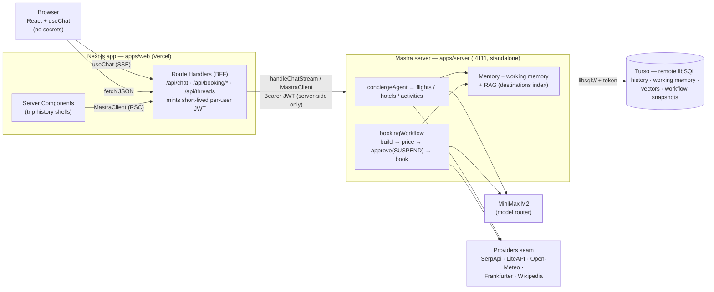
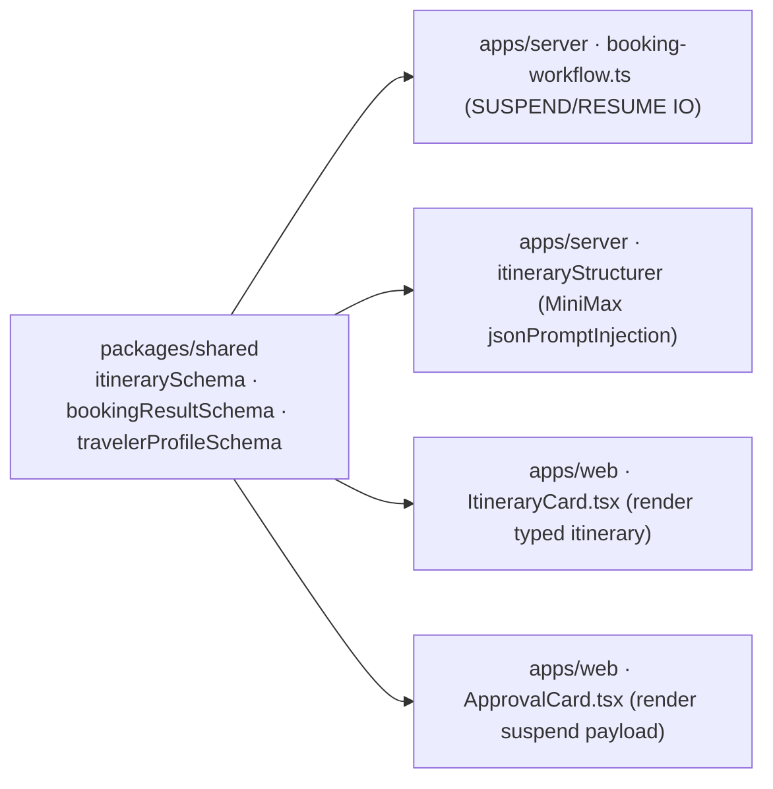
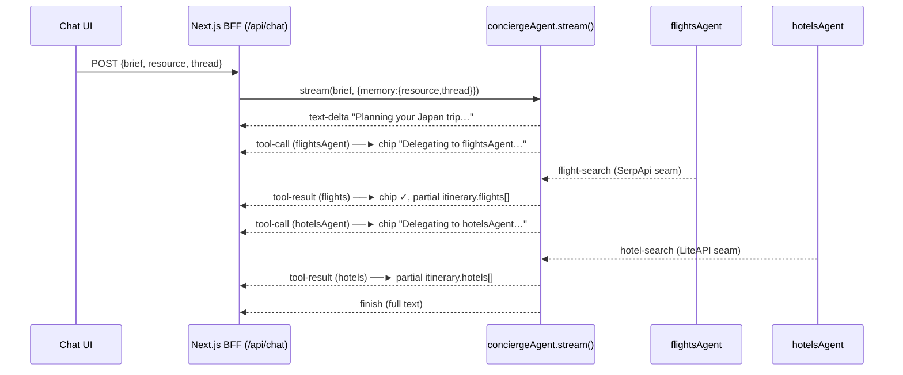
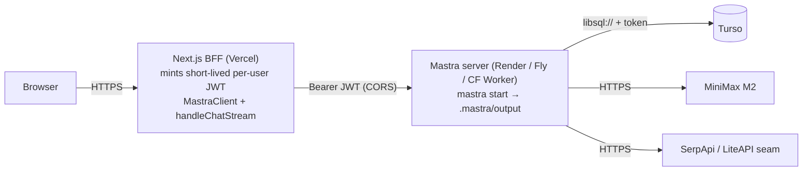

# Travel AI Agent — Frontend, Backend & Deployment Architecture

> ⚠️ **Scope note (2026-06-20).** The project has since pivoted to a **plan-only terminal agent** (`pnpm plan`) — see [`README.md`](./README.md) and [`CLAUDE.md`](./CLAUDE.md) for the current shape. The **booking / human-approval workflow** described throughout this document has been **removed from the codebase** and is **out of scope**. There is **no web UI being built right now**. Treat this document as an aspirational reference for *if/when* a UI is added — and ignore every booking / approval / suspend-resume section, which no longer reflects the code. The Mastra agent, provider seam, memory, RAG, and the LibSQL→Turso deployment guidance still apply.

## Executive Summary

Travel AI Agent is a production multi-agent travel concierge built on **Mastra** (`@mastra/core`, TypeScript, Node ≥22.13, pnpm). The backend is complete through **Phase 6**: a supervisor `conciergeAgent` that delegates to three specialists (flights/hotels/activities), a tool layer behind a one-line provider seam, Memory (history + working memory + semantic recall) and RAG over a single LibSQL store, and a `bookingWorkflow` with a human-approval **suspend/resume** gate. It runs today only on `mastra dev` (Studio + HTTP API on `:4111`) against a local `file:./travel-agent.db` — there is **no UI**.

This document specifies how to add one. The recommended shape is a **pnpm monorepo** with a standalone Mastra **server** (`apps/server`, unchanged from today), a **Next.js BFF + UI** (`apps/web`), and a **`packages/shared`** holding the Zod schemas both sides import — so the typed `Itinerary` contract never drifts. The browser holds **no secrets**: it talks only to Next.js Route Handlers (the BFF), which attach a short-lived per-user JWT and forward to Mastra. Three existing design decisions make almost every step cheap: the **provider seam** (`providers/index.ts`), **`DATABASE_URL` indirection** (local file → Turso in one env var), and the **`jsonPromptInjection` structurer** that already emits a typed itinerary from MiniMax M2 (which has no native structured output).

The single load-bearing prerequisite for any deploy is migrating the LibSQL `file:` store to **remote Turso** — without it, suspended booking runs cannot survive the fresh invocation that resumes them.

## Table of Contents

1. [Current State](#current-state)
2. [Target Architecture](#target-architecture)
3. [Repository Structure & Migration](#repository-structure--migration)
4. [Frontend Architecture](#frontend-architecture)
5. [Backend & API Integration](#backend--api-integration)
6. [Realtime & Human-in-the-Loop UX](#realtime--human-in-the-loop-ux)
7. [Deployment & Infrastructure](#deployment--infrastructure)
8. [Progression Roadmap](#progression-roadmap)
9. [Recommended Path (TL;DR)](#recommended-path-tldr)

---

## Current State

What exists today (Phase 6 complete; Phases 7–10 pending):

- **Mastra instance** (`src/mastra/index.ts`) registering agents `{ conciergeAgent, flightsAgent, hotelsAgent, activitiesAgent }`, workflow `{ bookingWorkflow }`, `storage` (LibSQLStore), `vectors: { libsql }` (LibSQLVector), and a Pino logger. No `server`, `auth`, `deployer`, or `mcpServers` keys yet.
- **Supervisor + specialists.** `conciergeAgent` (registration key `conciergeAgent`, internal id `'concierge-agent'`) parses a free-text brief, delegates to specialists for full itineraries, and answers focused visa/safety questions directly via RAG. Specialists each own their tools: flights (`flightSearchTool`, `currencyTool`), hotels (`hotelSearchTool`, `currencyTool`), activities (`activitySearchTool`, `weatherTool`, `ragRetrievalTool`). Model is `'minimax/MiniMax-M2'` throughout.
- **Tools & provider seam.** flight-search (SerpApi), hotel-search (LiteAPI), weather (Open-Meteo), currency (Frankfurter), activity-search (Wikipedia), RAG retrieval (LibSQLVector, index `destinations`, fastembed 384-dim). Tools import from `src/mastra/providers/index.ts`, so a data source swaps in one edit.
- **Memory** (`src/mastra/memory.ts`): last 20 messages, semantic recall (`topK: 3`, resource-scoped), working memory typed by `travelerProfileSchema` (`homeAirport`, `dietaryNeeds`, `budgetStyle`, `seatPreference`, `passportCountry`), scoped per traveler `resource`. Calls pass `{ memory: { resource, thread } }`.
- **Storage** (`src/mastra/storage.ts`): one LibSQL DB via `const url = process.env.DATABASE_URL ?? 'file:./travel-agent.db'` holds message history, working memory, semantic vectors, RAG metadata, and workflow snapshots.
- **Booking workflow** (`src/mastra/workflows/booking-workflow.ts`): `buildItinerary` → `priceItinerary` → `approveIfOverBudget` (the **SUSPEND gate**, threshold **$1500**) → `book`. The structurer step turns the concierge's prose into a typed `Itinerary` via a tool-free `itineraryStructurer` agent with `jsonPromptInjection: true` (MiniMax has no native `response_format`). The approval step id is `approve-if-over-budget`; the step object `approveIfOverBudget` is exported for type-safe `resume()`.
- **Scripts:** `pnpm dev` (`mastra dev`), `pnpm build` (`mastra build`), `pnpm ingest` (RAG), `pnpm booking-demo`, `pnpm plan-trip`.
- **Env:** `MINIMAX_API_KEY`, `SERPAPI_KEY`, `LITE_API_KEY`, `DATABASE_URL`; planned `MASTRA_JWT_SECRET`, `TURSO_AUTH_TOKEN`.

**Schemas the UI depends on** (`src/mastra/schemas/itinerary.ts`):

- `itinerarySchema` → `{ destination, startDate, endDate, travelers, flights[{from,to,carrier,price}], hotels[{name,nights,pricePerNight}], activities[{title,price}] }` (per-item USD).
- `bookingResultSchema` → `{ status: 'booked'|'rejected', total, currency, confirmationId?, message }`.
- Suspend payload (from `approve-if-over-budget`) → `{ reason, total, currency, destination }`.

---

## Target Architecture

A **standalone Mastra server** keeps all reasoning, tools, memory, and the booking suspend/resume gate. A **Next.js Backend-for-Frontend (BFF)** sits in front: the browser calls only the BFF's `/api/*` routes; the BFF mints a short-lived per-user JWT and forwards to Mastra via `@mastra/client-js` (typed calls) and `handleChatStream` (`@mastra/ai-sdk`, chat streaming). Provider keys and the JWT secret never leave the server tier. State lives in **Turso** (remote libSQL) so suspended runs survive across invocations.



**Primary recommendation:** standalone Mastra server + Next.js BFF (Topology B). **Alternative, mentioned once:** for a throwaway MVP you can embed Mastra directly inside Next.js Route Handlers (`serverExternalPackages: ['@mastra/*']`) for a single deploy with no CORS — but it weakens the secret boundary and makes the suspend/resume booking flow fragile on serverless, so it is not the default here. (For the cheapest *deploy* you can still run the standalone server's logic on Vercel as Topology A; see [Deployment](#deployment--infrastructure).)

Why the BFF hop matters: `MastraJwtAuth` requires `Authorization: Bearer <jwt>` on every call, and `MASTRA_JWT_SECRET` must never reach the browser. The Route Handlers mint a short-lived JWT keyed to the traveler's `resourceId`, server-side.

---

## Repository Structure & Migration

### Decision: pnpm monorepo (default), not embedded-Next

Three packages — `apps/server` (the Mastra backend, exactly what exists today), `apps/web` (the Next.js BFF + UI), and `packages/shared` (the Zod schemas shared by both).

| Force in this project | Why it pushes to a monorepo (separate server) |
|---|---|
| **`bookingWorkflow` suspend/resume** | The approval gate must rehydrate a snapshot from storage on a *fresh* invocation. A long-lived standalone server survives this cleanly; serverless-embedded makes it fragile. |
| **LibSQL store + fastembed + RAG ingest** | Want a Node server runtime, not edge. The deploy plan already targets a standalone server + Turso. |
| **`mastra dev`/`build`/Studio on :4111** | These assume a Mastra project root with `src/mastra/index.ts`. Keeping that intact as `apps/server` means **zero churn** to the backend toolchain. |
| **Provider seam + MiniMax structurer** | Backend-only concerns (SerpApi/LiteAPI keys, `jsonPromptInjection`, `MINIMAX_API_KEY`) must never reach the browser; a separate `apps/server` enforces the boundary by construction. |
| **Shared `Itinerary` Zod schema** | `packages/shared` lets both sides import the **same** Zod source of truth — no drift, no hand-copied types. |

### Target directory tree

```
travel-ai-agent/                      # repo root = pnpm workspace root
├── package.json                      # workspace root: scripts delegate via --filter
├── pnpm-workspace.yaml               # packages globs + existing allowBuilds
├── tsconfig.base.json                # shared compilerOptions (extracted from today's tsconfig)
├── .gitignore                        # *.db, .mastra/, .env, .next/, dist/
├── .env  .env.example                # ROOT env — server reads it via --env-file=../../.env
├── SPEC.md  README.md  CLAUDE.md
│
├── packages/
│   └── shared/                       # @travel-agent/shared — isomorphic; only dep is zod
│       ├── package.json              # "exports": "./src/index.ts" (TS source, bundler resolution)
│       ├── tsconfig.json             # extends ../../tsconfig.base.json
│       └── src/
│           ├── index.ts              # re-exports schemas
│           └── schemas/
│               ├── itinerary.ts      # MOVED from src/mastra/schemas/itinerary.ts
│               └── traveler-profile.ts
│
├── apps/
│   ├── server/                       # @travel-agent/server — Mastra app (mastra dev/build runs HERE)
│   │   ├── package.json              # @mastra/* deps; dev/ingest/booking-demo/plan-trip scripts
│   │   ├── tsconfig.json
│   │   ├── knowledge/destinations.md # MOVED — RAG source
│   │   ├── scripts/{ingest,booking-demo,plan-trip}.ts   # MOVED
│   │   └── src/mastra/               # MOVED verbatim from repo-root src/mastra/
│   │       ├── index.ts  storage.ts  memory.ts  embedder.ts
│   │       ├── agents/  tools/  providers/  workflows/  rag/
│   │       └── schemas/              # now THIN re-exports from @travel-agent/shared
│   │
│   └── web/                          # @travel-agent/web — Next.js BFF + UI (new)
│       ├── package.json              # next, react, @mastra/client-js, @mastra/ai-sdk, @ai-sdk/react
│       ├── next.config.ts            # transpilePackages: ['@travel-agent/shared']
│       └── src/
│           ├── app/
│           │   ├── (chat)/trip/[threadId]/page.tsx   # concierge chat + itinerary
│           │   ├── trips/page.tsx                     # trip history (RSC)
│           │   ├── profile/page.tsx                   # working-memory view
│           │   └── api/                               # BFF: only place JWT/secret lives
│           │       ├── chat/route.ts                  # handleChatStream → SSE
│           │       ├── booking/start/route.ts         # MastraClient: workflow start
│           │       ├── booking/resume/route.ts        # workflow resume
│           │       └── threads/route.ts               # list memory threads
│           ├── lib/{mastra-client,auth,ids,schemas}.ts
│           ├── hooks/{use-booking,use-threads}.ts
│           ├── stores/ui-store.ts                     # Zustand: modal, active itinerary, runId
│           └── components/{chat,itinerary,booking,profile,ui}/
│
└── .mastra/                          # mastra build output (gitignored) — generated under apps/server
```

`mastra dev`/`build` run inside `apps/server` where `src/mastra/index.ts` lives, so the Mastra CLI's expected layout is preserved. `packages/shared` ships **TypeScript source** (no build step) — `tsx` (server) and Next's bundler (web) resolve `.ts` directly.

### Workspace configuration

**`pnpm-workspace.yaml`** (keep the existing `allowBuilds`):

```yaml
packages:
  - 'apps/*'
  - 'packages/*'
allowBuilds:
  esbuild: true
  onnxruntime-node: true   # fastembed native dep — ingest/recall break without it
```

**Root `package.json`** — scripts delegate so root-level muscle memory still works:

```jsonc
{
  "name": "travel-ai-agent",
  "private": true,
  "type": "module",
  "scripts": {
    "dev": "pnpm --filter @travel-agent/server dev",            // = mastra dev (:4111 + Studio)
    "dev:web": "pnpm --filter @travel-agent/web dev",           // = next dev (:3000)
    "dev:all": "pnpm -r --parallel --filter './apps/*' dev",
    "build": "pnpm --filter @travel-agent/server build",        // mastra build
    "build:web": "pnpm --filter @travel-agent/web build",
    "ingest": "pnpm --filter @travel-agent/server ingest",
    "booking-demo": "pnpm --filter @travel-agent/server booking-demo",
    "plan-trip": "pnpm --filter @travel-agent/server plan-trip"
  },
  "devDependencies": { "typescript": "^6.0.3" }
}
```

`pnpm dev`, `pnpm ingest`, `pnpm booking-demo`, `pnpm plan-trip` keep working **identically** from the root.

**`apps/server/package.json`** — today's manifest, with `@travel-agent/shared` added, `--env-file=../../.env` in scripts, and `@mastra/*` **pinned to exact versions** (no `^`, per the 2026-06-17 supply-chain incident):

```jsonc
{
  "name": "@travel-agent/server",
  "type": "module", "private": true,
  "scripts": {
    "dev": "mastra dev",
    "build": "mastra build",
    "ingest": "node --env-file=../../.env --import tsx scripts/ingest.ts",
    "booking-demo": "node --env-file=../../.env --import tsx scripts/booking-demo.ts",
    "plan-trip": "node --env-file=../../.env --import tsx scripts/plan-trip.ts"
  },
  "dependencies": {
    "@mastra/core": "1.43.0",
    "@mastra/fastembed": "1.1.2",
    "@mastra/libsql": "1.13.2",
    "@mastra/loggers": "1.1.2",
    "@mastra/memory": "1.20.5",
    "@mastra/rag": "2.2.1",
    "@travel-agent/shared": "workspace:*",
    "zod": "^4.4.3"
  },
  "devDependencies": { "@types/node": "^25.9.3", "mastra": "1.14.0", "tsx": "^4.22.4" }
}
```

**`packages/shared/package.json`** — source-only, dual consumer:

```jsonc
{
  "name": "@travel-agent/shared",
  "type": "module", "private": true,
  "exports": { ".": "./src/index.ts" },
  "dependencies": { "zod": "^4.4.3" }
}
```

**`apps/web/next.config.ts`** must transpile the shared TS source:

```ts
import type { NextConfig } from 'next'
const config: NextConfig = { transpilePackages: ['@travel-agent/shared'] }
export default config
```

### Single source of truth for the itinerary schema

Move the schemas to `packages/shared` and leave a thin **compat shim** in `apps/server` so no backend import path changes:

```ts
// packages/shared/src/index.ts
export * from './schemas/itinerary'
export * from './schemas/traveler-profile'
```

```ts
// apps/server/src/mastra/schemas/itinerary.ts  (compat shim — keeps every existing import working)
export * from '@travel-agent/shared'
```



The browser imports only the Zod schema + inferred `type Itinerary` — pure data, no `@mastra/*`, no provider/key code.

### Step-by-step migration (non-destructive, scripts stay green)

```bash
# Step 0 — Branch, pin, audit (supply-chain first)
git checkout -b chore/monorepo-ui-split
# pin every @mastra/* to exact versions in package.json, then:
pnpm install --ignore-scripts
grep -r "easy-day-js" pnpm-lock.yaml || echo "clean: no easy-day-js"   # 2026-06-17 typosquat

# Step 1 — Workspace skeleton
mkdir -p apps/server packages/shared/src/schemas apps/web/src

# Step 2 — Move backend verbatim (git mv preserves history & relative imports)
git mv src apps/server/src
git mv scripts apps/server/scripts
git mv knowledge apps/server/knowledge

# Step 3 — Extract shared schemas, then add the index + compat shims
git mv apps/server/src/mastra/schemas/itinerary.ts        packages/shared/src/schemas/itinerary.ts
git mv apps/server/src/mastra/schemas/traveler-profile.ts packages/shared/src/schemas/traveler-profile.ts
# (create packages/shared/src/index.ts and the two re-export shims under apps/server/src/mastra/schemas/)

# Step 4 — Write manifests + tsconfigs (root delegating scripts; tsconfig.base.json; keep moduleResolution: bundler)
# Step 5 — Env: keep ONE root .env; retarget server scripts to --env-file=../../.env; add MASTRA_JWT_SECRET, MASTRA_API_URL

# Step 6 — Reinstall and verify backend UNBROKEN (gate before touching web)
pnpm install --ignore-scripts
pnpm rebuild esbuild onnxruntime-node
pnpm ingest && pnpm booking-demo && pnpm plan-trip && pnpm dev   # all must match pre-migration output

# Step 7 — Scaffold web last
pnpm --filter @travel-agent/web exec -- npx create-next-app@latest . --ts --app --src-dir --use-pnpm
pnpm --filter @travel-agent/web add @travel-agent/shared@workspace:* @mastra/client-js @mastra/ai-sdk @ai-sdk/react ai

# Step 8 — Commit the split as one reviewable commit
git add -A && git commit
```

**Invariants the migration guarantees:** (1) every `from '../schemas/itinerary'` import keeps resolving via the compat shim; (2) `pnpm dev/ingest/booking-demo/plan-trip` run unchanged from root; (3) the provider seam, MiniMax structurer, suspend/resume, and `DATABASE_URL` seam move byte-for-byte; (4) the browser can import `Itinerary`/`bookingResultSchema` without pulling in any `@mastra/*` code.

---

## Frontend Architecture

### Recommended stack

| Concern | Choice | Why for Travel AI Agent |
|---|---|---|
| Framework | **Next.js 15 (App Router) + React 19 + TS** | App Router gives a server-side **BFF layer** (Route Handlers) holding `MASTRA_JWT_SECRET`/keys; Server Components render trip-history shells; Client Components handle streaming. |
| Styling / UI | **Tailwind v4 + shadcn/ui** | Itinerary cards, approval modal, profile panel are all `Card`/`Dialog`/`Badge`/`Tabs` primitives. |
| Chat / streaming | **`@ai-sdk/react` `useChat` + `@mastra/ai-sdk` (`handleChatStream`)** | `handleChatStream` converts the concierge's `fullStream` into AI SDK v5 wire protocol → message parts + tool-invocation states for free. Delegations to specialists and SerpApi/LiteAPI runs surface as `message.parts`. |
| Backend calls (non-chat) | **`@mastra/client-js` (`MastraClient`)** | Typed client for the booking **workflow** (`createRun`/`startAsync`/`resume`) and **memory threads** (`listMemoryThreads`, `getMemoryThread`). |
| Client state | **TanStack Query** (server cache) + **Zustand** (ephemeral UI) + `useChat` (chat) | Three clearly-scoped stores; no Redux. |

### Client-state approach

- **`useChat`** owns the live conversation (messages, streaming status, tool-invocation parts) — the only state for in-flight assistant text.
- **TanStack Query** owns server-derived data: memory threads, the booking-run lifecycle (`use-booking` mutation: `suspended` → `resume` → `booked`/`rejected`), and the profile. Cache keys include `resourceId`/`threadId`.
- **Zustand (`ui-store`)** owns pure UI: approval-modal open state, the currently-rendered itinerary object, and the active `runId` (persisted to `localStorage` so a reload can re-attach to a suspended booking run — snapshots live in Turso keyed by `runId`).
- **IDs:** `resourceId = traveler-<userId>` (stable per user → working memory + cross-thread recall), `threadId = trip-<uuid>` (per conversation). Both passed on every agent call via `memory: { resource, thread }`. The BFF derives `resource` from the **verified session**, never the request body.

### Key screens

1. **Concierge chat (`/trip/[threadId]`)** — streaming chat via `useChat`; renders text deltas plus tool-invocation parts (which specialist was delegated to, which provider tool ran). Hosts the live itinerary card.
2. **Itinerary card** — renders the typed `Itinerary`; ideally streamed via `partialObjectStream` for progressive fill.
3. **Booking-approval modal** — driven by the suspend gate; reads `{ reason, total, currency, destination }`, shows approve/reject, calls resume.
4. **Traveler profile panel (`/profile`)** — reads/edits working-memory fields scoped by `resourceId`. Edits are sent as a normal concierge message ("update my home airport to BLR") so the agent applies them via working-memory **merge semantics** — the UI never writes the memory store directly.
5. **Trip history (`/trips`)** — RSC listing memory threads (`listMemoryThreads({ resourceId, agentId: 'conciergeAgent' })`).

### Streaming chat component

```tsx
'use client'
import { useChat } from '@ai-sdk/react'
import { DefaultChatTransport } from 'ai'
import { useUiStore } from '@/stores/ui-store'
import { ToolTrace } from './tool-trace'

export function ChatPanel({ threadId, userId }: { threadId: string; userId: string }) {
  const setItinerary = useUiStore((s) => s.setItinerary)
  const { messages, sendMessage, status } = useChat({
    transport: new DefaultChatTransport({ api: '/api/chat', body: { threadId, userId } }),
    onData: (part) => { if (part.type === 'data-itinerary') setItinerary(part.data) },
  })

  return (
    <div className="flex h-full flex-col">
      <div className="flex-1 space-y-4 overflow-y-auto p-4">
        {messages.map((m) => (
          <div key={m.id} className={m.role === 'user' ? 'text-right' : ''}>
            {m.parts.map((part, i) => {
              if (part.type === 'text') return <p key={i}>{part.text}</p>
              if (part.type.startsWith('tool-')) return <ToolTrace key={i} part={part} />
              return null
            })}
          </div>
        ))}
        {status === 'streaming' && <p className="text-muted-foreground">Concierge is planning…</p>}
      </div>
      <form className="border-t p-4" onSubmit={(e) => {
        e.preventDefault()
        const input = e.currentTarget.elements.namedItem('msg') as HTMLInputElement
        if (input.value.trim()) { sendMessage({ text: input.value }); input.value = '' }
      }}>
        <input name="msg" placeholder="Plan a 5-day trip to Tokyo under $2000…"
               className="w-full rounded-md border px-3 py-2" />
      </form>
    </div>
  )
}
```

### Itinerary card — rendering the structured output

Types derive from the **same Zod schema** the backend uses (`@travel-agent/shared`), so the contract stays in lockstep. Fields match `itinerarySchema` exactly (`destination`, `startDate`, `endDate`, `travelers`, `flights[{from,to,carrier,price}]`, `hotels[{name,nights,pricePerNight}]`, `activities[{title,price}]`).

```tsx
'use client'
import type { z } from 'zod'
import type { itinerarySchema } from '@travel-agent/shared'
import { Card, CardHeader, CardTitle, CardContent } from '@/components/ui/card'
import { Badge } from '@/components/ui/badge'

type Itinerary = z.infer<typeof itinerarySchema>
const money = (n: number) => `$${n.toLocaleString('en-US')}`

export function ItineraryCard({ it }: { it: Itinerary }) {
  const flightsTotal = it.flights.reduce((s, f) => s + f.price * it.travelers, 0)
  const hotelsTotal = it.hotels.reduce((s, h) => s + h.pricePerNight * h.nights, 0)
  const activitiesTotal = it.activities.reduce((s, a) => s + a.price, 0)
  const total = flightsTotal + hotelsTotal + activitiesTotal

  return (
    <Card className="w-full">
      <CardHeader className="flex-row items-center justify-between">
        <CardTitle>{it.destination}</CardTitle>
        <Badge variant="secondary">
          {it.startDate} → {it.endDate} · {it.travelers} traveler{it.travelers > 1 ? 's' : ''}
        </Badge>
      </CardHeader>
      <CardContent className="space-y-5">
        {/* Flights / Hotels / Activities sections render row-by-row */}
        <div className="flex justify-between border-t pt-3 font-semibold">
          <span>Estimated total</span>
          {/* Crosses $1500 → backend will SUSPEND for approval */}
          <span className={total > 1500 ? 'text-amber-600' : ''}>{money(total)}</span>
        </div>
      </CardContent>
    </Card>
  )
}
```

> The frontend re-derives `total` only for display; the **authoritative** total comes from the workflow's deterministic `priceItinerary` step and is what the suspend gate compares against `$1500`.

### Frontend env vars

```bash
# .env (root) — server-side only unless prefixed NEXT_PUBLIC_
MASTRA_API_URL=https://api.travel.example.com   # standalone Mastra server (:4111 in dev)
MASTRA_JWT_SECRET=__shared_with_backend__       # used by lib/auth to mint per-user JWTs — NEVER NEXT_PUBLIC_
NEXT_PUBLIC_APP_NAME="Travel AI Agent"          # safe to expose
```

**Critical rule:** `MASTRA_JWT_SECRET` and all provider keys (`MINIMAX_API_KEY`, `SERPAPI_KEY`, `LITE_API_KEY`, `DATABASE_URL`/`TURSO_AUTH_TOKEN`) stay on the Mastra server and the Next BFF only. The browser holds none of them.

---

## Backend & API Integration

This layer's single rule: **Mastra stays the brain.** The UI renders typed data and forwards user intent to the existing `conciergeAgent`, the specialist network, and `bookingWorkflow`. Nothing in `src/mastra/` changes its responsibilities — we only add an HTTP/auth seam in front of it.

### HTTP surface Mastra already exposes

`mastra build`/`mastra dev` serve a Hono server (default `:4111`) that auto-mounts every registered agent and workflow:

| Method & path | Purpose | Maps to |
|---|---|---|
| `POST /api/agents/conciergeAgent/generate` | One-shot concierge reply | `conciergeAgent.generate()` |
| `POST /api/agents/conciergeAgent/stream` | Token/chunk streaming | `conciergeAgent.stream()` |
| `POST /api/workflows/bookingWorkflow/create-run` | New booking run | `workflow.createRun()` |
| `POST /api/workflows/bookingWorkflow/runs/:runId/start` (`/start-async`) | Start the chain | `run.start()` |
| `POST /api/workflows/bookingWorkflow/runs/:runId/resume` | Resume the **`approve-if-over-budget`** gate | `run.resume({ step, resumeData })` |
| `GET /api/workflows/bookingWorkflow/runs/:runId` + `.../watch` | Poll / subscribe | `run.watch()` |
| `GET /api/memory/threads?resourceId=&agentId=` | Thread sidebar history | `listMemoryThreads()` |
| `GET /health`, `GET /api/openapi.json`, `GET /swagger-ui` | Ops / contract | built-in |

> **Naming gotcha:** the agent route segment is the *registration key* (`conciergeAgent`), **not** the internal `id` (`'concierge-agent'`). The workflow segment is `bookingWorkflow`; the resume `step` id is `approve-if-over-budget`. Wrong values give 404s that look like auth failures.

### `@mastra/client-js` — server side only

Instantiate the client in BFF route handlers / Server Components, never in a `'use client'` component.

```ts
// apps/web/src/lib/mastra-client.ts  (server-only)
import 'server-only'
import { MastraClient } from '@mastra/client-js'
import { mintUserJwt } from './auth'

export function mastraFor(userId: string) {
  return new MastraClient({
    baseUrl: process.env.MASTRA_API_URL!,
    headers: { Authorization: `Bearer ${mintUserJwt({ userId })}` }, // short-lived per-traveler JWT
    retries: 3,
  })
}
export const CONCIERGE_AGENT_ID = 'conciergeAgent'      // registration key, not 'concierge-agent'
export const BOOKING_WORKFLOW_ID = 'bookingWorkflow'
export const APPROVAL_STEP = 'approve-if-over-budget'
```

**Chat route (SSE pass-through):**

```ts
// apps/web/src/app/api/chat/route.ts
import { handleChatStream } from '@mastra/ai-sdk'
import { createUIMessageStreamResponse } from 'ai'
import { mastra } from '@/mastra'                  // or proxy to the standalone server
import { requireSession } from '@/lib/auth'

export async function POST(req: Request) {
  const session = await requireSession()
  const { messages, threadId } = await req.json()
  const stream = await handleChatStream({
    mastra, agentId: 'conciergeAgent',
    params: { messages, memory: { resource: session.userId, thread: threadId } }, // resource from session, never body
  })
  return createUIMessageStreamResponse({ stream })
}
```

**Booking start / resume** (keyed by `runId` so an approval survives reload):

```ts
// apps/web/src/app/api/booking/start/route.ts
const run = await client.getWorkflow(BOOKING_WORKFLOW_ID).createRun()
const result = await run.startAsync({ inputData: { brief, resourceId, threadId } })
if (result.status === 'suspended') {
  return Response.json({ runId: run.runId, status: 'suspended',
    payload: result.steps[APPROVAL_STEP]?.suspendPayload })   // { reason, total, currency, destination }
}
return Response.json({ runId: run.runId, status: result.status, result: result.result })

// apps/web/src/app/api/booking/resume/route.ts
const run = await client.getWorkflow(BOOKING_WORKFLOW_ID).createRun({ runId })  // rehydrate by id
const final = await run.resumeAsync({ step: APPROVAL_STEP, resumeData: { approved } }) // matches resumeSchema
return Response.json({ status: final.status, result: final.result }) // booked | rejected
```

### Auth with `MastraJwtAuth` + per-user memory

Enable JWT verification on the Mastra service so only the BFF can reach it (Phase 10 addition to `src/mastra/index.ts`):

```ts
import { MastraJwtAuth } from '@mastra/auth'

export const mastra = new Mastra({
  agents: { conciergeAgent, flightsAgent, hotelsAgent, activitiesAgent },
  workflows: { bookingWorkflow },
  storage, vectors: { libsql: vector },
  server: {
    cors: {
      origin: [process.env.WEB_ORIGIN!],            // the BFF origin only — never '*'
      allowHeaders: ['Content-Type', 'Authorization'],
      allowMethods: ['GET', 'POST', 'OPTIONS'],
      credentials: false,
    },
    auth: new MastraJwtAuth({ secret: process.env.MASTRA_JWT_SECRET! }),
  },
  logger: new PinoLogger({ name: 'Travel Agent', level: 'info' }),
})
```

The BFF **mints a short-lived per-user token** (secret stays server-side):

```ts
// apps/web/src/lib/auth.ts
import { SignJWT } from 'jose'
const secret = new TextEncoder().encode(process.env.MASTRA_JWT_SECRET!)
export async function mintUserJwt(session: { userId: string }) {
  return new SignJWT({ sub: session.userId })       // sub == traveler id
    .setProtectedHeader({ alg: 'HS256' }).setIssuedAt().setExpirationTime('5m').sign(secret)
}
```

**Identity → memory binding is load-bearing.** The authenticated `session.userId` is the *only* source of `resourceId`. The BFF sets `memory.resource` from the verified session, never from the request body — otherwise traveler A could read traveler B's working-memory profile (home airport, passport country) and semantic recall. `threadId` is client-chosen but always namespaced under the server-derived `resource`.

### Structured-output contract & rate limiting

- The UI consumes `itinerarySchema`, `bookingResultSchema`, and the suspend payload from `@travel-agent/shared` — render as cards, never re-parse prose. Because MiniMax has no native `response_format`, structured output is produced by the tool-free `itineraryStructurer` with `jsonPromptInjection: true`. Treat it as fallible: if `structured.object` is absent the workflow throws on `build-itinerary`, so surface a "couldn't build itinerary, retry" state rather than a blank card.
- **Keys stay on the Mastra service.** The browser bundle contains zero secrets; the BFF holds only `MASTRA_JWT_SECRET` and `MASTRA_API_URL`.
- **Two-tier rate limiting:** per-user/IP limits on the BFF (keyed on `session.userId`) plus a coarse global limit as Mastra server middleware. Gate the expensive paths hardest (`bookingWorkflow` start, `conciergeAgent.stream`) to protect the SerpApi 250-search/mo free tier and MiniMax spend. Suspended runs persist in Turso, so a low concurrency cap on *active* runs is safe — approvals resume cheaply by `runId`.

---

## Realtime & Human-in-the-Loop UX

Two distinct realtime channels — do not conflate them:

| Channel | Backend primitive | Transport | UI renders |
| --- | --- | --- | --- |
| **Concierge chat** | `conciergeAgent.stream()` (delegates to specialists) | `fullStream` events (SSE) | delegation chips, tool-call chips, partial itinerary |
| **Booking** | `bookingWorkflow` run with `suspend()` at `approve-if-over-budget` | `run.watch()` / poll on `runId` | progress steps, **approval card**, booked/rejected |

The booking channel is **durable** (every suspended snapshot persists in LibSQL/Turso). The chat channel is **ephemeral** — a dropped stream just re-runs.

### 1. Streaming supervisor → specialist delegation

When the concierge delegates, Mastra emits sub-agent invocations as **tool-call events** on `fullStream`. The BFF forwards them as SSE; the UI maps each event to a visual primitive.



```ts
for await (const ev of stream.fullStream) {
  switch (ev.type) {
    case 'text-delta': append(ev.payload.text); break
    case 'tool-call': {
      const isAgent = ['flightsAgent','hotelsAgent','activitiesAgent'].includes(ev.payload.toolName)
      pushChip(isAgent
        ? { kind: 'delegation', label: `Delegating to ${ev.payload.toolName}…`, status: 'running' }
        : { kind: 'tool', label: ev.payload.toolName, args: ev.payload.args, status: 'running' })
      break
    }
    case 'tool-result': resolveChip(ev.payload.toolCallId, 'done'); break   // chip turns ✓
    case 'error':       resolveChip(ev.payload.toolCallId, 'error'); break  // chip turns ⚠
  }
}
```

**Partial itinerary — two paths:**
- **Cheap (recommended for chat):** render progressive cards from the `tool-result` payloads of `flight-search`/`hotel-search`/`activity-search` (they already match each tool's `outputSchema`), filling in before the final itinerary exists.
- **Typed (for booking preview):** run a second `structuredOutput` stream and consume `partialObjectStream` to fill the `itinerarySchema` shape live, keeping `jsonPromptInjection: true` as the MiniMax fallback so the preview never hard-fails.

UI affordance: a **delegation rail** (vertical stepper of agent chips) on the left, streaming itinerary cards on the right; chip `running → done` driven by `tool-call`/`tool-result` pairing on `toolCallId`.

### 2. Booking SUSPEND/RESUME approval flow

For any trip over **$1500** with no decision yet, the step calls `suspend({ reason, total, currency, destination })`. The UI surfaces that payload and POSTs back `{ approved: boolean }`.

```mermaid
sequenceDiagram
  participant UI
  participant BFF as /api/booking/*
  participant WF as bookingWorkflow
  participant DB as Turso (snapshots)
  UI->>BFF: POST /start {brief,resource,thread}
  BFF->>WF: createRun(); start({inputData})
  WF->>DB: persist snapshot @ approve-if-over-budget
  WF-->>BFF: status:'suspended', steps['approve-if-over-budget'].suspendPayload
  BFF-->>UI: { runId, suspendPayload }
  Note over UI: render ApprovalCard(total,destination,reason) · persist runId to localStorage
  UI->>BFF: POST /resume {runId, approved:true}
  BFF->>WF: createRun({runId}).resume({step:'approve-if-over-budget', resumeData:{approved}})
  WF->>DB: load snapshot, run book step
  WF-->>BFF: status:'completed', result:{status:'booked', confirmationId}
  BFF-->>UI: booked ✓ (or rejected)
```

### 3. Durability, optimistic UI, and tripwires

- **Durability — a suspended run survives reload.** Persist `{ runId, suspendPayload }` to `localStorage` the moment `/start` returns `suspended`. On mount, rehydrate and re-open the card; `resume()` loads the snapshot by `runId`, so the user can approve hours later, on a different device, after a deploy. The approval card must be reachable from a "Pending approvals" surface, not just inline in transient chat. **Multi-tab caveat:** treat any non-`suspended` start/resume response as "already decided" and reconcile to the server result.
- **Optimistic UI.** On click, flip the card to "Booking…" (the `book` step is deterministic and fast); reconcile against the real `final.result`, rolling back on `rejected` or error. **Never** optimistically render a `confirmationId` — it is generated server-side in `book` and must come from the response.
- **Errors & tripwires.**
  - *Resume failure ≠ lost booking* — the snapshot is untouched and the run stays `suspended`; offer a non-destructive retry. A successful resume is terminal/idempotent, so retrying an already-resumed run returns a completed status (treat as success, not a double-book).
  - *Provider-seam failures during `buildItinerary`* (SerpApi/LiteAPI) bubble up as `error` stream events or a thrown `start()` — mark the offending tool chip ⚠ and offer "retry this leg."
  - *Structurer tripwire* — `buildItinerary` throws when `jsonPromptInjection` fails to yield a valid object (a real MiniMax risk); catch on `/start` and show "I drafted a plan but couldn't finalize the booking sheet — regenerate?" instead of a raw 500. (Phase 7 PII/moderation processors will add typed tripwire aborts; render those as distinct user-facing messages.)
- **Auto-approve path.** Trips ≤ $1500 never suspend — `/start` returns `status:'completed'` directly. Handle completed-on-start as a first-class branch (skip the card, render the confirmation), not an edge case.

---

## Deployment & Infrastructure

> ⚠️ **Hard blocker:** the repo defaults to `file:./travel-agent.db`. A `file:` URL needs a persistent local disk; serverless/edge filesystems are **ephemeral per invocation**, so memory, RAG vectors, and (critically) suspended booking runs vanish between the suspend invocation and the resume invocation. **Move to remote Turso before any deploy** (§ below).

### Topologies

**Topology A — single Next.js + Mastra app on Vercel (fastest first deploy).** Mastra imported into Next route handlers; one repo, one deploy, no CORS, no second auth hop. Watch Vercel function `maxDuration` (a full supervisor → 3 specialists → MiniMax structurer run is slow) and cold starts. Booking suspend/resume works **only because snapshots live in Turso** — resume is a fresh invocation that rehydrates.

**Topology B — standalone Mastra server (Render / Fly / Cloudflare) + Next.js frontend (recommended target).** Backend ships via `mastra build` + a deployer. For suspend/resume + Phase 7 streaming, a **long-lived process on Render or Fly** is the most robust fit (Workers have CPU/time ceilings long agent loops can trip); the SPEC also names the Cloudflare deployer as an option. Frontend is a thin Next.js BFF attaching the JWT and calling the backend with `@mastra/client-js`.



**Recommendation for a solo dev:** ship the MVP as **Topology A on Vercel** (Turso from day one), then **graduate the backend to Topology B on Render/Fly + Turso** once streaming/booking-approval load strains serverless time limits. The provider seam and the single `storage.ts` URL mean neither move touches agents, tools, or workflows.

### What `mastra build` produces (Topology B)

`pnpm build` emits `.mastra/output/` (`index.mjs` entry, `mastra.mjs`, `tools.mjs`, bundled `node_modules/`). Run with `mastra start` (loads `.env.production`/`.env`, graceful shutdown) or `node .mastra/output/index.mjs`. Built-in `GET /health`, `/api/openapi.json`, `/swagger-ui`. In containers set `MASTRA_HOST=0.0.0.0` and `PORT`.

Cloudflare deployer (per SPEC) — `mastra build` generates `wrangler.jsonc`; **secrets are deliberately NOT written into it** (upload separately). Keep any `cloudflare:workers` bindings **inline inside `new Mastra({...})`** — module-level reads evaluate before bindings populate and crash. Note: `fastembed` downloads `bge-small-en-v1.5` and runs locally; on a constrained Worker, switch the embedder to a hosted model (`ModelRouterEmbeddingModel('openai/text-embedding-3-small')`) and **recreate the index at the matching dimension (1536, not 384)**.

```ts
// src/mastra/index.ts (Topology B — Cloudflare)
import { CloudflareDeployer } from '@mastra/deployer-cloudflare'
export const mastra = new Mastra({
  agents: { conciergeAgent, flightsAgent, hotelsAgent, activitiesAgent },
  workflows: { bookingWorkflow }, storage, vectors: { libsql: vector },
  logger: new PinoLogger({ name: 'Travel Agent', level: 'info' }),
  deployer: new CloudflareDeployer({
    name: 'travel-ai-agent',
    routes: [{ pattern: 'api.travel.example.com/*', zone_name: 'example.com', custom_domain: true }],
    vars: { NODE_ENV: 'production' },   // PUBLIC config only — never secrets
  }),
})
```

### Database migration: LibSQL `file:` → Turso

The single Turso DB carries **all four stateful subsystems** auto-managed by `LibSQLStore`: message history + working memory, semantic-recall vectors, RAG chunk metadata, and **`bookingWorkflow` suspend/resume snapshots** (+ later traces/eval scores) — they ride along because `storage.ts` derives every store from one `DATABASE_URL`.

```bash
# 1. Provision (one time)
turso db create travel-ai-agent
turso db show   travel-ai-agent --url        # → libsql://travel-ai-agent-<org>.turso.io
turso db tokens create travel-ai-agent       # → TURSO_AUTH_TOKEN
```

```ts
// 2. Thread the auth token through src/mastra/storage.ts (current file passes only url)
import { LibSQLStore, LibSQLVector } from '@mastra/libsql'
const url = process.env.DATABASE_URL ?? 'file:./travel-agent.db'
const authToken = process.env.TURSO_AUTH_TOKEN          // undefined locally (file: needs none)
export const storage = new LibSQLStore({  id: 'travel-agent-storage', url, authToken })
export const vector  = new LibSQLVector({ id: 'travel-agent-vector',  url, authToken })
```

| Environment | `DATABASE_URL` | `TURSO_AUTH_TOKEN` |
|---|---|---|
| Local dev | `file:./travel-agent.db` (keep `*.db` git-ignored) | _(unset)_ |
| Staging | `libsql://travel-ai-agent-staging-<org>.turso.io` | staging token |
| Prod | `libsql://travel-ai-agent-<org>.turso.io` | prod token |

```bash
# 4. Re-ingest RAG against the remote DB (the local index doesn't migrate itself)
DATABASE_URL=libsql://travel-ai-agent-<org>.turso.io TURSO_AUTH_TOKEN=*** pnpm ingest
```

Keep `EMBEDDING_DIMENSION = 384` (`src/mastra/embedder.ts`) in lockstep with the index — a mismatch makes vector writes fail. Keeping `LibSQLVector` on the same Turso DB is simplest; if you go all-Cloudflare and hit Worker limits, pair Turso storage with Cloudflare **Vectorize** (and recreate the index there).

### CORS, secrets, and config

- **Topology A:** add the domain in Vercel → Domains; no CORS (same origin).
- **Topology B CORS** (on the Mastra server): `origin: ['https://travel.example.com', 'http://localhost:3000']`, `allowHeaders: ['Content-Type', 'Authorization']`, `credentials: false` (true only for cookie auth). Never `'*'` with the Authorization header.
- **Secrets per platform:** Vercel → Settings → Environment Variables (auto-synced by the deployer; `vercel env pull` locally). Cloudflare → `npx wrangler secret bulk .env` (only public config in `vars`). Render/Fly → env groups / `fly secrets set`. `TURSO_AUTH_TOKEN`, `MASTRA_JWT_SECRET`, and all provider keys are secrets; never commit `.env`, never write secrets into `wrangler.jsonc`/`.vc-config.json`.
- **Topology A config:** `vercel.json` sets `functions["app/api/**/*"].maxDuration = 300` (headroom for supervisor → 3 specialists → structurer), and `next.config.ts` sets `serverExternalPackages: ['@mastra/*']`.

### CI/CD (GitHub Actions)

A shared `ci` job (typecheck + `mastra build`) gates both topologies; deploy jobs diverge per target. Install with `pnpm install --frozen-lockfile --ignore-scripts` (supply-chain hardening — see below), and run `pnpm ingest` against prod Turso as a release step. For Topology B on Render/Fly, swap the Cloudflare deploy job for Render auto-deploy or `flyctl deploy`.

### Staging vs prod & cost

- Branch model: `staging` → preview/staging, `main` → production. **Separate Turso DBs and `MASTRA_JWT_SECRET` per environment** so a botched ingest or a stuck suspended run never touches prod.
- Rough cost (solo dev / demo): Vercel Hobby **$0** (Pro ~$20 at limits) · Turso free **$0** · Cloudflare Workers **$0 → ~$5** · Render/Fly small instance **~$5–7** · MiniMax/SerpApi/LiteAPI metered (SerpApi 250 free searches/mo). **An MVP runs at ~$0 on Vercel Hobby + Turso free; budget ~$5–25/mo once the backend graduates to a long-lived instance.**

### Supply-chain advisory (act before any deploy)

On **2026-06-17** the `@mastra` npm org was compromised (a typosquat `easy-day-js` injected into 144 packages via a `postinstall` dropper). Before deploying: **pin exact `@mastra/*` versions** (drop `^`), audit `pnpm-lock.yaml` for `easy-day-js`, and run all CI installs with `--frozen-lockfile --ignore-scripts` so a malicious `postinstall` can't execute.

---

## Progression Roadmap

From **today (Phase 6, local `mastra dev` against `file:./travel-agent.db`)** to a **deployed, multi-user full-stack app**, interleaving backend Phases 7–10 with frontend and deploy milestones. Three existing decisions make almost every step cheaper and are called out repeatedly: the **provider seam**, **`DATABASE_URL` indirection** (the single line that unblocks every serverless target), and **`jsonPromptInjection` + `itineraryStructurer`** (Phase 7's `structuredOutput` is an upgrade of a thing that already works).

Legend: **BE** backend phase · **FE** frontend · **OPS** deploy/infra.

| # | Milestone | Track | Depends on | Done when |
|---|-----------|-------|-----------|-----------|
| **M0** | Supply-chain + version pin | OPS | — | `pnpm audit` clean; no `easy-day-js`; `mastra build` green |
| **M1** | **Phase 7** — streaming + structured output | BE | M0 | `agent.stream()` yields `textStream` **and** `objectStream`; keep MiniMax as `fallbackValue` |
| **M2** | **Phase 7** — processors (PII / moderation) | BE | M1 | A passport number in a brief is redacted before logs/memory; tests assert it |
| **M3** | **FE skeleton** — Next.js BFF + chat | FE | M1 | Typing a brief streams the concierge reply token-by-token; resource/thread threaded |
| **M4** | **FE** — itinerary cards + tool trace | FE | M1, M3 | Itinerary renders progressively from `partialObjectStream`; delegation + provider calls visible |
| **M5** | **FE** — booking approval UI | FE | M3 (+ M9 for reload-safe resume) | A >$1500 trip pauses, shows reason/total/destination, Approve books it (returns `confirmationId`) |
| **M6** | **Phase 9** — evals + observability | BE | M1 | Booking + plan flows emit traces; an eval suite scores itinerary validity in CI |
| **M7** | **OPS** — Turso migration | OPS | M0 | Memory, RAG, **and workflow snapshots** read/write Turso; a suspended run resumes from a fresh process |
| **M8** | **Phase 10** — auth + client-js | BE | M3 | Unauthenticated calls 401; BFF mints per-user JWTs; threads isolated by `resource` |
| **M9** | **OPS** — deploy backend | OPS | M7, M8 | `GET /health` green in prod; a suspend/resume booking survives across two separate invocations |
| **M10** | **OPS** — deploy frontend | OPS | M3, M9 | Public URL chats, renders cards, completes an approved booking end-to-end |
| **M11** | **Phase 8** — MCP (consume + expose) | BE | M9 | External MCP client can call `flight-search`; an MCP-backed provider drops into `providers/index.ts` |
| **M12** | **FE polish** — CopilotKit / generative UI | FE | M4, M5 | Approval + itinerary editing become first-class generative-UI components (optional) |

```
M0 ─┬─► M1 (stream + structured) ─┬─► M3 (chat BFF) ─┬─► M4 (itinerary cards)
    │       └─► M2 (processors)   │                  └─► M5 (approval UI) ◄── M9 for reload-safe resume
    │                             └─► M6 (evals/obs)
    └─► **M7 (Turso)** ──────────────┐
                                     ├─► **M9 (deploy BE)** ─► **M10 (deploy FE)** ─► M11 (MCP)
        M3 ─► **M8 (auth+client)** ──┘                         M4+M5 ─► M12 (CopilotKit, optional)
```

**Critical path to "live, multi-user, end-to-end":** `M0 → M1 → M3 → M7 → M8 → M9 → M10`. Everything else (processors, evals, MCP, CopilotKit) hangs off that spine and can be deferred without blocking a public demo.

**Why this order (load-bearing unblocks):**
- **M1 unblocks the whole UI** — a chat UI needs token streaming, and itinerary cards need a typed object stream, not free text. Since `itineraryStructurer` already emits a validated `Itinerary`, M1 is hardening an existing capability, and the same schema is reused verbatim as the M4 card contract.
- **M7 unblocks every deploy** — `file:./travel-agent.db` cannot back a suspend/resume booking across invocations. After M7 a run that suspends at `approveIfOverBudget` can be resumed by a *different* instance — the prerequisite for M5's reload-safety and any serverless target.
- **M8 unblocks multi-user** — every agent call already passes `{ memory: { resource, thread } }`, so isolation is just minting a per-user JWT in the BFF and mapping it to `resource`. No agent/workflow code changes.

**Solo-dev pragmatics:** ship M3–M5 against local `mastra dev` first (provider seam keeps SerpApi/LiteAPI in sandbox so you don't burn the 250-search quota); do **M2 before any public deploy** (passport numbers flow into working memory); prefer a long-lived backend (Render/Fly) for M9 over pure serverless; treat M11 and M12 as post-launch.

---

## Recommended Path (TL;DR)

For a solo dev, in order:

1. **Harden first (M0).** Pin exact `@mastra/*` versions, audit the lockfile for `easy-day-js`, set CI `--frozen-lockfile --ignore-scripts`.
2. **Restructure into a pnpm monorepo** — `apps/server` (Mastra, unchanged), `apps/web` (Next.js BFF + UI), `packages/shared` (Zod schemas). Use `git mv` + a compat shim so `pnpm dev/ingest/booking-demo/plan-trip` stay green.
3. **Phase 7 streaming + structured output (M1)** — the single unblock for the UI; keep `jsonPromptInjection` as the MiniMax fallback.
4. **Build the chat UI (M3–M4)** with `@ai-sdk/react useChat` + `handleChatStream`; render the typed `Itinerary` from `partialObjectStream`. Iterate against local `mastra dev` (no auth, no Turso, sandbox providers).
5. **Migrate to Turso (M7)** — a one-env-var change; mandatory before any deploy and for reload-safe approvals.
6. **Add auth (M8)** — `MastraJwtAuth` on the server + CORS; BFF mints short-lived per-user JWTs and derives `resourceId` from the verified session only.
7. **Build the booking-approval UI (M5)** driven by `bookingWorkflow` `status: 'suspended'` → approval card → `resume({ step, resumeData })`, with `runId` persisted for reload-safety.
8. **Deploy (M9–M10).** Ship the MVP as **embedded-on-Vercel + Turso** for speed; graduate the **standalone Mastra server to Render/Fly + Turso** (Next.js stays on Vercel) once streaming and booking-approval load strain serverless time limits.

**Default tech recommendation (one consistent set):** pnpm monorepo · standalone Mastra server + Next.js BFF · Turso (libSQL) for all state · `@mastra/client-js` + `@mastra/ai-sdk handleChatStream` + `@ai-sdk/react useChat` · Tailwind v4 + shadcn/ui · `MastraJwtAuth` with short-lived per-user JWTs minted server-side · Vercel for the frontend, Render/Fly for the backend. CopilotKit/AG-UI is an optional post-launch upgrade for generative-UI itinerary cards and native approval buttons.
